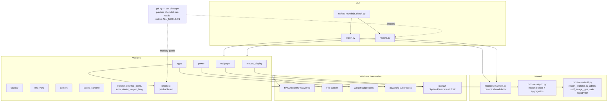
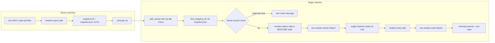
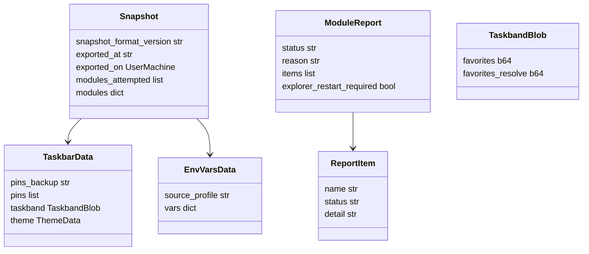
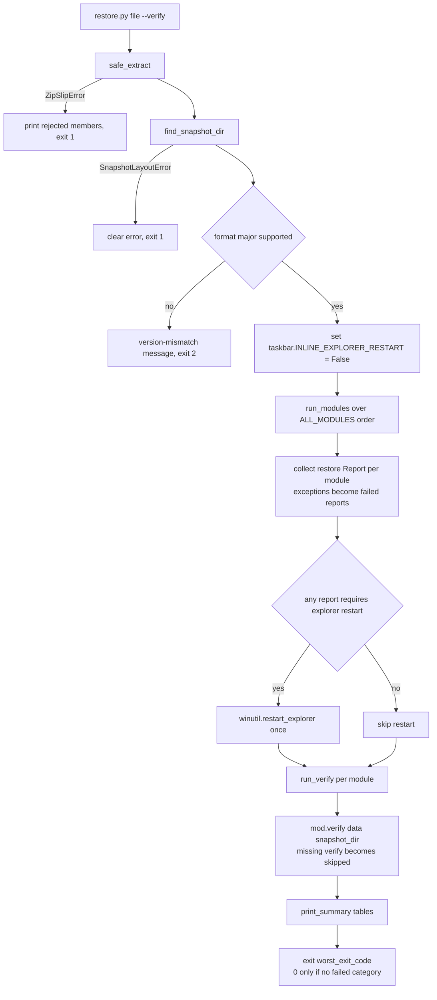
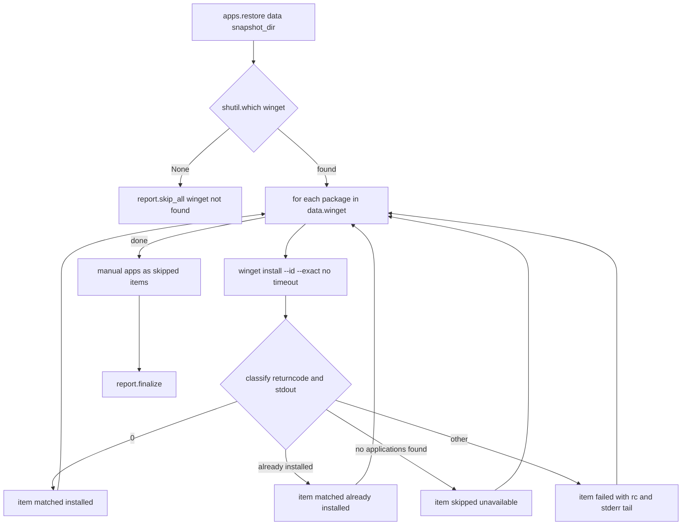
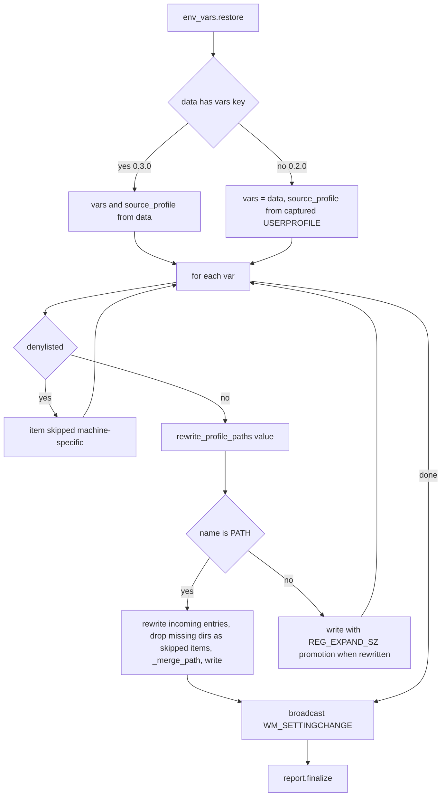

# Design Document — Backend Round-Trip Hardening

Feature: `backend-roundtrip-hardening`
Requirements: `.claude/specs/backend-roundtrip-hardening/requirements.md` (Req 1–15)
Snapshot format: **0.2.0 → 0.3.0**
(Merged design: v1 base + v2's `--report-json`, verify-item expected/actual fields, and precise gui.py citations.)

## Overview

WinSnap's restore today "succeeds" whenever no exception escapes a module. This design hardens the
export → `.winsnap` → restore pipeline so that:

1. Every module's restore **collects per-item outcomes** into a structured report instead of
   printing warnings and returning `None`.
2. A new optional module function `verify(data, snapshot_dir) -> report` re-reads live machine
   state and compares it against the snapshot, producing an honest
   matched / partial / failed / skipped verdict per category.
3. Known false-success paths are fixed: taskbar pins without the Taskband registry blob, winget
   batch imports killed by a 600 s timeout, verbatim env-var restore that breaks TEMP/OneDrive,
   a dead COM wallpaper path, a power import flow that parses GUIDs out of failed output, fake
   DPI coverage, and unsafe zip extraction.
4. The restore process exit code becomes machine-checkable (0 only when no category failed), and
   a scripted same-machine round trip (`export → restore --verify`) is the executable definition
   of done.

**Scope guard:** backend only. `gui.py` is not modified. The GUI's two integration points are
preserved exactly: the runtime monkey-patch of `modules.checklist.run` (gui.py:1228–1230) and its
consumption of `restore.ALL_MODULES` as a `(key, module)` tuple list (gui.py:1470). All registry
writes remain HKCU-only; the only non-HKCU touchpoint remains `powercfg`, admin-gated. No new
runtime dependency is added (the comtypes COM path is **removed**, see Decision D4).

### Research findings that ground this design

Findings from reading the current code (all paths relative to project root):

| Finding | Location | Consequence |
|---|---|---|
| Taskbar restore copies `.lnk` files only; the Taskband `Favorites`/`FavoritesResolve` REG_BINARY blobs are never captured, so Windows rebuilds a default taskbar | `modules/taskbar.py` | Req 1: capture/restore the blobs (Decision D6) |
| `taskbar.restore()` restarts Explorer inline; `restore.py` runs `apps` **last**, after `startup` and `taskbar` | `modules/taskbar.py:_restart_explorer`, `restore.py:ALL_MODULES` | Req 2: reorder + single final restart (Decision D2) |
| `winget import` runs with `timeout=600`, which raises `TimeoutExpired` mid-install; per-app outcomes are invisible; `_export_winget` returns `[]` on timeout (looks like "no apps"); `CreationDate` is hardcoded `2024-01-01` | `modules/apps.py` | Req 3: per-package install loop (Decision D3) |
| `env_vars.restore` writes every captured variable verbatim, including `TEMP`, `USERPROFILE`, `OneDrive`, with source-machine paths | `modules/env_vars.py` | Req 4: denylist + profile rewrite (Decision D5) |
| `_apply_wallpaper_per_monitor` calls `comtypes.CoCreateInstance(CLSID, interface=GUID)` — passing a bare GUID instead of an interface class, which always throws at runtime; only mocks exercise it. `WallpaperStyle`/`TileWallpaper` are never captured | `modules/wallpaper.py`, `tests/conftest.py:FakeDesktopWallpaper` | Req 5: remove COM path, capture style, sniff magic bytes (Decision D4) |
| `power.restore` parses a "new GUID" out of a **failed** import's stdout (dead logic — a failed `powercfg /import` prints an error, not a GUID) and never checks elevation | `modules/power.py` | Req 6: admin gate + correct import flow |
| `restore.py` extracts with `zf.extractall` (zip-slip), picks `extracted_dirs[0]` blindly, and prints "Restore completed successfully!" whenever no exception escaped | `restore.py:172–235` | Req 7, 13 |
| `apps.export` unconditionally calls the interactive `msvcrt` checklist; headless runs hang | `modules/apps.py:export`, `modules/checklist.py:run` | Req 8 (Decision D8) |
| Accent capture covers DWM values only; `AccentPalette`, `AccentColorMenu`, `StartColorMenu` under `Explorer\Accent` are missed | `modules/taskbar.py:_read_theme_settings` | Req 9 |
| Cursor/sound custom files are saved as verbatim paths, never bundled | `modules/cursors.py`, `modules/sound_scheme.py` (both docstrings admit it) | Req 10 |
| `mouse_display` captures `DpiScaling` (never restored), restores `LogPixels` (a no-op on modern Windows without the DPI-override sibling values), duplicates `cursor_scheme` owned by `cursors.py`, and hardcodes acceleration thresholds 6/10 | `modules/mouse_display.py` | Req 11, 12 |
| GUI consumes `restore.ALL_MODULES` as `(key, module)` tuples (gui.py:1470) but drives its own order list (`MODULES_RESTORE_ORDER`, gui.py:216, 1477); calls `mod.restore(...)` directly (gui.py:1525) and relies on `taskbar.restore()`'s inline Explorer restart; also reads `export.SNAPSHOT_FORMAT_VERSION` (gui.py:1238) and `create_snapshot_dir` (gui.py:1219) | `gui.py:216, 1219, 1238, 1470, 1477, 1525` | Constrains Decisions D2, D6; export.py public names frozen |
| Tests mock OS boundaries via `FakeWinReg` / `FakeUser32` / `FakeSubprocess` dataclasses patched per-module | `tests/conftest.py` | Testing strategy reuses and extends these |

## Architecture

### System Architecture Diagram



### Data Flow Diagram



## Key Design Decisions

### D1 — Report shape, aggregation, and exit code (Req 7)

**Decision:** introduce `modules/report.py` with a small `Report` builder used by both restore and
verify phases. A report is a plain JSON-friendly dict (no dataclass in the snapshot path, so it
serializes and mocks trivially):

```python
{
    "status": "matched" | "partial" | "failed" | "skipped",   # aggregate
    "reason": str | None,          # required when status == "skipped"
    "items": [                     # per-item detail
        {"name": str, "status": "matched"|"failed"|"skipped", "detail": str | None,
         "expected": Any | None, "actual": Any | None},   # expected/actual: populated by verify-phase
                                                          # comparisons; omitted/None in restore phase
    ],
    "explorer_restart_required": bool,   # restore-phase reports only
}
```

Restore-phase item statuses reuse the same vocabulary (`matched` = applied successfully) so one
aggregation function serves both phases.

**Aggregation rule** (`Report.finalize()`):

- any `failed` item and at least one `matched` item → `partial`
- any `failed` item and no `matched` item → `failed`
- no `failed`, at least one `matched` → `matched` (skipped items remain listed — this is how
  denylisted env vars appear as skips inside a matched category, Req 4.5)
- no `failed`, no `matched`, at least one `skipped` → `skipped`
- no items at all → `skipped` with the builder-supplied reason ("nothing to restore" etc.)

**How per-write failures stop being swallowed (Req 7.4):** module `restore()` functions keep their
signature but now **return** a report dict (returning a value from a function whose return was
previously ignored is contract-compatible — `restore.py` and `gui.py` both discard/ignore the old
`None`). Internal helpers that currently `print()` and continue (`_write` in env_vars,
`_write_reg_value` in mouse_display, `_copy_pins_tolerant` in taskbar, …) are changed to record a
`failed` item on the module's `Report` instead of only printing. `restore.py` collects returned
reports; if a module raises, `restore.py` synthesizes `{"status": "failed", "items": [],
"reason": str(exc)}`. Legacy modules returning `None` (should not exist after this change, but
defensive) are recorded as `skipped: "module returned no report"` — never as success.

**Banner and exit code (Req 7.3, 7.5):** the final banner prints a per-category table
(category, restore status, verify status, item counts) and per-item lines for every `partial`
and `failed` category. Exit code: `0` if no category has status `failed` in either phase;
otherwise `1`. (`2` remains the existing exit for a version-incompatible snapshot, `1` also
covers missing file/invalid archive — all non-zero, so scripts can assert.)

**Alternatives considered:**
- *Exceptions-only error propagation* — rejected: an exception aborts the remaining writes of a
  module and cannot express "7 of 9 values written".
- *Dataclass `ModuleReport`* — rejected: the report must land in JSON output and be built by 13
  modules; a dict + tiny builder has less ceremony and zero serialization code.
- *Separate restore-result and verify-result schemas* — rejected: one schema with a `status`
  vocabulary shared across phases keeps `restore.py`'s summary/exit-code logic single-pathed.

### D2 — Single source of truth for ordering; Explorer restart exactly once (Req 1.3, 2)

**Decision:** create `modules/manifest.py` holding the canonical ordered module list:

```python
# modules/manifest.py
MODULE_NAMES: list[str] = [
    "env_vars", "region_lang", "apps",            # apps early: startup/taskbar depend on it
    "wallpaper", "mouse_display", "cursors",
    "sound_scheme", "power", "fonts",
    "explorer", "desktop_icons",
    "startup", "taskbar",                          # consumers of installed apps run last
]
```

- `restore.py` builds `ALL_MODULES = [(name, importlib.import_module(f"modules.{name}")) for name in manifest.MODULE_NAMES]`
  — **keeping the public name `ALL_MODULES` and the `(key, module)` tuple shape** that gui.py:1470
  consumes as a lookup dict (reordering is safe for the GUI: it only builds `{key: mod}` from it).
- `export.py`'s `_build_modules(args)` iterates `manifest.MODULE_NAMES` and wraps `apps` with its
  CLI-bound kwargs, so the export set can never drift from the restore set. A unit test asserts
  both derive from the manifest and that `apps` precedes `startup` and `taskbar` (Req 2.5).
- The existing test `tests/test_integration_restore.py::...` that pins the old order is updated as
  part of this feature (it asserts implementation detail that Req 2 explicitly changes).

**Explorer restart extraction:** `_restart_explorer()` moves to `modules/winutil.py` as
`restart_explorer()`. `taskbar.restore()` no longer performs the restart when orchestrated by
`restore.py`; instead every module whose changes need an Explorer reload (`taskbar`, `explorer`,
`desktop_icons`) sets `explorer_restart_required: True` in its restore report, and `restore.py`
performs **one** `winutil.restart_explorer()` after the last module and **before** verification
(so verify sees post-restart state and restored Taskband data is loaded, Req 1.3, 2.2).

**GUI compatibility shim:** the GUI calls `taskbar.restore()` directly (gui.py:1477) and relies on
its inline restart. To avoid silently changing GUI behavior without touching gui.py, `taskbar.py`
keeps a module-level flag:

```python
# modules/taskbar.py
INLINE_EXPLORER_RESTART = True   # legacy default: restart inside restore()
```

`restore.py` sets `taskbar.INLINE_EXPLORER_RESTART = False` for its orchestrated run (and restores
it in a `finally`). Direct callers (GUI, old scripts) keep the old behavior.

**Alternatives considered:**
- *Ordering lives only in restore.py* (the literal wording of Req 2.5 allows it) — rejected in
  favor of `manifest.py` because export.py holds a second hand-maintained list today and the
  module *set* drifting is the real risk; manifest satisfies "or equivalent single source of truth".
- *Explorer restart as a pseudo-module appended to `ALL_MODULES`* — rejected: gui.py builds a
  module dict from `ALL_MODULES` and would import/execute an entry it doesn't know; a plain
  post-loop call in `restore.py` is simpler and testable.
- *Passing a `defer_restart=True` kwarg to `taskbar.restore`* — rejected: Req 15.1 fixes the
  contract to `restore(data, snapshot_dir)`; a module flag keeps the signature intact.

### D3 — winget: per-package install loop (Req 3)

**Decision:** replace the single `winget import` batch with a **per-package
`winget install` loop**, because Req 3.3's per-application result reporting is the driving
requirement and batch `winget import` exposes only one aggregate exit code and interleaved stdout
that cannot be attributed to packages reliably.

Restore flow (`modules/apps.py`):

1. **Presence check** (Req 3.1): `shutil.which("winget")`. If absent → report
   `skipped, reason="winget not found on target"`, manual list still printed; no exception.
2. For each package in `snapshot["winget"]`:
   `winget install --id <PackageIdentifier> --exact --accept-package-agreements
   --accept-source-agreements --disable-interactivity` run with **`timeout=None`**
   (Req 3.2 — no WinSnap-imposed kill; winget owns its own hang behavior).
3. **Per-package classification** (Req 3.3, 3.4), by exit code with stdout fallback:

   | Outcome | Signal | Item status |
   |---|---|---|
   | installed | returncode == 0 | matched, detail "installed" |
   | already installed | `0x8A150061` (as signed int `-1978335135`) or stdout contains "already installed" | matched, detail "already installed" |
   | unavailable in sources | `0x8A150014` (`-1978335212`, NO_APPLICATIONS_FOUND) or stdout contains "No package found" | skipped, detail "unavailable" |
   | anything else | other returncode | failed, detail includes returncode + stderr tail |

   Exit-code constants live as named module constants with the stdout heuristics as fallback, so
   a winget version that renumbers codes degrades to heuristic classification, not misreporting.
   The loop always continues to the next package (`--ignore-unavailable` semantics, Req 3.4).
4. Manual apps are reported as `skipped, detail="manual install required, url=…"` items — never
   counted as failures.

`winget_export.json` is **still written** on export (Decision: keep it — it costs nothing, remains
usable with `winget import` by hand, and preserves the on-disk format), with
`"CreationDate": datetime.now().astimezone().isoformat()` (Req 3.6).

**Export honesty (Req 3.5):** `_export_winget` returns `(packages, error_msg | None)` and keeps a
generous timeout (120 s — export is a metadata dump, not an install). On
`TimeoutExpired` / `FileNotFoundError` / nonzero exit / JSON decode error, the apps export result
gains `"winget_export_error": "<message>"` and the console prints an explicit WARNING; an empty
package list co-occurring with an error is thereby distinguishable from "genuinely no apps".

**Verify (Req 7.2):** `apps.verify` checks winget presence (absent → skipped), then per package
runs `winget list --id <id> --exact --disable-interactivity`: returncode 0 → matched, else failed.
Manual apps → skipped ("not verifiable programmatically").

**Alternatives considered:**
- *Batch `winget import --ignore-unavailable` with no timeout* — satisfies Req 3.2/3.4 but fails
  Req 3.3: per-app outcomes would have to be scraped from interleaved progress output; rejected.
- *Batch import followed by `winget list` reconciliation* — closer, but cannot distinguish
  "failed" from "unavailable", and reports are indirect; rejected.
- *Pre-checking availability with `winget show`* — doubles subprocess count for no added truth;
  the install exit code already distinguishes the cases.

### D4 — Wallpaper: remove the COM path, legacy-only + style capture (Req 5)

**Decision:** take Req 5.5 **option (b)** — delete `_apply_wallpaper_per_monitor` and the comtypes
import entirely; apply via `SystemParametersInfoW(SPI_SETDESKWALLPAPER, …)` plus registry style
values.

Rationale:
- The current COM code is **provably dead**: `comtypes.CoCreateInstance(CLSID, interface=GUID)`
  passes a GUID where an interface class (with `_methods_` definitions for `IDesktopWallpaper`) is
  required — it throws on every real machine and is exercised only by
  `FakeDesktopWallpaper` mocks. Req 5.5 forbids exactly this.
- Keeping it would make `comtypes` WinSnap's **first runtime dependency** (Req 15.3 allows it but
  the project is deliberately stdlib-only) and would require hand-writing the full
  `IDesktopWallpaper` vtable definition — significant new surface for marginal gain.
- The snapshot captures **one** wallpaper image. `SPI_SETDESKWALLPAPER` + `WallpaperStyle` /
  `TileWallpaper` registry values apply that image across all monitors — per-monitor COM adds
  nothing when there is only one image to set. Per-monitor *distinct* wallpapers would be a new
  settings category, out of scope per the requirements introduction.

New export behavior:
- Capture `WallpaperStyle` (REG_SZ) and `TileWallpaper` (REG_SZ) from `HKCU\Control Panel\Desktop`
  (Req 5.1).
- **Magic-byte sniffing** (Req 5.2/5.3): `winutil.sniff_image_type(path) -> str | None` reads the
  first 16 bytes: `FF D8 FF` → `jpg`, `89 50 4E 47 0D 0A 1A 0A` → `png`, `42 4D` → `bmp`,
  `47 49 46 38` → `gif`. Used whenever the source file has no extension or an extension not in
  `{.jpg, .jpeg, .png, .bmp, .gif}` (covers `TranscodedWallpaper`). Unknown type → bundle as
  `wallpaper.img`, record `"image_format": "unknown"`, restore applies it with a recorded warning
  item (skipped-with-warning, not silent failure).
- Compute and store `"sha256"` of the bundled file for verify (Req 5.7).

Restore order inside the module (Req 5.4): copy file to `Pictures/WinSnap/` → write
`WallpaperStyle`/`TileWallpaper` → then `SPI_SETDESKWALLPAPER` with
`SPIF_UPDATEINIFILE | SPIF_SENDCHANGE`. SPI returning 0 records a failed item (registry writes
still recorded individually).

Verify (Req 5.7): re-read `Wallpaper`, `WallpaperStyle`, `TileWallpaper` from the registry;
compare the `Wallpaper` path's file content hash against the snapshot `sha256`. Registry
`Wallpaper` often points at `TranscodedWallpaper`; the comparison is:
target file at the registry `Wallpaper` path exists **and** either its sha256 or the sha256 of
`Pictures/WinSnap/<filename>` equals the snapshot hash → matched; style/tile mismatches → per-item
failed.

The `FakeDesktopWallpaper` conftest fixture and the multi-monitor mock tests are removed/replaced
(they test the deleted path); see Testing Strategy.

### D5 — env_vars safety: denylist, profile rewrite, PATH merge (Req 4)

**Denylist location:** module-level frozen constant in `modules/env_vars.py`, importable by tests:

```python
RESTORE_DENYLIST: frozenset[str] = frozenset({
    "TEMP", "TMP", "USERPROFILE", "HOMEPATH", "HOMEDRIVE",
    "APPDATA", "LOCALAPPDATA", "USERNAME",
})
def _is_denylisted(name: str) -> bool:
    u = name.upper()
    return u in RESTORE_DENYLIST or u.startswith("ONEDRIVE")   # OneDrive, OneDriveConsumer, OneDriveCommercial
```

Each denylisted variable becomes a `skipped` item with detail `"machine-specific (denylist)"`
(Req 4.1) — and verify reports them as skipped, never mismatches (Req 4.5).

**Snapshot shape change (0.3.0):** export wraps the flat dict:

```python
{"source_profile": os.environ.get("USERPROFILE", ""), "vars": {name: {"value": v, "type": t}}}
```

Backward compatibility (Req 14.2): `restore`/`verify` detect the 0.2.0 shape (`"vars"` key absent
→ the dict *is* the vars map) and derive `source_profile` from the snapshot's own captured
`USERPROFILE` variable when present (0.2.0 always captured it); if underivable, the rewrite step
is skipped and recorded as a skipped item with reason.

**Rewrite algorithm** (Req 4.2), pure function for property testing:

```python
def rewrite_profile_paths(value: str, source_profile: str, target_profile: str) -> tuple[str, bool]:
    """Replace every occurrence of source_profile at a path boundary with %USERPROFILE%.
    Case-insensitive. A path boundary means the prefix is followed by a backslash,
    a semicolon, a quote, or end-of-string. Returns (new_value, changed)."""
```

- No-op when `source_profile.rstrip("\\").lower() == target_profile.rstrip("\\").lower()`
  (same-machine round trip stays byte-identical).
- Applied to **every** non-denylisted value before writing.
- If a rewrite occurred and the captured type was `REG_SZ`, the value is written as
  `REG_EXPAND_SZ` so `%USERPROFILE%` expands (values already `REG_EXPAND_SZ` keep their type).
  The post-rewrite value and type are what verify compares against (expected = rewritten form).

**PATH merge** (Req 4.3/4.4): keep the existing `_merge_path(existing, incoming)` order-preserving
case-insensitive merge, with two pre-passes over the *incoming* entries only:
1. rewrite each entry via `rewrite_profile_paths`;
2. drop entries whose `os.path.expandvars`-expanded directory does not exist on the target,
   recording each as a `skipped` item `"PATH entry dropped, directory missing: <entry>"`.
Existing target entries are never dropped or rewritten.

**Verify:** for each non-denylisted variable, expected value = rewrite of the snapshot value with
the same algorithm; compare against live `HKCU\Environment` (`EnumValue` read). PATH verifies as
"every kept incoming entry is present in live PATH" (a superset check — the target may add its own
entries), not string equality.

**Alternative considered:** storing `exported_on.user` only in top-level snapshot metadata and
threading it into `restore(data, snapshot_dir)` — rejected: it changes the module contract
(Req 15.1) or forces modules to re-read `snapshot.json` from `snapshot_dir`. Embedding
`source_profile` in the module's own data keeps the module self-contained; the full profile path
is strictly more accurate than reconstructing `C:\Users\<user>` (profiles can live off `C:`).

### D6 — Taskband pin restore (Req 1)

**Export** (`taskbar.py`):
- Keep copying `*.lnk` from `%APPDATA%\...\User Pinned\TaskBar\` into `taskbar_pins/`, now also
  recording `"pins": [<filename>, ...]` for verification.
- Read `Favorites` and `FavoritesResolve` (REG_BINARY) from
  `HKCU\Software\Microsoft\Windows\CurrentVersion\Explorer\Taskband` via `winreg.QueryValueEx`
  (which returns `bytes` for REG_BINARY) and store them **base64-encoded** in the module data:
  `"taskband": {"favorites": "<b64>", "favorites_resolve": "<b64>"}`; if the key/values are
  missing at export, `"taskband": None` with a printed note.

Base64-in-JSON is chosen over a sidecar binary file because the blobs are small (KBs), it keeps
`snapshot.json` self-describing, and it avoids new bundle-layout handling; the `.lnk` files remain
real files in `taskbar_pins/` because Explorer needs them on disk at the pinned location.

**Restore:**
1. Copy `.lnk` files first (tolerant per-file copy, each file an item on the report).
2. If `taskband` present: `winreg.SetValueEx(key, name, 0, winreg.REG_BINARY, base64.b64decode(b64))`
   for both values, opening the Taskband key with `CreateKey` + `KEY_SET_VALUE`. A write failure
   records a failed item → category becomes partial/failed, never success (Req 1.4).
3. If `taskband` absent (0.2.0 snapshot): restore `.lnk` files only and add a skipped item
   `"pin state: snapshot predates Taskband capture"` (Req 1.5).
4. No inline Explorer restart under `restore.py` orchestration (Decision D2); the report sets
   `explorer_restart_required: True`. The `.lnk` copies and blob writes must land **before** the
   final restart so Explorer reads them on startup (Req 1.3).

**Verify** (runs after the Explorer restart): re-read both REG_BINARY values and compare
byte-for-byte against the decoded snapshot blobs; compare the live `.lnk` filename set against
`"pins"`. Blob mismatch or missing pins → failed items; 0.2.0 snapshot without `taskband`/`pins` →
those aspects verify as skipped (Req 1.6, 14.4). Theme/accent values are verified in the same
module report as additional items (see Req 9 below: `AccentPalette` compared byte-for-byte after
base64 decode).

**Caveat, stated honestly in the module docstring:** Explorer may rewrite the Taskband blobs on
restart if the `.lnk` targets are unresolvable; that surfaces as a verify `partial` — which is the
honest outcome this feature wants, not something to paper over.

### D7 — Snapshot format 0.3.0 and backward compatibility (Req 14)

`SNAPSHOT_FORMAT_VERSION = "0.3.0"` in `export.py` (minor bump — additive fields plus one
module-local shape change with sniffed fallback, same major). `restore.py` keeps
`SUPPORTED_MAJOR = 0` and its existing refusal of newer majors (Req 14.3, already implemented).

Per-module field deltas are specified in **Data Models** below. The compatibility rule applied
uniformly: every module reads new fields with `.get(...)` defaults, treats absence as
"skip that portion, record a skipped item with reason 'snapshot predates <field>'", and never
raises on absent keys (Req 14.2). Verify reports absent-in-snapshot aspects as skipped (Req 14.4).
The only non-additive change is env_vars' wrapper dict, which carries an explicit sniff
(`"vars" in data`) documented in D5.

### D8 — Headless export (Req 8)

New `export.py` flags (mutually exclusive group):
- `--all-apps` — select every winget and manual app, no UI (Req 8.1).
- `--apps-from FILE` — JSON file `{"winget": ["Git.Git", ...], "manual": ["App Name", ...]}`;
  ids/names are matched against the discovered lists, unknown entries produce a warning list in
  the export result (Req 8.2).
- no flag — current interactive checklist (Req 8.3).

Plumbing: `apps.export` gains keyword-only parameters (contract-compatible — `export(snapshot_dir)`
still works, mirroring the existing `show_all` precedent):

```python
def export(snapshot_dir: Path, show_all: bool = False,
           selection: str = "interactive",          # "interactive" | "all" | "file"
           selection_file: Path | None = None) -> dict:
```

- `"all"` and `"file"` never import/touch the checklist.
- `"interactive"` keeps the exact current call sequence — `from modules import checklist;
  checklist.run(winget_apps, manual_only)` — attribute lookup at call time on the module object,
  so the GUI's `checklist_module.run = self._bridge.request_app_selection` patch keeps working
  unmodified (Req 8.4, 15.6).

**TTY fail-fast (Req 8.5) lives inside `modules/checklist.py:run`**, not in apps.py:

```python
def run(winget_list, manual_list):
    if not sys.stdin.isatty():
        raise RuntimeError(
            "Interactive app selection requires a terminal. "
            "Use --all-apps or --apps-from FILE for headless export.")
    ...
```

Placement rationale: the GUI *replaces* `checklist.run` entirely, so a guard inside the original
implementation can never fire under the GUI (which runs without a console), while any headless CLI
run hits it before `msvcrt.getch()` can hang. A guard in `apps.py` would break the GUI. The
RuntimeError is caught by export.py's per-module try/except and recorded as the apps module error —
"fail fast with a clear message".

### D9 — Restore-side and CLI hygiene (Req 13)

**Zip-slip (Req 13.1):** replace `zf.extractall(tmp_dir)` with:

```python
def safe_extract(zf: zipfile.ZipFile, dest: Path) -> None:
    """Extract all members; raise ZipSlipError listing every member whose
    resolved path escapes dest."""
    bad = [m.filename for m in zf.infolist()
           if not (dest / m.filename).resolve().is_relative_to(dest.resolve())]
    if bad:
        raise ZipSlipError(bad)
    zf.extractall(dest)
```

Policy: **fail the whole restore** (exit 1, offending members listed) rather than skip-and-continue
— an archive with traversal members is hostile; nothing in it should be trusted. This still
satisfies "refuse to extract any member … reporting which member was rejected". Absolute paths and
drive-letter members also fail `is_relative_to`. Well-formed archives take the identical
`extractall` path — no regression (Req 13.4).

**Snapshot dir selection (Req 13.2):**

```python
def find_snapshot_dir(tmp_dir: Path) -> Path:
    """Return the directory containing snapshot.json: tmp_dir itself or exactly the
    first immediate subdirectory that has one; raise SnapshotLayoutError if none."""
```

Checks `tmp_dir/snapshot.json` first (flat archives), then each immediate subdirectory; no
`extracted_dirs[0]` guess. No match → clear error, cleanup, exit 1.

**Export `--name` collision (Req 13.3):** documented deterministic behavior — if
`<output>/<name>` (dir) or `<output>/<name>.winsnap` exists, export **fails before running any
module** with a message naming the colliding path, unless the new `--force` flag is given, which
deletes/overwrites both. Chosen over auto-uniquify because a silently renamed output breaks the
scripted round trip's ability to know its own artifact path.

### D10 — verify() orchestration in restore.py (Req 7)

New flag `restore.py <file> --verify` (and `--verify-only` is *not* added — out of the 15
requirements). Sequence per the Business Process diagram below:

- Verification runs **after** the single Explorer restart.
- For each module that was in the run set and present in the snapshot:
  `report = getattr(mod, "verify", None)` — modules without verify (none, after this feature; but
  future-proof) are reported `skipped: "verification not implemented"` (Req 7.6's spirit: never
  default to matched).
- `verify(data, snapshot_dir)` must be **read-only** (registry reads, file reads, `powercfg
  /getactivescheme`, `winget list`); this is a stated invariant, enforced in tests by asserting
  `fake_winreg.writes == []` after verify calls.
- Inherently unverifiable aspects return skipped items with explicit reasons: manual apps,
  fonts' live `AddFontResourceW` session state (files + registry values *are* verified), DPI
  (Req 11.3 — reported "not covered").
- `--dry-run` continues to bypass both restore and verify.
- A `--report-json FILE` flag writes the combined report dict
  (`{"snapshot_format", "restore": {key: report}, "verify": {key: report}, "exit_code"}`) as JSON,
  so the round-trip script and tests assert against structured data instead of scraping the
  console banner.

## Components and Interfaces

### New shared components

**`modules/report.py`**

```python
Status = str  # "matched" | "partial" | "failed" | "skipped"

class Report:
    def __init__(self, module: str, phase: str):                    # phase: "restore"|"verify"
    def add(self, name: str, status: str, detail: str | None = None) -> None
    def add_matched(self, name, detail=None) / add_failed(...) / add_skipped(...)  # sugar
    def require_explorer_restart(self) -> None
    def skip_all(self, reason: str) -> dict          # terminal: whole-category skip
    def finalize(self) -> dict                       # applies aggregation rule from D1

def aggregate_status(items: list[dict]) -> str       # pure, property-testable
def worst_exit_code(reports: dict[str, dict]) -> int # 0 or 1
```

**`modules/winutil.py`**

```python
def restart_explorer() -> bool                       # taskkill + Popen, moved from taskbar.py
def is_admin() -> bool                               # moved from power.py (shared with export.py)
def sniff_image_type(path: Path) -> str | None       # "jpg"|"png"|"bmp"|"gif"|None
def sha256_file(path: Path) -> str
def read_reg_value(path: str, name: str) -> tuple[Any, int] | None    # HKCU, returns (value, type)
def write_reg_value(path: str, name: str, value, reg_type: int) -> None   # HKCU, raises OSError
```

`read_reg_value`/`write_reg_value` are offered for **new** code (taskband blobs, accent key,
style values); existing module-local helpers are left in place except where a requirement forces
edits, to keep the diff reviewable.

**`modules/manifest.py`** — `MODULE_NAMES` (see D2).

### Changed CLI surfaces

**`export.py`**

```python
SNAPSHOT_FORMAT_VERSION = "0.3.0"
# new flags: --all-apps | --apps-from FILE   (mutually exclusive), --force
def resolve_output_path(output: Path, name: str | None, force: bool) -> Path   # collision check, D9
def _build_modules(args) -> list[tuple[str, Callable[[Path], dict]]]           # derives from manifest.MODULE_NAMES
```

`create_snapshot_dir` and `SNAPSHOT_FORMAT_VERSION` keep their names (gui.py imports both).
Snapshot metadata gains nothing new at top level except the bumped version string.

**`restore.py`**

```python
SUPPORTED_MAJOR = 0
ALL_MODULES: list[tuple[str, ModuleType]]            # built from manifest; name/shape preserved for gui.py

class ZipSlipError(Exception): members: list[str]
class SnapshotLayoutError(Exception): ...

def safe_extract(zf: zipfile.ZipFile, dest: Path) -> None                  # D9
def find_snapshot_dir(tmp_dir: Path) -> Path                               # D9
def run_modules(modules_to_run, modules_data, snapshot_dir, *, dry_run: bool) -> dict[str, dict]
        # returns {module_name: restore_report}; sets/clears taskbar.INLINE_EXPLORER_RESTART
def run_verify(modules_to_run, modules_data, snapshot_dir) -> dict[str, dict]
def print_summary(restore_reports, verify_reports) -> None                 # banner, D1
def write_report_json(path: Path, restore_reports, verify_reports, exit_code: int) -> None
        # {"snapshot_format": str, "restore": {key: report}, "verify": {key: report}, "exit_code": int}
def main() -> None                                                         # sys.exit(worst_exit_code(...))
# new flags: --verify, --report-json FILE  (machine-readable combined report for scripted assertions)
```

### Module contract (Req 15.1, Req 7.1)

```python
def export(snapshot_dir: Path) -> dict                      # unchanged (apps keeps kwargs)
def restore(data: dict, snapshot_dir: Path) -> dict         # NOW RETURNS a restore-phase report
def verify(data: dict, snapshot_dir: Path) -> dict          # NEW, read-only, verify-phase report
```

Returning a report from `restore` is the one behavioral addition to an existing function; every
existing caller ignores the previous `None` return, so this is contract-preserving.

### Per-module changes (signatures unchanged unless shown)

| Module | restore() changes | verify() checks |
|---|---|---|
| `wallpaper` | style/tile registry writes before SPI; sniffed filename; report items: file copy, style write, tile write, SPI apply | `Wallpaper`/`WallpaperStyle`/`TileWallpaper` values; file content sha256 |
| `apps` | per-package winget install loop (D3); `export(snapshot_dir, show_all=False, selection="interactive", selection_file=None)` | `winget list --id --exact` per package; manual → skipped |
| `mouse_display` | drop LogPixels/DpiScaling/cursor_scheme handling; write captured MouseThreshold1/2; live SPI calls (Req 12, table below) | re-read Mouse/Keyboard/Desktop values; SPI GET where available (`SPI_GETMOUSESPEED`) |
| `power` | admin gate first; corrected import flow (below) | `powercfg /getactivescheme` GUID-or-name match |
| `taskbar` | taskband blob write; accent key writes; no inline restart under orchestration (D2, D6) | blob bytes, pin filename set, theme + accent values (AccentPalette byte-for-byte) |
| `env_vars` | denylist, rewrite, PATH pre-passes (D5) | live `HKCU\Environment` vs post-rewrite expected values |
| `cursors` | restore bundled files to `%LOCALAPPDATA%\WinSnap\cursors\`, rewrite registry paths (Req 10) | every restored role path points at an existing file; scheme values match |
| `sound_scheme` | restore bundled `.wav` to `%LOCALAPPDATA%\WinSnap\media\`, rewrite `.Current` values | scheme name; each event path exists |
| `fonts` | report per-font items (copy+register) | file exists in user fonts dir + registry value present; live session load → skipped item |
| `explorer` | report per-value items; `explorer_restart_required` | re-read the 7 DWORDs |
| `desktop_icons` | report items; `explorer_restart_required` | re-read CLSID DWORDs (missing value == 0 default) |
| `startup` | skipped Run entries recorded with path (Req 2.4); shortcut items | Run values match; shortcut files exist |
| `region_lang` | report items | re-read intl + Preload values |

**power restore flow (Req 6):**

```
if not winutil.is_admin(): return report.skip_all("requires elevation — run restore.py as Administrator")
rc1 = powercfg /import <file> <original_guid>          # capture stdout+stderr
if rc1 == 0: target_guid = original_guid
elif original_guid in powercfg /list output:           # plan already exists (Req 6.3)
    target_guid = original_guid   (item: "plan already present, activating existing")
else:
    rc2 = powercfg /import <file>                      # no GUID → Windows assigns one
    if rc2 == 0: target_guid = parse GUID from rc2's SUCCESSFUL stdout
    else: return failed report with both commands' stdout/stderr captured (Req 6.4)
powercfg /setactive <target_guid>                      # nonzero → failed item with output
```

The old parse-GUID-from-failed-import branch is deleted (Req 6.4).

**mouse/keyboard live-apply table (Req 12):** after each registry write, the matching SPI call with
`SPIF_UPDATEINIFILE | SPIF_SENDCHANGE`; an SPI failure records a failed-live-apply item with detail
"logoff may be required" while the registry write stands (Req 12.5).

| Setting | Registry value | SPI call |
|---|---|---|
| pointer speed | `Mouse\MouseSensitivity` | `SPI_SETMOUSESPEED` (0x0071), pvParam = speed |
| acceleration | `Mouse\MouseSpeed` + captured `MouseThreshold1`/`MouseThreshold2` | `SPI_SETMOUSE` (0x0004) with the three captured values — no 6/10 hardcode (Req 12.4) |
| double-click time | `Mouse\DoubleClickSpeed` | `SPI_SETDOUBLECLICKTIME` (0x0020), uiParam = ms |
| keyboard delay | `Keyboard\KeyboardDelay` | `SPI_SETKEYBOARDDELAY` (0x0017) |
| keyboard speed | `Keyboard\KeyboardSpeed` | `SPI_SETKEYBOARDSPEED` (0x000B) |

Docstrings are scrubbed of DPI claims (Req 11.4); `display`/`cursor_scheme` keys in old snapshots
are read-and-ignored with a skipped item "DPI not covered" (Req 11.3).

## Data Models

### Report schema (shared by restore and verify phases)

See D1. JSON Schema sketch:

```json
{
  "status":  "matched | partial | failed | skipped",
  "reason":  "string | null",
  "items":   [{"name": "string", "status": "matched | failed | skipped", "detail": "string | null",
               "expected": "any | null", "actual": "any | null"}],
  "explorer_restart_required": "bool (restore phase only)"
}
```

### Snapshot format deltas: 0.2.0 → 0.3.0

Top level: `winsnap_version` / `snapshot_format_version` = `"0.3.0"`. All other top-level fields
unchanged. Per-module (only changed modules listed; `+` additive, `Δ` shape change, `−` removed):

| Module | Delta | 0.3.0 shape |
|---|---|---|
| `wallpaper` | + `style`, `tile`, `image_format`, `sha256` | `{"enabled", "filename", "original_path", "style": "10"\|null, "tile": "0"\|null, "image_format": "jpg\|png\|bmp\|gif\|unknown", "sha256": "<hex>"}` |
| `apps` | + `winget_export_error` (null when clean); `winget_export.json` gains a real `CreationDate` | `{"winget": [...], "manual": [...], "winget_export_error": null\|"<msg>"}` |
| `taskbar` | + `pins`, `taskband`; `theme` + accent fields | `{"pins_backup", "pins": ["a.lnk", ...], "taskband": {"favorites": "<b64>", "favorites_resolve": "<b64>"}\|null, "theme": {…existing…, "accent_palette": "<b64>"\|null, "accent_color_menu": int\|null, "start_color_menu": int\|null}}` |
| `env_vars` | Δ wrapped | `{"source_profile": "C:\\Users\\alice", "vars": {name: {"value", "type"}}}` (0.2.0 = bare vars map, sniffed via `"vars"` key) |
| `mouse_display` | + `threshold1`, `threshold2` under `mouse`; − `display`, − `cursor_scheme` | `{"mouse": {…existing…, "threshold1", "threshold2"}, "keyboard": {…unchanged…}}` |
| `cursors` | + `bundled` | `{"scheme", "scheme_source", "cursors": {role: path}, "bundled": {role: {"filename": "cursors/<f>", "original_path", "missing": bool}}}` — `cursors` map stays verbatim for 0.2.0 readers; `bundled` entries exist only for files outside `%SystemRoot%\Cursors` (Req 10.1) |
| `sound_scheme` | + `bundled` | `{"scheme", "event_sounds", "beep", "bundled": {"App/Event": {"filename": "media/<f>", "original_path", "missing": bool}}}` — bundling applies to `.wav` outside `%SystemRoot%\Media` (Req 10.2) |
| `power`, `fonts`, `explorer`, `desktop_icons`, `startup`, `region_lang` | none | unchanged |

Bundle layout additions: `cursors/` and `media/` directories inside the snapshot folder (alongside
existing `taskbar_pins/`, `fonts/`, `startup_shortcuts/`, `wallpaper.<ext>`, `power_plan.pow`,
`winget_export.json`).

Restore-side stable locations for re-pointed files (Req 10.3): `%LOCALAPPDATA%\WinSnap\cursors\`
and `%LOCALAPPDATA%\WinSnap\media\`; wallpaper keeps `~\Pictures\WinSnap\`. Files recorded
`"missing": true` at export are skipped with reason at restore — no dangling paths written
(Req 10.4).

### Data model diagram



## Business Process

### Process 1: Hardened restore with verification



### Process 2: Per-package winget restore



### Process 3: env_vars restore with rewrite



## Error Handling

| Layer | Failure | Handling |
|---|---|---|
| Archive | zip-slip member | `ZipSlipError` → whole restore refused, members listed, exit 1 (D9) |
| Archive | no `snapshot.json` anywhere | `SnapshotLayoutError` → clear message, exit 1 |
| Snapshot | newer major version | existing check, message, exit 2 — before any module runs (Req 14.3) |
| Snapshot | missing 0.3.0 fields (old snapshot) | per-module `.get()` defaults → skipped items with reason; never `KeyError` (Req 14.2) |
| Module | uncaught exception in `restore()`/`verify()` | `restore.py` catches per module, synthesizes `failed` report; remaining modules still run |
| Registry | single `SetValueEx` OSError | failed item on the report; module continues with remaining writes (Req 7.4) |
| File | single copy failure | failed item; loop continues (existing tolerant-copy pattern, now recorded) |
| subprocess | winget absent | apps report `skipped` (Req 3.1); `powercfg` absent → power report `failed` with message |
| subprocess | powercfg nonzero | stdout+stderr captured verbatim into item detail (Req 6.4) |
| Live-apply | SPI returns 0 | registry write stands; failed live-apply item, "logoff may be required" (Req 12.5) |
| Elevation | power restore without admin | `skipped: "requires elevation"` before any powercfg call (Req 6.1) |
| Export | winget export timeout/failure | `winget_export_error` recorded + console WARNING; never a silent `[]` (Req 3.5) |
| Export | `--name` collision | fail-fast before modules run unless `--force` (Req 13.3) |
| Export | interactive checklist without TTY | `RuntimeError` from `checklist.run` → recorded as apps module error, export continues (Req 8.5) |

Console `print()` diagnostics remain (they feed the GUI's stdout-capture log), but every printed
warning that reflects a state divergence now also lands in the owning report — printing is never
the only record.

## Testing Strategy

Conventions: pytest + hypothesis, OS boundaries mocked per `tests/conftest.py` — no test touches
the real registry, file-system boundaries use `tmp_path`.

### Fixture extensions (`tests/conftest.py`)

- `FakeWinReg`: add `REG_BINARY = 3`, `REG_EXPAND_SZ = 2`, `CreateKey` (no-op returning a key),
  and `EnumValue(key, i)` replaying from a `values` sub-map keyed by `(hive, path)` — needed for
  env_vars/taskband/verify tests. `writes` list format unchanged so existing tests keep passing.
- `FakeSubprocess`: `run_side_effect` already supports per-command scripting; add a helper
  `script(matcher, result)` convenience for winget/powercfg sequences.
- Remove `FakeDesktopWallpaper` and `make_fake_desktop_wallpaper` (the COM path they mock is
  deleted); `tests/test_wallpaper_multimon_bug.py` is rewritten to assert the legacy path is used
  regardless of monitor count and that style/tile writes precede the SPI call.
- New helpers: `stage_snapshot_json(dir, version, modules)`, `make_winsnap_zip(tmp_path, ...,
  member_names=None)` (for zip-slip cases), `stage_v020_snapshot(...)` for compat tests.

### Unit tests (new, per module/component)

- `test_report.py` — aggregation truth table; hypothesis: `aggregate_status` over arbitrary item
  lists is total, order-independent, and returns `failed`/`partial` iff a failed item exists.
- `test_env_rewrite.py` — hypothesis properties for `rewrite_profile_paths` (idempotent, no-op on
  same profile, boundary-safe: `C:\Users\alice2` untouched when source is `C:\Users\alice`);
  denylist skips (each listed name + `OneDrive*` variants) asserting **no write** occurred;
  REG_SZ→REG_EXPAND_SZ promotion; PATH merge preserves target entries and drops missing dirs.
- `test_apps_winget.py` — presence check, per-package classification table (scripted returncodes),
  no `timeout` kwarg passed to install `subprocess.run`, continue-past-unavailable, export error
  surfacing, real `CreationDate` (parseable, ≈ now).
- `test_taskband.py` — b64 round trip of REG_BINARY writes, 0.2.0 snapshot → lnk-only + skipped
  pin-state item, blob write failure → partial, verify byte comparison.
- `test_wallpaper_sniff.py` — magic-byte table incl. `TranscodedWallpaper`-style extensionless
  files and unknown bytes; style/tile capture+restore; sha256 verify.
- `test_power_flow.py` — non-admin skip, import-ok, guid-exists, reimport-new-guid, all-fail with
  captured output; dead parse-from-failure branch gone (failed import + GUID-looking stdout must
  NOT be activated).
- `test_mouse_live_apply.py` — SPI call table via `FakeUser32.get_spi_calls_for`; captured
  thresholds used (no 6/10); DPI fields absent from export and ignored+skipped on old snapshots.
- `test_restore_hygiene.py` — zip-slip members (`../evil`, absolute, drive-letter) → refusal
  listing members; `find_snapshot_dir` flat/nested/missing; well-formed archive regression.
- `test_headless_export.py` — `--all-apps`/`--apps-from` never touch checklist (checklist import
  monkeypatched to raise if called); interactive default; `checklist.run` TTY guard raises off-TTY;
  patched `checklist.run` (GUI simulation) bypasses the guard.
- `test_ordering.py` — `manifest.MODULE_NAMES` drives both `restore.ALL_MODULES` and export's
  module list; `apps` index < `startup` and `taskbar` indexes; exactly one `restart_explorer` call
  per orchestrated restore, occurring after all module restores and before verify
  (call-order recorded via monkeypatched winutil).
- `test_verify_readonly.py` — every module's `verify` leaves `fake_winreg.writes` empty.
- `test_compat_020.py` — full 0.2.0 snapshot fixture restored/verified: no exceptions, new-field
  portions reported skipped with reasons, never matched/failed (Req 14.2/14.4).

Existing tests: preserved except the two that pin deleted behavior (multi-monitor COM mock test;
`ALL_MODULES` order assertion in `test_integration_restore.py`), which are updated to the new
contract as part of this feature — Req 15.4's "continue to pass" applies to the suite as updated
for intentionally changed behavior, called out explicitly in tasks.

### Round-trip harness (Definition of done, Req 7.7 / 15.5)

Two artifacts:

1. **`tests/test_roundtrip_mocked.py`** — CI-safe: drives `export.main()` → `restore.main()`
   (via monkeypatched `sys.argv`, fully mocked winreg/user32/subprocess/TTY) with `--all-apps`
   and `--verify --report-json`, asserting on the structured report that every category is
   `matched` or `skipped` with a reason, and `SystemExit(0)`.
2. **`scripts/roundtrip_check.py`** — the real-machine executable script:
   `python export.py --all-apps --output <tmp> --name rt_check --force` →
   `python restore.py <tmp>/rt_check.winsnap --verify --report-json <tmp>/rt_report.json`
   (optionally `--skip apps power` via flags for quick runs), reads the `--report-json` output,
   asserts exit code 0 and that every category is `matched` or `skipped`-with-reason,
   prints a PASS/FAIL line and exits accordingly. This is the scripted same-machine
   round trip the requirements define as done.

## Requirements Traceability

| Req | Requirement | Design sections |
|---|---|---|
| 1 | Taskbar pin round trip | D6; D2 (restart timing); Data Models `taskbar` delta; Process 1; tests `test_taskband.py` |
| 2 | Restore ordering | D2 (`manifest.py`, `ALL_MODULES` rebuild, single restart); per-module table `startup` (skipped entries recorded, Req 2.3/2.4); tests `test_ordering.py` |
| 3 | Robust winget import/export | D3; Process 2; Error Handling (winget rows); Data Models `apps` delta; tests `test_apps_winget.py` |
| 4 | Safe env-var restore | D5; Process 3; Data Models `env_vars` delta; tests `test_env_rewrite.py` |
| 5 | Wallpaper fidelity | D4 (option b chosen, 5.5/5.6 satisfied by removal — no COM path remains to fall back from); Data Models `wallpaper` delta; tests `test_wallpaper_sniff.py` |
| 6 | Reliable power-plan restore | Components: power restore flow; Error Handling (elevation, powercfg rows); tests `test_power_flow.py` |
| 7 | Verification & honest reporting | D1; D10 (incl. `--report-json`); Process 1; Components `report.py`; round-trip harness |
| 8 | Headless export | D8; CLI surfaces; tests `test_headless_export.py` |
| 9 | Accent color fidelity | Per-module table `taskbar` (accent writes/verify); Data Models `taskbar.theme` delta; D6 verify (byte-for-byte AccentPalette) |
| 10 | Bundle cursor/sound files | Per-module table `cursors`/`sound_scheme`; Data Models `bundled` deltas + stable locations; Error Handling (missing-at-export row) |
| 11 | Remove fake DPI coverage | Per-module table `mouse_display` (fields removed, old snapshots ignored+skipped, docstrings scrubbed) |
| 12 | Live mouse/keyboard apply | mouse/keyboard SPI table; Error Handling (SPI row); tests `test_mouse_live_apply.py` |
| 13 | Archive & CLI hygiene | D9 (`safe_extract`, `find_snapshot_dir`, `--name`/`--force`); tests `test_restore_hygiene.py` |
| 14 | Format versioning & compat | D7; per-module `.get()` rule; existing major check retained; tests `test_compat_020.py` |
| 15 | Contract, constraints, tests | Module contract section (15.1); HKCU-only preserved — new writes limited to HKCU Taskband/Accent/Desktop/Environment keys (15.2); stdlib-only via D4 (15.3); Testing Strategy (15.4/15.5); D2 GUI shims + D8 checklist injection point (15.6) |

## Open items deferred to tasks phase (not design gaps)

- Exact wording of summary-banner formatting (design fixes the content: per-category table +
  per-item detail for partial/failed).
- Whether `scripts/roundtrip_check.py` defaults to `--skip apps power` (fast mode) — script flag,
  behavior defined either way.
