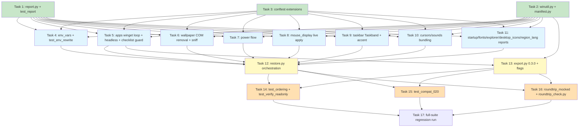

# Implementation Plan — Backend Round-Trip Hardening

Feature: `backend-roundtrip-hardening` | Snapshot format 0.2.0 → 0.3.0
Sources: `.claude/specs/backend-roundtrip-hardening/requirements.md` (Req 1–15), `.claude/specs/backend-roundtrip-hardening/design.md` (D1–D10).

Execution phases (tasks within a phase are safe to run in PARALLEL by different agents; a phase starts only when the previous phase is complete):

- **Phase A — Foundations (parallel):** 1, 2, 3
- **Phase B — Module hardening (parallel, requires Phase A):** 4, 5, 6, 7, 8, 9, 10, 11
- **Phase C — CLI orchestration (parallel with each other, requires Phase B):** 12, 13
- **Phase D — Cross-cutting tests & harness (parallel, requires Phase C):** 14, 15, 16
- **Phase E — Regression gate (sequential, last):** 17

File-conflict rules for parallel agents: only Task 3 and Task 6 edit `tests/conftest.py` (Task 6 depends on Task 3, so never concurrent). Only Task 5 and Task 13 edit `tests/test_headless_export.py` (Task 13 depends on Task 5). No two tasks in the same phase edit the same file otherwise.

---

## Phase A — Foundations

- [x] 1. Create `modules/report.py` (Report builder + aggregation) with unit tests
  - Create `modules/report.py` implementing the `Report` class exactly per design Components: `__init__(module, phase)`, `add(name, status, detail=None)`, sugar methods `add_matched`/`add_failed`/`add_skipped`, `require_explorer_restart()`, `skip_all(reason) -> dict`, `finalize() -> dict`; item dicts carry `name`, `status`, `detail`, and optional `expected`/`actual` (verify phase). `finalize()` applies the D1 aggregation rule (failed+matched → partial; failed only → failed; matched present, no failed → matched; skipped only → skipped; empty → skipped with builder reason).
  - Implement module-level pure functions `aggregate_status(items) -> str` and `worst_exit_code(reports) -> int` (0 iff no report has status `failed`).
  - Report dicts must be plain JSON-serializable dicts; restore-phase reports include `explorer_restart_required: bool`.
  - Create `tests/test_report.py`: aggregation truth table for all status combinations, `skip_all`/empty-report behavior, `worst_exit_code` over mixed report dicts; hypothesis property test that `aggregate_status` is total over arbitrary item lists, order-independent, and returns `failed`/`partial` iff a failed item exists.
  - Depends on: nothing. Parallel with Tasks 2, 3.
  - _Requirements: 7.1, 7.3, 7.4, 7.5_  _Design: D1_

- [x] 2. Create `modules/winutil.py` and `modules/manifest.py` (shared helpers + canonical module order)
  - Create `modules/winutil.py` with: `restart_explorer() -> bool` (move the taskkill/Popen logic from `modules/taskbar.py:_restart_explorer`; do not delete taskbar's inline call yet — Task 9 rewires it), `is_admin() -> bool` (move from `modules/power.py:_is_admin`; keep a thin alias in power.py until Task 7 rewires callers), `sniff_image_type(path) -> str | None` reading the first 16 bytes (`FF D8 FF` → `jpg`, `89 50 4E 47 0D 0A 1A 0A` → `png`, `42 4D` → `bmp`, `47 49 46 38` → `gif`, else None), `sha256_file(path) -> str`, and HKCU-only `read_reg_value(path, name) -> tuple | None` / `write_reg_value(path, name, value, reg_type)` (raises OSError on failure).
  - Create `modules/manifest.py` with `MODULE_NAMES` in exactly the D2 order: `env_vars, region_lang, apps, wallpaper, mouse_display, cursors, sound_scheme, power, fonts, explorer, desktop_icons, startup, taskbar` (apps before startup/taskbar; taskbar last).
  - Create `tests/test_wallpaper_sniff.py` with the `sniff_image_type` magic-byte table only (jpg/png/bmp/gif/unknown/extensionless `TranscodedWallpaper`-style names, short files) plus `sha256_file` sanity — Task 6 extends this file with wallpaper-module tests (sequential, no conflict).
  - Stdlib only — no comtypes import anywhere (Req 15.3).
  - Depends on: nothing. Parallel with Tasks 1, 3.
  - _Requirements: 2.5, 5.2, 6.1, 15.2, 15.3_  _Design: D2, D4, Components (winutil)_

- [x] 3. Extend test fixtures in `tests/conftest.py`
  - `FakeWinReg`: add constants `REG_BINARY = 3`, `REG_EXPAND_SZ = 2`; add `CreateKey(hive, path)` (no-op returning a `FakeRegistryKey`); add `EnumValue(key, i)` replaying from the existing `values` map filtered by `(key.hive, key.path)` (raise OSError past the end). Keep the `writes` tuple format `(hive, path, name, reserved, reg_type, value)` unchanged so existing tests keep passing. Mirror the new names in `_build_winreg_module`.
  - `FakeSubprocess`: add a `script(matcher, result)` convenience that composes into `run_side_effect` for scripting winget/powercfg command sequences (first matching matcher wins; default `FakeSubprocessResult(returncode=0)`).
  - Add new helpers: `stage_snapshot_json(dir, version, modules)`, `make_winsnap_zip(tmp_path, ..., member_names=None)` (supports injecting hostile member names for zip-slip tests), `stage_v020_snapshot(...)` producing a full 0.2.0-shape snapshot (flat env_vars map, taskbar without `pins`/`taskband`/accent fields, wallpaper without `style`/`tile`/`sha256`, mouse_display with `display`/`cursor_scheme`).
  - Do NOT remove `FakeDesktopWallpaper`/`make_fake_desktop_wallpaper` here — Task 6 removes them together with the test that uses them, keeping the suite green between tasks.
  - Add a smoke test (e.g. extend `tests/test_scaffolding_smoke.py`) exercising `EnumValue`, `CreateKey`, and the zip helper.
  - Depends on: nothing. Parallel with Tasks 1, 2.
  - _Requirements: 15.4_  _Design: Testing Strategy (fixture extensions)_

## Phase B — Module hardening (all depend on Tasks 1–3; parallel with each other)

- [x] 4. Harden `modules/env_vars.py`: denylist, profile rewrite, PATH pre-passes, verify
  - Add `RESTORE_DENYLIST` frozenset and `_is_denylisted(name)` (denylist names plus `startswith("ONEDRIVE")`, case-insensitive) exactly per D5.
  - Add pure function `rewrite_profile_paths(value, source_profile, target_profile) -> tuple[str, bool]`: case-insensitive replacement of `source_profile` at path boundaries (followed by `\`, `;`, quote, or end-of-string) with `%USERPROFILE%`; no-op when source and target profiles match after `rstrip("\\")`/lower.
  - Change `export()` to return the 0.3.0 wrapped shape `{"source_profile": os.environ.get("USERPROFILE",""), "vars": {...}}`; change `restore()`/`verify()` to sniff the shape via the `"vars"` key, deriving `source_profile` from the captured `USERPROFILE` var for 0.2.0 snapshots (underivable → skip rewrite step, record skipped item).
  - Rewire `restore()` to build and return a `report.Report`: denylisted vars → skipped items with `"machine-specific (denylist)"` and **no write**; non-denylisted values run through `rewrite_profile_paths` before `_write`; REG_SZ values that were rewritten are written as REG_EXPAND_SZ; `_write` failures become failed items (keep the print). PATH: rewrite incoming entries, drop entries whose `os.path.expandvars`-expanded directory does not exist (skipped item `"PATH entry dropped, directory missing: <entry>"`), then existing `_merge_path`; never rewrite/drop existing target entries. Keep `_broadcast_settings_change()`.
  - Add `verify(data, snapshot_dir) -> dict` (read-only): expected value = same rewrite of snapshot value; compare against live `HKCU\Environment` via `EnumValue` reads; denylisted vars → skipped; PATH verifies as superset check (every kept incoming entry present in live PATH).
  - Create `tests/test_env_rewrite.py` per Testing Strategy: hypothesis properties for `rewrite_profile_paths` (idempotent, same-profile no-op, boundary-safe — `C:\Users\alice2` untouched when source is `C:\Users\alice`); denylist skip asserts `fake_winreg.writes` contains no write for each denylisted name and `OneDrive*` variants; REG_SZ→REG_EXPAND_SZ promotion; PATH merge preserves target entries and drops missing dirs as skipped items; 0.2.0 flat-shape restore works without KeyError.
  - _Requirements: 4.1, 4.2, 4.3, 4.4, 4.5, 14.2, 14.4, 15.1_  _Design: D5, Process 3_

- [x] 5. Harden `modules/apps.py` (per-package winget loop, export honesty) and `modules/checklist.py` (TTY guard, headless selection)
- [x] 5.1 Rewrite `apps.restore` as per-package install loop; fix export honesty
  - `restore()`: first `shutil.which("winget")` — absent → `report.skip_all("winget not found on target")` (manual list still printed), no exception (Req 3.1). Then per package in `data["winget"]`: run `winget install --id <PackageIdentifier> --exact --accept-package-agreements --accept-source-agreements --disable-interactivity` with `capture_output=True, text=True` and **no `timeout` kwarg** (Req 3.2). Classify per the D3 table using named module constants `WINGET_ALREADY_INSTALLED = -1978335135` and `WINGET_NO_PACKAGE_FOUND = -1978335212` with stdout-substring fallbacks ("already installed", "No package found"): rc 0 → matched "installed"; already-installed → matched; unavailable → skipped "unavailable"; else failed with returncode + stderr tail. Always continue to the next package (Req 3.4). Manual apps → skipped items `"manual install required, url=…"`. Return `report.finalize()`. Delete the `winget import` batch call and its `timeout=600`.
  - `_export_winget`: return `(packages, error_msg | None)` with `timeout=120`; on TimeoutExpired/FileNotFoundError/nonzero exit/JSONDecodeError set an explicit error message and print a WARNING; `export()` stores `"winget_export_error": None | "<msg>"` in its result (Req 3.5).
  - `_write_filtered_winget_export`: replace the hardcoded `"CreationDate": "2024-01-01..."` with `datetime.now().astimezone().isoformat()` (Req 3.6).
  - Add `apps.verify(data, snapshot_dir)`: winget absent → skipped; per package `winget list --id <id> --exact --disable-interactivity` (rc 0 → matched, else failed); manual apps → skipped "not verifiable programmatically".
  - Create `tests/test_apps_winget.py`: presence-check skip; classification table via `FakeSubprocess.script`; assert no `timeout` kwarg is passed to any `winget install` `subprocess.run` call; continue-past-unavailable; export error surfaced in result + never a silent `[]`; `CreationDate` parseable and ≈ now; verify classification.
  - _Requirements: 3.1, 3.2, 3.3, 3.4, 3.5, 3.6, 7.1_  _Design: D3, Process 2_
- [x] 5.2 Headless selection plumbing in `apps.export` and TTY guard in `checklist.run`
  - Extend `apps.export` signature to `export(snapshot_dir, show_all=False, selection="interactive", selection_file=None)`: `"all"` selects every discovered winget + manual app without importing checklist; `"file"` loads `{"winget": [...], "manual": [...]}` from `selection_file`, matches ids/names against discovered lists, and records unmatched entries as a warnings list in the export result; `"interactive"` keeps the exact current sequence `from modules import checklist; checklist.run(winget_apps, manual_only)` (attribute lookup at call time so the GUI monkey-patch at gui.py:1228 keeps working; `gui.py` is NOT modified).
  - Add the TTY guard at the top of `modules/checklist.py:run` (before any `msvcrt` use): `if not sys.stdin.isatty(): raise RuntimeError("Interactive app selection requires a terminal. Use --all-apps or --apps-from FILE for headless export.")`.
  - Create `tests/test_headless_export.py` (module-level tests only; Task 13 appends CLI-level tests): `selection="all"`/`"file"` never touch checklist (monkeypatch `modules.checklist.run` to raise if called); interactive default still calls `checklist.run`; `checklist.run` raises off-TTY (patch `sys.stdin.isatty` → False); a replaced `checklist.run` (GUI simulation) bypasses the guard entirely.
  - _Requirements: 8.1, 8.2, 8.3, 8.4, 8.5, 15.1, 15.6_  _Design: D8_

- [x] 6. Harden `modules/wallpaper.py`: remove COM path, style/tile capture, sniffing, sha256, verify
  - Delete `_apply_wallpaper_per_monitor`, the `comtypes` import, the `GetSystemMetrics(SM_CMONITORS)` monitor branch in `restore()`, and the `SM_CMONITORS` constant; `restore()` always uses the `SystemParametersInfoW` path (Req 5.5 option b — no fallback path remains, satisfying 5.6 by removal).
  - `export()`: additionally read `WallpaperStyle` and `TileWallpaper` (REG_SZ) from `HKCU\Control Panel\Desktop`; when the source file's extension is not in `{.jpg,.jpeg,.png,.bmp,.gif}` use `winutil.sniff_image_type` to pick the bundled extension, unknown → bundle as `wallpaper.img` with `"image_format": "unknown"`; compute `winutil.sha256_file` of the bundled file. New shape: `{"enabled", "filename", "original_path", "style", "tile", "image_format", "sha256"}`.
  - `restore()`: return a `Report` with items for file copy, style write, tile write, SPI apply, in that order — copy to `~/Pictures/WinSnap/`, write `WallpaperStyle`/`TileWallpaper` (missing in snapshot → skipped item "snapshot predates style capture"), then `SPI_SETDESKWALLPAPER` with `SPIF_UPDATEINIFILE | SPIF_SENDCHANGE`; SPI returning 0 → failed item; `image_format == "unknown"` → apply anyway with a recorded warning/skipped item (Req 5.3).
  - Add `verify(data, snapshot_dir)`: re-read `Wallpaper`/`WallpaperStyle`/`TileWallpaper`; matched when the registry `Wallpaper` file exists and its sha256 (or the sha256 of `Pictures/WinSnap/<filename>`) equals the snapshot hash; style/tile mismatches → per-item failed with `expected`/`actual`; fields absent (0.2.0) → skipped items.
  - Extend `tests/test_wallpaper_sniff.py` (created in Task 2) with: style/tile capture and restore; write-order assertion (style/tile registry writes precede the SPI call); sha256 verify matched/failed; unknown-format warning path; 0.2.0 snapshot (no style/tile/sha256) restores without error and verifies those aspects as skipped.
  - Rewrite `tests/test_wallpaper_multimon_bug.py` (pins deleted behavior): assert the legacy SPI path is used regardless of monitor count (e.g. `fake_user32.metrics[80] = 3`) and that no comtypes/COM code path exists (`not hasattr(wallpaper, "_apply_wallpaper_per_monitor")`).
  - Remove `FakeDesktopWallpaper`, `fake_desktop_wallpaper`, and `make_fake_desktop_wallpaper` from `tests/conftest.py` in this same task (their only consumer is the test rewritten above). Depends on Task 3 (conftest edits are sequential).
  - _Requirements: 5.1, 5.2, 5.3, 5.4, 5.5, 5.6, 5.7, 14.2, 15.3_  _Design: D4_

- [x] 7. Harden `modules/power.py`: admin gate, corrected import flow, verify
  - `restore()`: first check `winutil.is_admin()` — not admin → return `report.skip_all("requires elevation — run restore.py as Administrator")` before any powercfg call (Req 6.1). Then implement exactly the design flow: `powercfg /import <file> <original_guid>` (capture stdout+stderr); rc 0 → activate original GUID; else if original GUID appears in `powercfg /list` output → treat as already-present, activate it with item "plan already present, activating existing" (Req 6.3); else retry `powercfg /import <file>` without GUID and parse the assigned GUID from the **successful** output; all imports failed → failed report containing both commands' stdout/stderr (Req 6.4). Finish with `powercfg /setactive <target_guid>` (nonzero → failed item with output). **Delete** the existing parse-GUID-from-failed-import branch in `restore()` (power.py:104–111).
  - Rewire `export()`/`restore()` to use `winutil.is_admin` and remove the local `_is_admin` (or keep it as a one-line delegate).
  - Add `verify(data, snapshot_dir)` (read-only): non-elevated → skipped (per Req 6.5 / design D6, "skipped (non-elevated)" is an explicit verify outcome); else run `powercfg /getactivescheme` and compare its GUID-or-name against the snapshot's intended plan (`data["guid"]`/`data["name"]`) → matched/failed.
  - Create `tests/test_power_flow.py`: non-admin skip with no powercfg `run_calls`; import-ok path; guid-already-exists path; reimport-assigns-new-guid path; all-fail path with both outputs captured in the report; regression: a failed import whose stdout contains a GUID-looking string must NOT be activated (dead branch gone); verify matched/failed via scripted `/getactivescheme` output.
  - _Requirements: 6.1, 6.2, 6.3, 6.4, 6.5, 15.2_  _Design: Components (power restore flow)_

- [x] 8. Harden `modules/mouse_display.py`: remove fake DPI/cursor_scheme, capture thresholds, live SPI apply, verify
  - `export()`: remove the `"display"` block (`LogPixels`, `DpiScaling`) and the `"cursor_scheme"` read; add `threshold1`/`threshold2` under `"mouse"` from `Control Panel\Mouse` values `MouseThreshold1`/`MouseThreshold2` (Req 11.1, 11.2, 12.4).
  - `restore()`: return a `Report`; ignore `display`/`cursor_scheme` keys in old snapshots gracefully, adding a skipped item "DPI not covered" (Req 11.3); remove the `LogPixels` write; for `SPI_SETMOUSE` use the **captured** threshold values, never hardcoded 6/10; after each registry write make the matching SPI call with `SPIF_UPDATEINIFILE | SPIF_SENDCHANGE` per the design table: `SPI_SETMOUSESPEED` (0x0071), `SPI_SETMOUSE` (0x0004), `SPI_SETDOUBLECLICKTIME` (0x0020), `SPI_SETKEYBOARDDELAY` (0x0017), `SPI_SETKEYBOARDSPEED` (0x000B); SPI failure → registry write stands, failed live-apply item with "logoff may be required" (Req 12.5); `_write_reg_value` failures become failed items.
  - Add `verify(data, snapshot_dir)`: re-read the Mouse/Keyboard/Desktop registry values against the snapshot; use `SPI_GETMOUSESPEED` where available; absent old fields → skipped.
  - Scrub the module docstring of DPI/display claims (Req 11.4).
  - Create `tests/test_mouse_live_apply.py`: SPI call table via `FakeUser32.get_spi_calls_for`; captured thresholds propagated (no 6/10 anywhere — including when acceleration is on); DPI fields absent from a fresh export; old snapshot with `display`/`cursor_scheme` restores without error and reports "DPI not covered" skipped; SPI failure path records failed item while the registry write remains.
  - Check `tests/test_mouse_accel_bug.py`: if it pins the 6/10 hardcode or `LogPixels` behavior, update it to the new contract in this task.
  - _Requirements: 11.1, 11.2, 11.3, 11.4, 12.1, 12.2, 12.3, 12.4, 12.5, 12.6, 14.2_  _Design: Per-module table (mouse_display), SPI table_

- [x] 9. Harden `modules/taskbar.py`: Taskband blobs, accent palette, restart flag, verify
  - `export()`: keep copying `.lnk` files to `taskbar_pins/`, additionally record `"pins": [<filename>...]`; read `Favorites`/`FavoritesResolve` (REG_BINARY) from `HKCU\Software\Microsoft\Windows\CurrentVersion\Explorer\Taskband` and store base64-encoded as `"taskband": {"favorites": "<b64>", "favorites_resolve": "<b64>"}` (missing → `"taskband": None` with a printed note). Extend `_read_theme_settings` with `AccentPalette` (REG_BINARY → base64 as `accent_palette`), `AccentColorMenu`, `StartColorMenu` from `HKCU\...\Explorer\Accent` (Req 9.1).
  - `restore()`: return a `Report`. Order: per-file `.lnk` copies (each an item; convert `_copy_pins_tolerant` prints into items), then Taskband blob writes via `winreg.CreateKey` + `SetValueEx(..., REG_BINARY, base64.b64decode(...))` — a write failure records a failed item so the category becomes partial/failed, never success (Req 1.4); `taskband` absent (0.2.0) → `.lnk` only + skipped item "pin state: snapshot predates Taskband capture" (Req 1.5). Write theme values incl. the new Accent key values when present; absent (0.2.0) → skipped item "accent palette: snapshot predates capture" (Req 9.3). `_write_theme_settings` failures become failed items.
  - Add module flag `INLINE_EXPLORER_RESTART = True`; `restore()` calls `winutil.restart_explorer()` only when the flag is True (legacy/GUI default preserved — gui.py:1477 calls `taskbar.restore` directly); when False (set by restore.py, Task 12) it instead sets `explorer_restart_required` on the report. Delete the local `_restart_explorer` in favor of `winutil.restart_explorer`.
  - Add `verify(data, snapshot_dir)`: re-read both Taskband REG_BINARY values and compare byte-for-byte against decoded snapshot blobs; compare live `.lnk` filename set in `TASKBAR_PINS_DIR` against `"pins"`; theme + accent values as additional items (`AccentPalette` byte-for-byte after base64 decode, Req 9.4); 0.2.0 snapshot without `taskband`/`pins`/accent → those aspects skipped (Req 1.6, 14.4). Add the honest docstring caveat that Explorer may rewrite the blobs on restart (surfaces as verify partial).
  - Create `tests/test_taskband.py`: b64 round trip of REG_BINARY writes (exact bytes in `fake_winreg.writes`); 0.2.0 snapshot → lnk-only + skipped pin-state item; blob write failure → partial; `INLINE_EXPLORER_RESTART=False` → no taskkill in `fake_subprocess.run_calls` and `explorer_restart_required=True`; True (default) → restart happens; verify byte comparison matched/failed; accent capture/restore/verify incl. byte-for-byte `AccentPalette`.
  - _Requirements: 1.1, 1.2, 1.3, 1.4, 1.5, 1.6, 9.1, 9.2, 9.3, 9.4, 14.2, 15.6_  _Design: D2 (flag), D6_

- [x] 10. Bundle custom cursor and sound files in `modules/cursors.py` and `modules/sound_scheme.py`
  - `cursors.export`: for each cursor role value pointing outside `%SystemRoot%\Cursors`, copy the file into `<snapshot_dir>/cursors/` and record `"bundled": {role: {"filename": "cursors/<f>", "original_path": ..., "missing": bool}}` (source file absent → `missing: true`, nothing copied) (Req 10.1, 10.4). Keep the existing `cursors` map verbatim for 0.2.0 readers.
  - `sound_scheme.export`: same for event `.wav` values outside `%SystemRoot%\Media` into `<snapshot_dir>/media/` under `"bundled": {"App/Event": {...}}` (Req 10.2).
  - `cursors.restore` / `sound_scheme.restore`: return `Report`s; when an entry has a bundled file, copy it to `%LOCALAPPDATA%\WinSnap\cursors\` / `%LOCALAPPDATA%\WinSnap\media\` and write the **rewritten** target path into the registry instead of the source path (Req 10.3); `missing: true` entries → skipped item with reason, no dangling path written (Req 10.4); no `bundled` key (0.2.0) → current verbatim behavior plus a skipped item "bundled files: snapshot predates bundling"; per-value write failures become failed items.
  - Add `verify(data, snapshot_dir)` to both: every restored registry path (after `expandvars`) points at an existing file; cursors additionally checks `Scheme`/scheme values; sound_scheme checks scheme name and each event `.Current` value (Req 10.5). Absent aspects → skipped.
  - Create `tests/test_bundled_files.py` (new file — design's Testing Strategy mandates new-behavior coverage): export bundles only non-default-dir files; missing-at-export recorded and skipped at restore; restore rewrites registry values to `%LOCALAPPDATA%\WinSnap\...` paths (assert via `fake_winreg.writes` + `tmp_path`-patched LOCALAPPDATA); 0.2.0 snapshot without `bundled` restores as before; verify existing/missing file paths → matched/failed.
  - _Requirements: 10.1, 10.2, 10.3, 10.4, 10.5, 14.2, 15.1_  _Design: Per-module table (cursors/sound_scheme), Data Models (bundled, stable locations)_

- [x] 11. Convert remaining modules to report-returning restore + add verify: `startup`, `fonts`, `explorer`, `desktop_icons`, `region_lang`
  - `modules/startup.py`: `restore()` returns a `Report`; each Run entry skipped by `_binary_in_command_exists` becomes a skipped item **including the command path** (Req 2.4); written entries and placed shortcuts are matched items; failures are failed items. `verify()`: Run values match snapshot values; shortcut files exist in the Startup folder.
  - `modules/fonts.py`: per-font items (copy + register); `verify()`: font file exists in the user fonts dir and registry value present; live `AddFontResourceW` session state → skipped item "live font load not verifiable" (Req 7.6).
  - `modules/explorer.py`: per-value items; report sets `explorer_restart_required`; `verify()` re-reads the 7 DWORDs with expected/actual.
  - `modules/desktop_icons.py`: per-CLSID items; `explorer_restart_required`; `verify()` re-reads CLSID DWORDs treating a missing value as the 0 default.
  - `modules/region_lang.py`: per-value items; `verify()` re-reads intl + Preload values.
  - Create `tests/test_module_reports.py`: startup skipped-entry items carry the command path; each of the five modules returns a well-formed finalized report from `restore()`; each `verify()` returns matched on identical fake-registry state and failed/skipped on divergence/absence.
  - _Requirements: 2.3, 2.4, 7.1, 7.4, 7.6, 15.1_  _Design: D1, Per-module table_

## Phase C — CLI orchestration (requires all of Phase B)

- [ ] 12. Rewrite `restore.py` orchestration: safe extraction, ordering, verify, reporting, exit codes
  - Add `class ZipSlipError(Exception)` (carries `members: list[str]`) and `class SnapshotLayoutError(Exception)`; implement `safe_extract(zf, dest)` per D9 (collect every member whose resolved path escapes `dest` via `is_relative_to`; any → raise listing all offenders; else `extractall`) and `find_snapshot_dir(tmp_dir)` (`tmp_dir/snapshot.json` first, then each immediate subdirectory; none → raise). Replace `zf.extractall(tmp_dir)` and the `extracted_dirs[0]` pick in `main()`; ZipSlipError → print rejected members, exit 1; SnapshotLayoutError → clear error, cleanup, exit 1 (Req 13.1, 13.2, 13.4).
  - Rebuild `ALL_MODULES` from the manifest: `[(name, importlib.import_module(f"modules.{name}")) for name in manifest.MODULE_NAMES]`, replacing the hand-written list — keep the public name and `(key, module)` tuple shape for gui.py:1470 (Req 2.1, 2.5, 15.6).
  - Implement `run_modules(modules_to_run, modules_data, snapshot_dir, *, dry_run)` → `{name: restore_report}`: sets `taskbar.INLINE_EXPLORER_RESTART = False` (restored in a `finally`); catches per-module exceptions into synthesized `{"status": "failed", "items": [], "reason": str(exc)}`; a module returning `None` → `skipped: "module returned no report"` (never success). After the loop, if any report has `explorer_restart_required`, call `winutil.restart_explorer()` exactly once — after all restores, before verification (Req 1.3, 2.2).
  - Implement `run_verify(...)` → `{name: verify_report}`: `getattr(mod, "verify", None)`; missing → `skipped: "verification not implemented"`; runs only under the new `--verify` flag; `--dry-run` bypasses both restore and verify (Req 7.2, 7.6).
  - Implement `print_summary(restore_reports, verify_reports)` (per-category table: restore status, verify status, item counts; per-item lines for partial/failed categories) and `write_report_json(path, ...)` writing `{"snapshot_format", "restore": {...}, "verify": {...}, "exit_code"}` under the new `--report-json FILE` flag. `main()` ends with `sys.exit(report.worst_exit_code(...))` — 0 only if no category failed in either phase; the unconditional "Restore completed successfully!" banner is removed (Req 7.3, 7.4, 7.5). Keep exit 2 for the newer-major refusal (existing `_check_format_version`, Req 14.3) and exit 1 for missing file/invalid archive.
  - Update `_summarize` for the changed env_vars shape (`data.get("vars", data)`), so `--dry-run` counts remain correct.
  - Create `tests/test_restore_hygiene.py`: zip-slip members (`../evil`, absolute path, drive-letter) → refusal listing every offender; `find_snapshot_dir` flat / nested / missing cases; well-formed archive regression (identical extraction result); exit-code matrix (all matched → 0, any failed → 1, newer major → 2) driven via `restore.main()` with monkeypatched `sys.argv` and the Task 3 zip/snapshot helpers; `--report-json` file structure; exactly-once restart ordering (restart after last restore, before first verify — record call order via monkeypatched `winutil.restart_explorer` and module stubs).
  - Update `tests/test_integration_restore.py::test_all_modules_order_unchanged` (line ~475): it pins the old order that Req 2 intentionally changes — rewrite it to assert `ALL_MODULES` order equals `manifest.MODULE_NAMES` and that `apps` precedes `startup` and `taskbar`; fix any other assertions in that file that depend on the old order or on `restore()` returning None.
  - Depends on: Tasks 1, 2, 9 (INLINE_EXPLORER_RESTART flag), and all Phase B report-returning modules. Parallel with Task 13 (disjoint files).
  - _Requirements: 1.3, 2.1, 2.2, 2.5, 7.2, 7.3, 7.4, 7.5, 7.6, 13.1, 13.2, 13.4, 14.3, 15.6_  _Design: D1, D2, D9, D10, Process 1_

- [x] 13. Update `export.py`: 0.3.0 version, headless flags, `--force` collision handling, manifest-derived modules
  - Bump `SNAPSHOT_FORMAT_VERSION = "0.3.0"`; keep the names `SNAPSHOT_FORMAT_VERSION` and `create_snapshot_dir` unchanged (gui.py:1238/1219 import them) (Req 14.1, 15.6).
  - Add mutually exclusive flags `--all-apps` / `--apps-from FILE` and plumb them into `_build_modules` as `apps.export(d, show_all=args.show_all, selection=..., selection_file=...)` (Req 8.1, 8.2); no flag keeps the interactive default (Req 8.3). The checklist RuntimeError off-TTY is caught by the existing per-module try/except and recorded as the apps module error (Req 8.5).
  - Add `--force` and `resolve_output_path(output, name, force) -> Path`: when `--name` is given and `<output>/<name>` or `<output>/<name>.winsnap` exists, fail **before any module runs** with a message naming the colliding path, unless `--force` (delete/overwrite both); replace the bare `snapshot_dir.rename(named)` crash path (Req 13.3).
  - Rewrite `_build_modules(args)` to iterate `manifest.MODULE_NAMES` (wrapping only `apps` with kwargs) so the export set cannot drift from the restore set (Req 2.5).
  - Extend `tests/test_headless_export.py` (after Task 5) with CLI-level tests: `export.main()` with `--all-apps`/`--apps-from` never invokes `checklist.run`; `--all-apps` and `--apps-from` are mutually exclusive; `--name` collision fails fast with the path in the message and `--force` overwrites; snapshot.json carries `"0.3.0"`; `_build_modules` names equal `manifest.MODULE_NAMES`.
  - Check `tests/test_snapshot_naming.py` (pins current `--name` rename behavior) and update any assertions broken by the deterministic collision handling.
  - Depends on: Tasks 2 (manifest), 5 (apps kwargs/checklist guard). Parallel with Task 12.
  - _Requirements: 2.5, 8.1, 8.2, 8.3, 8.5, 13.3, 14.1, 15.6_  _Design: D7, D8, D9, Changed CLI surfaces_

## Phase D — Cross-cutting tests and round-trip harness (requires Phase C; parallel with each other)

- [ ] 14. Cross-module invariant tests: `tests/test_ordering.py` and `tests/test_verify_readonly.py`
  - `tests/test_ordering.py`: `manifest.MODULE_NAMES` drives both `restore.ALL_MODULES` (keys equal, in order) and `export._build_modules` (names equal, in order); `MODULE_NAMES.index("apps")` is less than the indexes of `startup` and `taskbar`; an orchestrated restore (stub modules whose reports request a restart) produces exactly one `restart_explorer` call, positioned after all module restores and before any verify call (call sequence recorded via monkeypatched winutil and stub modules).
  - `tests/test_verify_readonly.py`: for every module in `manifest.MODULE_NAMES` that defines `verify`, call it against a populated fake registry/filesystem snapshot and assert `fake_winreg.writes == []` afterward (the D10 read-only invariant); also assert no `subprocess` call other than the allowed read-only ones (`powercfg /getactivescheme`, `winget list`).
  - _Requirements: 2.1, 2.2, 2.5, 7.2, 15.4_  _Design: D2, D10, Testing Strategy_

- [ ] 15. Backward-compatibility suite: `tests/test_compat_020.py`
  - Using `stage_v020_snapshot` (Task 3), build a full 0.2.0-shape snapshot covering: flat env_vars map, taskbar without `pins`/`taskband`/accent fields, wallpaper without `style`/`tile`/`image_format`/`sha256`, mouse_display with legacy `display`/`cursor_scheme`, cursors/sound_scheme without `bundled`.
  - Assert: every module's `restore()` completes without exception and returns a report; every new-field portion is reported `skipped` with a reason (never `matched`, never `failed`) in both restore and verify phases (Req 14.2, 14.4, 1.5, 9.3, 11.3); a snapshot with `snapshot_format_version: "1.0.0"` makes `restore.main()` exit 2 before any module runs (Req 14.3).
  - _Requirements: 1.5, 9.3, 11.3, 14.2, 14.3, 14.4_  _Design: D7_

- [ ] 16. Round-trip harness: `tests/test_roundtrip_mocked.py` and `scripts/roundtrip_check.py`
  - `tests/test_roundtrip_mocked.py` (CI-safe, definition of done in mocked form): drive `export.main()` with `--all-apps --output <tmp> --name rt --force` then `restore.main()` on the produced `.winsnap` with `--verify --report-json <tmp>/report.json`, with winreg/user32/subprocess/TTY fully mocked via conftest fixtures; assert `SystemExit(0)` and, from the structured report JSON, that **every** category in both `restore` and `verify` sections is `matched` or `skipped` with a non-empty reason — never `failed`, and `skipped` never without reason (Req 7.7, 15.5).
  - Create `scripts/roundtrip_check.py` (real-machine executable): run `python export.py --all-apps --output <tmp> --name rt_check --force`, then `python restore.py <tmp>/rt_check.winsnap --verify --report-json <tmp>/rt_report.json`; support a `--skip MODULE...` pass-through (default: skip `apps power` for quick runs, overridable with `--full`); parse the report JSON, assert exit code 0 and every category matched-or-skipped-with-reason; print a single PASS/FAIL line and exit 0/1 accordingly. Coding-only: the script is written and unit-smoke-tested for its report-parsing/verdict function (pure function, testable in `test_roundtrip_mocked.py`); it is not executed against the real machine as part of this plan.
  - _Requirements: 7.5, 7.7, 15.5_  _Design: Testing Strategy (round-trip harness)_

## Phase E — Regression gate (sequential, last)

- [ ] 17. Full-suite regression run and cleanup sweep
  - Run `python -m pytest tests/ -q` from the project root; fix any remaining failures — including the GUI-side tests (`test_export_worker.py`, `test_restore_worker.py`, `test_pre_start_guards.py`, etc.) that exercise `restore.ALL_MODULES`, `export.SNAPSHOT_FORMAT_VERSION`, `_build_modules`, or module `restore()` return values — without modifying `gui.py` (Req 15.4, 15.6).
  - Sweep for leftovers: no `comtypes` references anywhere (Req 15.3); no module docstring claims DPI restore (Req 11.4); grep confirms all registry writes are HKCU-only (powercfg excepted) (Req 15.2); `modules.checklist.run` is still a plain module attribute (patchable) (Req 8.4).
  - Contract sweep (code/grep assertions, not manual QA): confirm `git diff --stat gui.py` is empty — `gui.py` has zero diff (explicit scope constraint, Req 15.6); grep-verify no module signature drifted from `export(snapshot_dir) -> dict` / `restore(data, snapshot_dir) -> dict` / `verify(data, snapshot_dir) -> dict` (apps' keyword-only additions excepted) (Req 15.1).
  - Confirm `tests/test_wallpaper_multimon_bug.py` and `tests/test_integration_restore.py` reflect the new contracts (updated in Tasks 6 and 12).
  - Depends on: all previous tasks.
  - _Requirements: 15.1, 15.2, 15.3, 15.4, 15.6, 11.4, 8.4_  _Design: Testing Strategy_

---

## Tasks Dependency Diagram

Green = Phase A (parallel), blue = Phase B (parallel), yellow = Phase C (parallel pair), orange = Phase D (parallel), Task 17 sequential last.
