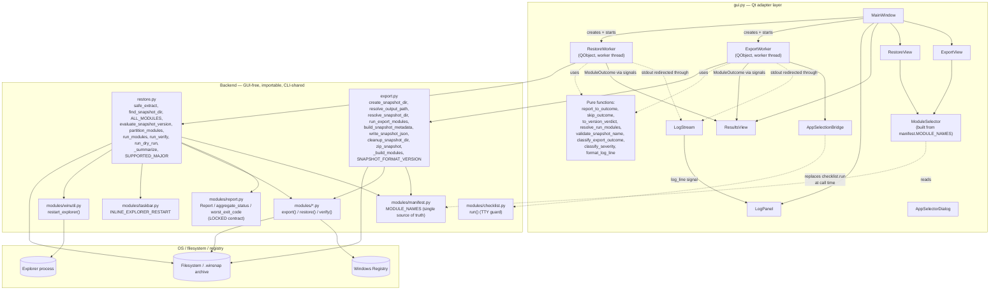
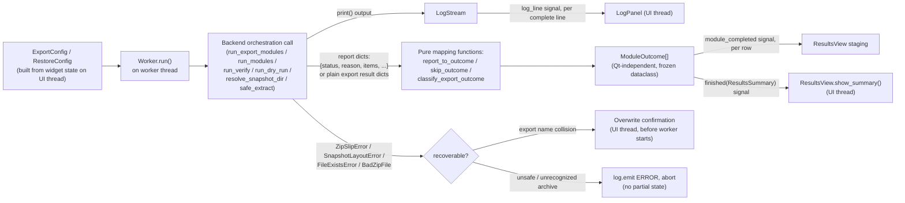
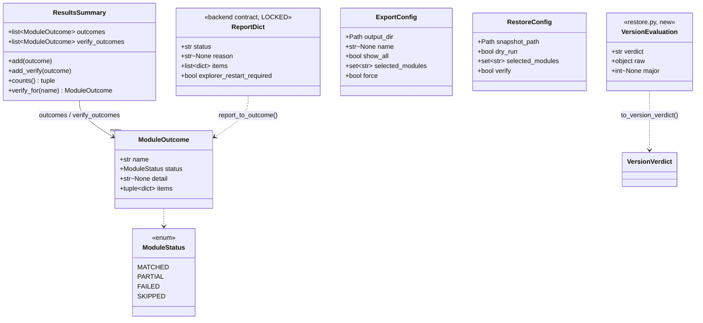
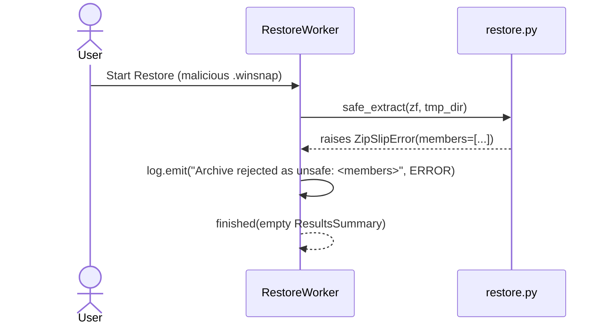
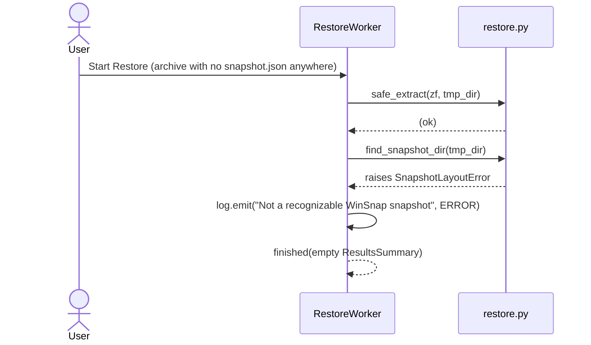
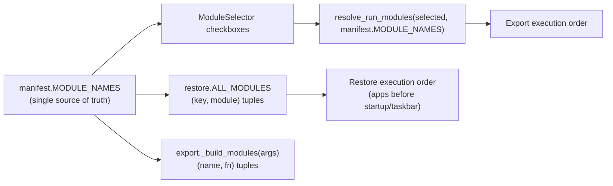

# Design Document

## Overview

`backend-roundtrip-hardening` changed what `export.py`, `restore.py`, and `modules/*` mean by "success": modules now return structured report dicts instead of raising, `restore.py` gained safe extraction, snapshot-dir discovery, a deferred single Explorer restart, and a version fallback chain, and `modules/manifest.py` became the single ordered source of module names. `gui.py` predates all of this. It carries its own module loop, its own ordering constants, its own version check, its own `extractall`, and an exception-based outcome classifier that treats "did not raise" as "succeeded" — so a module that returns `{"status": "failed"}` is displayed as a pass.

This design makes `gui.py` an honest, thin Qt adapter over the hardened backend. The rule that resolves every design choice below is:

> **If the CLI already has a function for a decision, the GUI calls that function. The GUI never re-derives a decision that importable backend code already makes.**

Where the backend does not yet expose a piece of logic the GUI needs (the version-acceptance decision, snapshot metadata construction, the dry-run summarization loop, the module-run/skip partition), it is extracted from the CLI's existing inline code into a small importable function, with CLI-observable behavior (stdout text, exit codes, `snapshot.json` shape) preserved exactly. Nothing about the module contract, report shape, or worker-thread structure changes.

Requirements addressed: R1–R11 (full traceability table at the end of this document).

## Architecture

### System Architecture Diagram



There is exactly one path from the GUI into orchestration logic (extraction, ordering, version evaluation, the module run/verify loop, output-path collision handling, zip creation) and it is the same path the CLI uses. (Requirements: 2.1, 2.6, 4.1, 4.3, 5.1, 7.3, 11.1)

`modules/manifest.py` is imported at `gui.py` module scope (it is pure data — no `winreg`, no side effects), exactly as `restore.py` already imports it. `export`, `restore`, and `modules.checklist` continue to be imported lazily inside worker methods, preserving the existing gui.py pattern of not paying the cost (or risk) of importing every `winreg`-touching module at GUI startup — `restore.ALL_MODULES` is built eagerly at `restore.py` import time by importing every module in the manifest.

### Data Flow Diagram



Everything left of the "Pure mapping functions" box runs on the worker thread; everything that touches a `QWidget` runs on the UI thread, reached only via signal/slot delivery. (Requirements: 11.4, 11.7)

## Components and Interfaces

### Backend refactors (single source of truth)

Every refactor below is additive, keeps existing public names/shapes intact, and is required to leave CLI-observable behavior (stdout text, exit codes, `snapshot.json` shape) byte-identical — verified explicitly in Testing Strategy by running the CLI's existing integration tests unmodified against the refactored code, plus golden-output tests for the two extracted print paths.

#### `restore.py`

| New surface | Signature | Replaces GUI's re-implementation of | Req |
|---|---|---|---|
| `VersionEvaluation` | `@dataclass(frozen=True)` with fields `verdict: str` (`"compatible"\|"incompatible"\|"unparseable"`), `raw: object` (original type preserved — see note below), `major: int \| None` | — (new value type) | 7.1 |
| `evaluate_snapshot_version` | `(snapshot: dict) -> VersionEvaluation` | `gui.evaluate_version` (removed) | 7.1, 7.2, 7.3 |
| `_check_format_version` (refactored, not new) | `(snapshot: dict) -> bool` | — (CLI-only; now a thin print+bool wrapper around `evaluate_snapshot_version`, output byte-identical) | 7.3, 11.1 |
| `partition_modules` | `(modules_to_run: list[tuple[str, module]], modules_data: dict) -> tuple[list[tuple[str, module]], dict[str, str]]` | The membership check the GUI would otherwise re-derive for its skip rows | 2.2, 2.6 |
| `run_dry_run` | `(modules_to_run: list[tuple[str, module]], modules_data: dict) -> dict[str, dict]` | The inline "not found / export error / `_summarize`" loop in `main()`'s `--dry-run` branch | 2.6, 8.8 |

```python
# restore.py

@dataclass(frozen=True)
class VersionEvaluation:
    verdict: str        # "compatible" | "incompatible" | "unparseable"
    raw: object          # value after the fallback chain, in its ORIGINAL
                         # type (not stringified) -- see note below
    major: int | None    # parsed MAJOR, or None if unparseable

def evaluate_snapshot_version(snapshot: dict) -> VersionEvaluation:
    """Pure, print-free version-acceptance decision -- single source of
    truth for restore.py's own _check_format_version and for the GUI
    (Req 7.1, 7.2, 7.3). Fallback chain identical to the pre-refactor
    _check_format_version: snapshot_format_version, then winsnap_version,
    then "0.1.0"."""
    raw = (snapshot.get("snapshot_format_version")
           or snapshot.get("winsnap_version")
           or "0.1.0")
    try:
        major = int(str(raw).split(".")[0])
    except (ValueError, IndexError):
        return VersionEvaluation("unparseable", raw, None)
    if major > SUPPORTED_MAJOR:
        return VersionEvaluation("incompatible", raw, major)
    return VersionEvaluation("compatible", raw, major)


def _check_format_version(snapshot: dict) -> bool:
    """CLI wrapper: same two diagnostic lines, same bool, now derived from
    evaluate_snapshot_version instead of re-implementing the fallback
    chain (Req 11.1: byte-identical CLI output)."""
    ev = evaluate_snapshot_version(snapshot)
    if ev.verdict == "unparseable":
        print(f"  WARNING: unrecognized version format {ev.raw!r}, "
              f"attempting restore anyway.")
        return True
    if ev.verdict == "incompatible":
        print(f"  ERROR: snapshot format v{ev.raw} is newer than this "
              f"restorer supports (v{SUPPORTED_MAJOR}.x). Update WinSnap and try again.")
        return False
    return True


def partition_modules(modules_to_run: list, modules_data: dict) -> tuple[list, dict]:
    """Pure classification of modules_to_run into (attemptable, skipped),
    where skipped maps key -> reason code ("not_found_in_snapshot" |
    "export_error"). This mirrors the membership check inline in
    run_modules's loop (which is deliberately NOT modified -- see the risk
    note below) and replaces the copy in main()'s dry-run loop and the one
    the GUI would otherwise re-derive (Req 2.2). A parity test in Testing
    Strategy guards partition_modules against ever drifting from
    run_modules's inline check."""
    attemptable = []
    skipped: dict[str, str] = {}
    for key, mod in modules_to_run:
        if key not in modules_data:
            skipped[key] = "not_found_in_snapshot"
            continue
        data = modules_data[key]
        if isinstance(data, dict) and "error" in data:
            skipped[key] = "export_error"
            continue
        attemptable.append((key, mod))
    return attemptable, skipped


_DRY_RUN_SKIP_MESSAGES = {
    "not_found_in_snapshot": "Not found in snapshot. Skipping.",
    "export_error": "Was not captured (export error). Skipping.",
}

def run_dry_run(modules_to_run: list, modules_data: dict) -> dict:
    """Extracted verbatim from main()'s --dry-run loop (Req 8.8): prints
    the identical lines, in the identical order, and additionally returns
    {key: {"would_restore": bool, "summary": str | None,
    "skip_reason": str | None}} so a structured caller (the GUI) does not
    have to scrape stdout to know what would have happened."""
    _, skipped = partition_modules(modules_to_run, modules_data)
    result: dict = {}
    for key, mod in modules_to_run:
        if key in skipped:
            print(f"[{key}] {_DRY_RUN_SKIP_MESSAGES[skipped[key]]}")
            result[key] = {"would_restore": False, "summary": None,
                            "skip_reason": skipped[key]}
            continue
        summary = _summarize(key, modules_data[key])
        print(f"[{key}] {summary}")
        result[key] = {"would_restore": True, "summary": summary,
                        "skip_reason": None}
    return result
```

**Note on `VersionEvaluation.raw`'s type (repr-parity edge case):** the pre-refactor `_check_format_version` applies `{raw!r}` to the *original* value pulled from the snapshot dict — which, for a malformed snapshot, can be a non-string JSON value (a number, for instance). Keeping `raw` untyped/unconverted, rather than eagerly doing `str(raw)`, preserves `repr()` byte-parity with the original CLI warning line for that edge case (`repr(123)` is `123`; `repr(str(123))` would be `'123'`). MAJOR parsing still goes through `str(raw)` internally, matching the original's `int(str(raw).split(".")[0])`. The GUI only interpolates `ev.raw` into its own log wording, so the original type is harmless there.

`main()`'s dry-run block becomes `run_dry_run(modules_to_run, modules_data)` followed by the unchanged cleanup/exit lines. `run_modules`, `run_verify`, `safe_extract`, `find_snapshot_dir`, `ALL_MODULES`, `_summarize`, and `SUPPORTED_MAJOR` are **not modified** — they are already correct and already reusable; touching `run_modules`'s internals (including its inline skip check) is unnecessary risk the GUI does not need to take on. The GUI gets its skip-row data from `partition_modules` directly, called independently of `run_modules`; the deliberate cost is that the two-line membership check now exists in two places inside `restore.py`, guarded by the parity test described in Testing Strategy — a cheaper price than reopening the hardened `run_modules`.

#### `export.py`

| New surface | Signature | Replaces GUI's re-implementation of | Req |
|---|---|---|---|
| `build_snapshot_metadata` | `(modules_attempted: list[str]) -> dict` | The inline `snapshot = {...}` literal duplicated in `gui.py` | 2.6, 10.1, 10.2 |
| `resolve_snapshot_dir` | `(output: Path, name: str \| None, force: bool) -> Path` | `gui.py`'s dead `default_snapshot_name()` + the bare `snapshot_dir.rename(named)` | 2.6, 9.1, 9.4, 10.1 |
| `run_export_modules` | `(modules_to_run: list[tuple[str, Callable]], snapshot_dir: Path) -> dict` | `gui.py`'s own per-module `importlib.import_module` + try/except loop | 2.6, 10.1, 10.3 |
| `write_snapshot_json` *(optional DRY, low risk)* | `(snapshot_dir: Path, snapshot: dict) -> Path` | `gui.py`'s inline `json_path.write_text(...)` | 10.2 |
| `cleanup_snapshot_dir` *(optional DRY, low risk)* | `(snapshot_dir: Path) -> None` | `gui.py`'s duplicated `_force_remove`/`rmtree` chmod-retry logic | 10.1 |

```python
# export.py

def build_snapshot_metadata(modules_attempted: list[str]) -> dict:
    """The exact metadata dict main() builds, with modules_attempted
    supplied by the caller instead of assigned after the fact -- same
    keys, same values, same insertion order, so a GUI-written and a
    CLI-written snapshot.json cannot structurally drift (Req 10.2)."""
    return {
        "winsnap_version": SNAPSHOT_FORMAT_VERSION,
        "snapshot_format_version": SNAPSHOT_FORMAT_VERSION,
        "exported_at": datetime.now().isoformat(),
        "exported_on": {
            "user": os.environ.get("USERNAME", ""),
            "machine": os.environ.get("COMPUTERNAME", ""),
        },
        "modules": {},
        "modules_attempted": modules_attempted,
    }


def resolve_snapshot_dir(output: Path, name: str | None, force: bool) -> Path:
    """Encapsulates main()'s "where does this export write to" branch
    (Req 9.1, 9.4): a named export goes through resolve_output_path's
    collision handling; an unnamed export uses create_snapshot_dir's
    timestamp naming -- the single place either decision is made. Raises
    FileExistsError (propagated from resolve_output_path) when name
    collides and force is False."""
    if name:
        target = resolve_output_path(output, name, force)
        output.mkdir(parents=True, exist_ok=True)
        target.mkdir(parents=True, exist_ok=True)
        return target
    return create_snapshot_dir(output)


def run_export_modules(modules_to_run: list, snapshot_dir: Path) -> dict:
    """The exact loop body of main()'s module-running section, extracted
    for reuse (Req 10.1, 10.3): a module raising is recorded as
    {"error": str(e)} and the loop continues -- never aborts the batch."""
    results: dict = {}
    for name, fn in modules_to_run:
        print(f"\n[{name}] Running...")
        try:
            results[name] = fn(snapshot_dir)
        except Exception as e:
            print(f"[{name}] ERROR: {e}")
            results[name] = {"error": str(e)}
    return results


def write_snapshot_json(snapshot_dir: Path, snapshot: dict) -> Path:
    json_path = snapshot_dir / "snapshot.json"
    json_path.write_text(
        json.dumps(snapshot, indent=2, ensure_ascii=False), encoding="utf-8"
    )
    return json_path


def cleanup_snapshot_dir(snapshot_dir: Path) -> None:
    """The chmod-retry rmtree already used by main() (Req 10.1)."""
    def _force_remove(func, path, _):
        import stat
        os.chmod(path, stat.S_IWRITE)
        func(path)
    try:
        shutil.rmtree(snapshot_dir, onexc=_force_remove)
    except Exception as e:
        print(f"[export] Note: could not fully clean up temp folder: {e}")
        print(f"[export] You can safely delete it manually: {snapshot_dir}")
```

`main()` is reordered (module resolution now happens before metadata construction, so `modules_attempted` can be passed into `build_snapshot_metadata` instead of assigned after) but produces the identical `snapshot.json`, the identical stdout, and the identical exit behavior — verified by running the existing `tests/test_headless_export.py`/`tests/test_roundtrip_mocked.py` integration tests unmodified. `create_snapshot_dir`, `resolve_output_path`, `zip_snapshot`, `_build_modules`, and `SNAPSHOT_FORMAT_VERSION` are unchanged and reused as-is.

### `gui.py` components

#### Pure functions (Qt-independent, headless-testable — Req 11.3)

| Function | Change | Req |
|---|---|---|
| `classify_severity`, `format_log_line` | unchanged | — |
| `validate_snapshot_name`, `format_version_info_message`, `record_app_selection` | unchanged | — |
| `resolve_run_modules(selected, order)` | unchanged signature; every caller now passes `manifest.MODULE_NAMES` as `order` instead of `MODULES_EXPORT_ORDER`/`MODULES_RESTORE_ORDER` | 5.1, 5.2 |
| `classify_export_outcome` | unchanged logic; now returns `ModuleStatus.MATCHED` where it previously returned `ModuleStatus.PASSED` (rename, see Data Models) | 1.5 |
| `classify_restore_outcome` | **removed** | 1.2 |
| `report_to_outcome(name, report)` | **new** — maps a restore/verify report dict to a `ModuleOutcome` | 1.1, 1.7, 3.3 |
| `skip_outcome(name, reason_code)` | **new** — maps a `partition_modules`/deselection reason code to a `ModuleOutcome(SKIPPED, ...)` with CLI-matching wording | 1.3, 2.2 |
| `evaluate_version` / `VersionVerdict` | `evaluate_version` **removed**; `VersionVerdict` enum (`COMPATIBLE`/`INCOMPATIBLE`/`UNPARSEABLE`) kept as a GUI presentation concept, populated by the new `to_version_verdict` | 7.3 |
| `to_version_verdict(evaluation)` | **new** — 3-way mapping from `restore.VersionEvaluation.verdict` to `VersionVerdict` | 7.1, 7.2, 7.3, 11.3 |
| `default_snapshot_name` | **removed** (dead code; `resolve_snapshot_dir(None)` already covers the unnamed case via `create_snapshot_dir`) | 9.4 |
| `MODULES_EXPORT_ORDER`, `MODULES_RESTORE_ORDER` | **removed** — replaced by `from modules import manifest; manifest.MODULE_NAMES` (one order for both flows) | 5.1, 5.3, 5.4 |

```python
_REPORT_SKIP_REASON_TEXT = {
    "not_found_in_snapshot": "Not found in snapshot",
    "export_error": "Was not captured (export error)",
}

def report_to_outcome(name: str, report: dict) -> "ModuleOutcome":
    """Pure mapping from a restore/verify report dict (modules/report.py's
    locked {status, reason, items, ...} contract) to a ModuleOutcome
    (Req 1.1, 1.7). ModuleStatus's values are the report's status strings
    themselves, so this is a direct lookup, not a hand-maintained table."""
    return ModuleOutcome(
        name=name,
        status=ModuleStatus(report["status"]),
        detail=report.get("reason"),
        items=tuple(report.get("items", [])),
    )


def skip_outcome(name: str, reason_code: str) -> "ModuleOutcome":
    """Pure mapping from a skip reason code -- 'deselected' (a GUI-only
    concept) or one of partition_modules's ('not_found_in_snapshot',
    'export_error') -- to a ModuleOutcome, using the same wording the CLI
    prints for the latter two (Req 1.3, 2.2)."""
    if reason_code == "deselected":
        return ModuleOutcome(name, ModuleStatus.SKIPPED, "Deselected by user")
    return ModuleOutcome(
        name, ModuleStatus.SKIPPED, _REPORT_SKIP_REASON_TEXT[reason_code]
    )


_VERSION_VERDICT_MAP = {
    "compatible": VersionVerdict.COMPATIBLE,
    "incompatible": VersionVerdict.INCOMPATIBLE,
    "unparseable": VersionVerdict.UNPARSEABLE,
}

def to_version_verdict(evaluation) -> VersionVerdict:
    """Pure mapping from restore.VersionEvaluation to the GUI's
    presentation-only VersionVerdict enum (Req 7.1, 7.2, 7.3)."""
    return _VERSION_VERDICT_MAP[evaluation.verdict]
```

#### Qt widgets

| Widget | Change | Req |
|---|---|---|
| `ModuleSelector` | Built from `manifest.MODULE_NAMES` instead of `MODULES_EXPORT_ORDER`; the same instance shape now serves both `ExportView` and `RestoreView` since there is only one canonical order | 5.1, 5.3 |
| `ExportView` | Unchanged controls; `build_config()` still returns an `ExportConfig` (now with a `force` field defaulting to `False`, set by `MainWindow` on collision confirmation, never by the view itself) | 9.3 |
| `RestoreView` | **New**: a "Verify after restore" checkbox, default unchecked, bound into `RestoreConfig.verify`; wired so checking "Dry run" disables (and unchecks) "Verify", matching the CLI's dry-run-bypasses-verify semantics | 3.1, 3.5 |
| `ResultsView` | Extended: four status groups (Matched / Partial / Failed / Skipped — Req 8.1 requires the literal report vocabulary, so the former "Passed" group is relabeled "Matched"); each row shows the module's `reason` when present (Req 8.3); rows for modules with `status` `partial` or `failed` render an indented per-item block (`name: status — detail`, plus `expected`/`actual` where present, Req 8.2); rows for a module with a verify outcome append `verify: <status> (<reason>)` alongside the restore status (Req 3.4, 8.4). No other layout change (Req 8.6). | 8.1–8.6 |
| `AppSelectorDialog`, `LogPanel`, `LogStream`, `RunningIndicator`, `AppSelectionBridge` | unchanged | 11.4 |

#### Workers

**`ExportWorker`** — `run()` rewritten as a thin adapter:

```
1. modules_to_run = [(name, fn) for name, fn in export._build_modules(args_ns)
                      if name in config.selected_modules]
   # args_ns = SimpleNamespace(show_all=config.show_all,
   #                            apps_selection="interactive", apps_from=None)
   # order comes from manifest.MODULE_NAMES via _build_modules -- no GUI ordering left.
2. admin check for "power" (GUI-only convenience warning, unchanged).
3. checklist_module.run = bridge.request_app_selection   # unchanged monkeypatch
   try:
4.     snapshot_dir = export.resolve_snapshot_dir(config.output_dir, config.name, config.force)
5.     with contextlib.redirect_stdout(log_stream):
           results = export.run_export_modules(modules_to_run, snapshot_dir)
6.     for name, result in results.items():
           outcome = classify_export_outcome(name, raised=None, result=result)
           summary.add(outcome); module_completed.emit(outcome)
7.     snapshot = export.build_snapshot_metadata(
           modules_attempted=[name for name, _ in modules_to_run])
       snapshot["modules"] = results
       export.write_snapshot_json(snapshot_dir, snapshot)
       zip_path = export.zip_snapshot(snapshot_dir)
       export.cleanup_snapshot_dir(snapshot_dir)
       log.emit(f"Snapshot saved to: {zip_path}", SUCCESS)
   except FileExistsError as e:      # defense in depth; MainWindow already pre-checks
       log.emit(str(e), ERROR)
   finally:
8.     checklist_module.run = original_checklist_run
```

Steps 4–7 replace the previous hand-rolled `importlib.import_module` loop, the bare `snapshot_dir.rename(named)`, and the inline metadata dict literal (Req 2.6, 9.1, 9.4, 10.1, 10.2, 10.3). A module that raised inside `run_export_modules` surfaces as `{"error": str(e)}`, which `classify_export_outcome` already maps to `FAILED` with the same text as the old `raised=e` path — no outcome semantics change. Per-module `module_completed` signals are now emitted from the returned batch (step 6) rather than interleaved mid-loop — the batch call under one `LogStream` capture is what "call backend orchestration under `LogStream` capture, emit report dicts out via signals" (Req 11.4) literally describes, and `MainWindow._on_module_completed` was already a no-op, so there is no behavior loss for users; live progress is still visible because module `print()` output continues to stream through `LogStream` during the batch call.

**`RestoreWorker`** — `_do_restore()` rewritten as a thin adapter:

```
1. zf = zipfile.ZipFile(snapshot_path)                # unchanged pre-flight open
   tmp_dir = mkdtemp()
   try:
2.     restore.safe_extract(zf, tmp_dir)               # was: zf.extractall(tmp_dir)
3.     snapshot_dir = restore.find_snapshot_dir(tmp_dir)  # was: first extracted subdir
       snapshot = json.loads((snapshot_dir / "snapshot.json").read_text())
4.     ev = restore.evaluate_snapshot_version(snapshot)
       verdict = to_version_verdict(ev)
       log.emit(format_version_info_message(snapshot), SUCCESS)
       if verdict == VersionVerdict.INCOMPATIBLE: log ERROR; return
       if verdict == VersionVerdict.UNPARSEABLE: log WARNING
5.     modules_to_run = [(k, m) for k, m in restore.ALL_MODULES
                          if k in config.selected_modules]
       modules_data = snapshot.get("modules", {})
       _, skipped = restore.partition_modules(modules_to_run, modules_data)

       for key in manifest.MODULE_NAMES:                # emit a row for every module
           if key not in config.selected_modules:
               summary.add(skip_outcome(key, "deselected")); emit

6.     if config.dry_run:
           with redirect_stdout(log_stream):
               dry = restore.run_dry_run(modules_to_run, modules_data)
           for key, mod in modules_to_run:
               if key in skipped: outcome = skip_outcome(key, skipped[key])
               else: outcome = ModuleOutcome(key, ModuleStatus.MATCHED, dry[key]["summary"])
               summary.add(outcome); emit
           return                                        # bypasses verify, like the CLI

7.     with redirect_stdout(log_stream):
           reports = restore.run_modules(modules_to_run, modules_data, snapshot_dir, dry_run=False)
       for key, mod in modules_to_run:
           if key in skipped: outcome = skip_outcome(key, skipped[key])
           else: outcome = report_to_outcome(key, reports[key])
           summary.add(outcome); emit
       # (key not in skipped => run_modules attempted it => reports[key] exists;
       #  run_modules synthesizes failed/skipped reports for raise/None returns)

8.     if config.verify:
           with redirect_stdout(log_stream):
               verify_reports = restore.run_verify(modules_to_run, modules_data, snapshot_dir)
           for key, verify_report in verify_reports.items():
               summary.add_verify(report_to_outcome(key, verify_report)); emit
   finally:
       shutil.rmtree(tmp_dir, ignore_errors=True)
```

This deletes the old per-module inline `mod.restore(...)` call, the old exception-based `classify_restore_outcome`, and the version-fallback re-implementation; `run_modules` alone gives Req 6's Explorer-restart parity "for free," since the suppression (`taskbar.INLINE_EXPLORER_RESTART = False` in a `finally`) and the single deferred `winutil.restart_explorer()` live entirely inside `run_modules`, unreachable and unre-implementable from `gui.py`.

Because `run_modules` runs as a single call, `module_completed` rows for attempted modules are emitted after the batch returns (as for export above); live per-module progress still reaches the `LogPanel` in real time through `LogStream`, since `run_modules`'s `print()` calls happen synchronously inside the redirected block. This is the honest trade for eliminating a second module-loop implementation — re-implementing the loop to preserve mid-run row granularity would be exactly the duplication this feature exists to remove.

### `MainWindow` changes

- `try_start_export()`: after building `config`, if `config.name` is set, calls `export.resolve_output_path(config.output_dir, config.name, force=False)` synchronously on the UI thread (a cheap filesystem check when `force=False` — it only raises; it does not touch disk on the non-collision path). On `FileExistsError`, shows a `QMessageBox.question` ("A snapshot named '<name>' already exists at <path>. Overwrite it?"). Yes → `config.force = True`, guard passes; No → log the conflict as an error, guard fails (Req 9.2, 9.3). The validated (possibly force-amended) `config` is what `_start_export()` passes to `ExportWorker` — the two methods no longer independently rebuild `ExportConfig` from the view. The worker's own `resolve_snapshot_dir` call is not a duplicate implementation: it is the same importable function invoked twice for two purposes (advisory pre-flight on the UI thread; authoritative resolve-and-possibly-delete on the worker thread).
- `try_start_restore()`: unchanged pre-flight checks (operation-in-progress, Windows-only, file selected/exists, `zf.testzip()` sanity check, at least one module selected) — these are cheap UI-thread guards, not orchestration logic, and stay as-is.
- Signal wiring, `_on_operation_finished`, `_on_running_changed`, `_on_app_selection_requested`: unchanged. Both workers keep their existing signal signatures (`module_completed = pyqtSignal(ModuleOutcome)`, `finished = pyqtSignal(ResultsSummary)`), so no new cross-thread machinery or slot types are introduced.

## Data Models

### Core Data Structure Definitions

```python
class ModuleStatus(enum.Enum):
    """Outcome status for a module row in the results summary. Values are
    literally the report.py status vocabulary, so report_to_outcome can
    construct one via ModuleStatus(report["status"]) with no translation
    table (Req 1.5)."""
    MATCHED = "matched"
    PARTIAL = "partial"
    FAILED = "failed"
    SKIPPED = "skipped"


class VersionVerdict(enum.Enum):
    """GUI-only presentation wrapper around restore.VersionEvaluation.verdict."""
    COMPATIBLE = "compatible"
    INCOMPATIBLE = "incompatible"
    UNPARSEABLE = "unparseable"


@dataclass(frozen=True)
class ModuleOutcome:
    """The result of running, verifying, or skipping a single module.
    items carries the report's per-item list verbatim (plain dicts, per
    modules/report.py's own "no dataclass" design) so the results view can
    render per-item detail for partial/failed modules (Req 8.2)."""
    name: str
    status: ModuleStatus
    detail: str | None
    items: tuple[dict, ...] = ()


@dataclass
class ResultsSummary:
    """Accumulates restore/export outcomes and, separately, verify
    outcomes, so a module can carry both a restore status and a verify
    status without conflating the two (Req 3.4, 8.4)."""
    outcomes: list[ModuleOutcome] = field(default_factory=list)
    verify_outcomes: list[ModuleOutcome] = field(default_factory=list)

    def add(self, outcome: ModuleOutcome) -> None: ...
    def add_verify(self, outcome: ModuleOutcome) -> None: ...
    def matched(self) -> list[ModuleOutcome]: ...
    def partial(self) -> list[ModuleOutcome]: ...
    def failed(self) -> list[ModuleOutcome]: ...
    def skipped(self) -> list[ModuleOutcome]: ...
    def counts(self) -> tuple[int, int, int, int]: ...   # matched, partial, failed, skipped
    def verify_for(self, name: str) -> ModuleOutcome | None: ...


@dataclass
class ExportConfig:
    output_dir: Path
    name: str | None
    show_all: bool
    selected_modules: set[str]
    force: bool = False        # set by MainWindow on overwrite confirmation


@dataclass
class RestoreConfig:
    snapshot_path: Path
    dry_run: bool
    selected_modules: set[str]
    verify: bool = False       # Req 3.1: defaults to off, matching CLI --verify default
```

When no verify phase ran, `verify_outcomes` is empty and `ResultsView` renders no verify column/suffix at all — no empty or placeholder verify outcomes (Req 3.5).

Report dicts themselves (produced by `modules/*.py` `restore()`/`verify()` and consumed via `report_to_outcome`) are the **locked** contract from `modules/report.py`, reproduced here for reference only — the GUI never constructs or mutates one:

```
{
    "status": "matched" | "partial" | "failed" | "skipped",
    "reason": str | None,
    "items": [
        {"name": str, "status": "matched"|"failed"|"skipped",
         "detail": str | None, "expected": Any | None, "actual": Any | None},
        ...
    ],
    "explorer_restart_required": bool,   # restore-phase reports only
}
```

### Data Model Diagrams



## Business Process

### Process 1: Export with a name collision, then force-overwrite

```mermaid
sequenceDiagram
    actor U as User
    participant MW as MainWindow (UI thread)
    participant EXP as export.py
    participant W as ExportWorker (worker thread)

    U->>MW: Start Export (name="foo")
    MW->>EXP: resolve_output_path(output, "foo", force=False)
    EXP-->>MW: raises FileExistsError
    MW->>U: QMessageBox "foo already exists — overwrite?"
    U-->>MW: Yes
    MW->>MW: config.force = True
    MW->>W: new ExportWorker(config); thread.start()
    W->>EXP: resolve_snapshot_dir(output, "foo", force=True)
    EXP-->>W: snapshot_dir (old contents deleted)
    W->>EXP: _build_modules(args_ns) filtered by selection
    W->>EXP: run_export_modules(modules_to_run, snapshot_dir)  note over W,EXP: under LogStream capture
    EXP-->>W: {name: result_dict, ...}
    W->>EXP: build_snapshot_metadata(modules_attempted)
    W->>EXP: write_snapshot_json(snapshot_dir, snapshot)
    W->>EXP: zip_snapshot(snapshot_dir)
    W->>EXP: cleanup_snapshot_dir(snapshot_dir)
    W-->>MW: finished(ResultsSummary)
    MW->>U: ResultsView.show_summary(...)
```
Requirements: 9.1–9.4, 10.1–10.3

### Process 2: Restore with verify enabled, one module partial

```mermaid
sequenceDiagram
    actor U as User
    participant MW as MainWindow
    participant W as RestoreWorker (worker thread)
    participant RST as restore.py

    U->>MW: Start Restore (verify=true, dry_run=false)
    MW->>W: new RestoreWorker(config); thread.start()
    W->>RST: safe_extract(zf, tmp_dir)
    W->>RST: find_snapshot_dir(tmp_dir)
    W->>RST: evaluate_snapshot_version(snapshot)
    RST-->>W: VersionEvaluation(compatible, ...)
    W->>W: modules_to_run = ALL_MODULES filtered by selection (manifest order)
    W->>RST: partition_modules(modules_to_run, modules_data)
    RST-->>W: (attemptable, skipped)
    W->>RST: run_modules(modules_to_run, modules_data, snapshot_dir, dry_run=False)
    Note over RST: taskbar.INLINE_EXPLORER_RESTART=False during loop;<br/>single winutil.restart_explorer() after, only if requested
    RST-->>W: {key: restore_report, ...}
    W->>W: build restore rows via report_to_outcome / skip_outcome
    W->>RST: run_verify(modules_to_run, modules_data, snapshot_dir)
    RST-->>W: {key: verify_report, ...}
    W->>W: build verify rows via report_to_outcome
    W-->>MW: finished(ResultsSummary)
    MW->>U: ResultsView: "taskbar restore=partial verify=matched" +<br/>per-item detail for the partial module
```
Requirements: 1.1–1.7, 2.1–2.6, 3.1–3.6, 6.1–6.4, 8.1–8.5

### Process 3: Unsafe or malformed archive rejected



Requirements: 4.1–4.5

### Process 4: Module ordering derivation


Adding a module to `MODULE_NAMES` makes it appear, correctly ordered, in the selector and both execution paths with zero `gui.py` changes. Requirements: 5.1–5.4

## Error Handling

| Error | Raised by | Caught in | GUI behavior | Req |
|---|---|---|---|---|
| `ZipSlipError` | `restore.safe_extract` | `RestoreWorker._do_restore` | `log.emit(ERROR)` listing every rejected member; abort, no partial extraction beyond `safe_extract`'s own guarantee | 4.2 |
| `SnapshotLayoutError` | `restore.find_snapshot_dir` | `RestoreWorker._do_restore` | `log.emit(ERROR, "not a recognizable WinSnap snapshot")`; abort, no traceback surfaced as the primary message | 4.5 |
| `zipfile.BadZipFile` / `OSError` opening the archive | `zipfile.ZipFile(...)` | `RestoreWorker._do_restore` (pre-existing) | `log.emit(ERROR)`; abort | (pre-existing, unchanged) |
| `FileExistsError` | `export.resolve_output_path` (via `resolve_snapshot_dir`) | `MainWindow.try_start_export` (primary path, pre-flight); `ExportWorker.run` (defense in depth for a TOCTOU race) | Pre-flight: `QMessageBox` overwrite confirmation, `config.force` set on Yes. Worker-level (should be unreachable in the normal flow): `log.emit(ERROR)`, abort, no module runs | 9.2, 9.3 |
| Module `restore()`/`verify()` raises | any `modules/*.py` | `restore.run_modules` / `run_verify` (already synthesizes `{"status": "failed", "reason": str(e)}`) | GUI performs no new catch — `report_to_outcome` maps the synthesized report like any other; the run continues with remaining modules (Req 1.6) | 1.6, 2.5 |
| Module `restore()` returns `None` | any `modules/*.py` | `restore.run_modules` (already synthesizes `{"status": "skipped", "reason": "module returned no report"}`) | mapped via `report_to_outcome`, same as any skipped report | 2.3 |
| Module `export()` raises | any `modules/*.py` | `export.run_export_modules` (mirrors CLI: records `{"error": str(e)}`, continues) | `classify_export_outcome` → `ModuleStatus.FAILED` | (pre-existing behavior, preserved through the new extraction) |
| Any other exception in `worker.run()` | * | top-level `try/except` in `ExportWorker.run()` / `RestoreWorker.run()` (pre-existing) | `log.emit("Fatal ... error: ...", ERROR)`; `finished` still emitted with whatever partial summary was built, so `running_changed(False)` fires and the UI never stays permanently "busy" | (pre-existing, unchanged) |

General rule embedded throughout: **no backend exception is caught and silently treated as success.** Every catch site either flows into a report/error path the GUI renders honestly, or is a pre-existing, out-of-scope cleanup path left untouched.

## Testing Strategy

All tests remain headless: `QT_QPA_PLATFORM=offscreen`, no real registry access, hypothesis for pure-function properties, `MagicMock`/`monkeypatch` for backend seams — the existing pattern in `tests/`. `conftest.py`'s fixtures are reused as-is; `make_winsnap_zip(..., member_names=[...])` already exists specifically for zip-slip member injection and needs no new fixture work.

### New pure-function unit tests (no `QApplication` needed)

- `report_to_outcome`: all four report statuses, with/without `reason`, with/without `items`, items pass through verbatim; property test that it never raises for any status string produced by `modules.report.aggregate_status`.
- `skip_outcome`: `"deselected"` vs. `partition_modules`'s two reason codes, exact wording match against the CLI's printed skip messages.
- `restore.partition_modules` (property-based, mirrors existing `test_prop_*` style): any combination of presence/export-error across a synthetic `modules_data`; plus the **run_modules parity test** — for arbitrary `modules_data`, the set of keys `run_modules` reports on (with module fns mocked to return a trivial matched report) equals `partition_modules`'s attemptable set, guarding the deliberately duplicated membership check against drift.
- `restore.evaluate_snapshot_version` (property-based, replaces the assumptions in `test_prop_version_verdict.py`): fallback chain (`snapshot_format_version` → `winsnap_version` → `"0.1.0"`), compatible/incompatible/unparseable branches, `major > SUPPORTED_MAJOR` boundary.
- `restore._check_format_version` golden-output test: table test replicating every case the pre-refactor function handles (missing `snapshot_format_version` → falls back to `winsnap_version` → falls back to `"0.1.0"`; unparseable string; **non-string raw value**, asserting the `{raw!r}` warning line is byte-identical thanks to `VersionEvaluation.raw` keeping the original type; MAJOR greater than supported; MAJOR within supported), asserting printed lines and return value are unchanged before/after the refactor — this is what proves Req 11.1 for this specific refactor.
- `to_version_verdict`: the 3-way mapping.
- `export.build_snapshot_metadata`: key set and order match the pre-refactor literal.
- `export.resolve_snapshot_dir`: unnamed → `create_snapshot_dir` path; named/no-collision; named/collision/`force=False` → raises; named/collision/`force=True` → deletes and returns.
- `export.run_export_modules`: one module raising does not stop the remaining modules; return dict shape; printed lines identical to the pre-refactor inline loop.
- `restore.run_dry_run`: skip-reason codes, `_summarize` passthrough, and stdout text equality against the pre-refactor inline loop's output for the same inputs (golden-output test for Req 8.8/11.1).
- `resolve_run_modules` against `manifest.MODULE_NAMES`: apps-before-startup/taskbar regression guard (`MODULE_NAMES.index("apps") < index("startup")` and `< index("taskbar")` — Req 5.2, explicitly required by Req 11.6), preserved after filtering.

### Worker integration tests (existing `SignalCollector` + offscreen `QApplication` pattern)

- `RestoreWorker`: zip-slip rejection (`make_winsnap_zip(member_names=["../evil.txt"])` — refused with no `run_modules` call at all), flat and nested archive layouts (real archives, as `test_restore_worker.py` already builds — both resolve via `find_snapshot_dir` and proceed identically), `SnapshotLayoutError` handling, verify on/off flows (`verify=True` triggers `run_verify` after `run_modules`; `verify=False` triggers no call and `verify_outcomes` stays empty), a `run_modules` return containing `{"status": "failed", ...}` surfaces as `ModuleStatus.FAILED` (the direct regression test for the bug this feature exists to fix — previously: no exception ⇒ shown as passed), a `{"status": "partial", ...}` report renders as a distinct row with item detail, single deferred Explorer restart (mock `winutil.restart_explorer`, assert exactly one call when any module's report sets `explorer_restart_required`, including the `explorer`/`desktop_icons`-without-`taskbar` regression case from Req 6.4), version fallback parity (a snapshot carrying only `winsnap_version` is accepted/refused identically to the CLI — the direct regression test for R7), dry-run × verify (verify never runs when `dry_run=True`).
- `ExportWorker`: collision fail-fast (no module executes when the pre-flight check fails and the user declines — `MainWindow._confirm_overwrite`/`QMessageBox` mocked to return No/Yes), force-overwrite path re-invokes with `force=True` and succeeds, `snapshot.json` metadata produced by the worker is field-for-field identical to metadata produced by calling `build_snapshot_metadata` directly with the same inputs (the direct test for Req 10.2's "cannot structurally drift"), `apps`/`checklist`/`AppSelectionBridge` monkeypatch and `None`-on-cancel handling kept covered by existing tests (mechanism explicitly unchanged, Req 10.4).

### Existing test files requiring rewrite (function/constant removed or reshaped)

Req 11.6's "all existing tests SHALL continue to pass" is read at full-suite granularity after these rewrites land alongside the production change — literally freezing tests that assert on removed functions (`classify_restore_outcome`, `MODULES_RESTORE_ORDER`) would contradict Requirements 1.2/5.1, which mandate those removals. Called out explicitly rather than claiming universal pass-through:

| File | Why |
|---|---|
| `tests/test_prop_restore_outcome.py` | `classify_restore_outcome` removed; rewrite against `report_to_outcome`/`skip_outcome` |
| `tests/test_prop_export_outcome.py` | `classify_export_outcome` return value changes `PASSED` → `MATCHED`; assertions update, function retained |
| `tests/test_prop_version_verdict.py`, `tests/test_prop_version_info_msg.py` | `evaluate_version` removed; rewrite against `restore.evaluate_snapshot_version` + `to_version_verdict` |
| `tests/test_prop_module_resolution.py` | `MODULES_EXPORT_ORDER`/`MODULES_RESTORE_ORDER` removed; rewrite against `manifest.MODULE_NAMES` |
| `tests/test_snapshot_naming.py`, `tests/test_prop_snapshot_name.py` | `default_snapshot_name` removed; repoint at `resolve_snapshot_dir`/`create_snapshot_dir` (`validate_snapshot_name` is distinct, still needed, keeps its tests) |
| `tests/test_restore_worker.py` | monkeypatch targets move from ad hoc `zf.extractall`/loop internals to `restore.safe_extract`/`find_snapshot_dir`/`run_modules`/`run_verify`/`run_dry_run`/`partition_modules` |
| `tests/test_export_worker.py`, `tests/test_export_view.py` | collision/force flow, metadata-builder reuse, `MODULES_EXPORT_ORDER` references |
| `tests/test_results_view.py`, `tests/test_prop_results_summary.py` | four-status grouping, `verify_outcomes`, per-item detail, `passed()` → `matched()` |
| `tests/test_widget_states.py` | `MODULES_EXPORT_ORDER` references → `manifest.MODULE_NAMES` |

Tests expected to pass unmodified (and used as the acceptance bar for "CLI behavior observably unchanged," Req 11.1): `tests/test_headless_export.py`, `tests/test_integration_restore.py`, `tests/test_roundtrip_mocked.py`, `tests/test_restore_hygiene.py`, `tests/test_report.py`, `tests/test_module_reports.py`, `tests/test_ordering.py`, `tests/test_log_panel.py`, `tests/test_log_stream.py`, `tests/test_running_indicator.py`, `tests/test_record_app_selection.py`, `tests/test_prop_app_selection.py`, `tests/test_prop_severity.py`, `tests/test_prop_select_all.py`, `tests/test_pre_start_guards.py`, and the per-module tests (`test_apps_winget.py`, `test_taskband.py`, etc.).

Single-deferred-restart coverage note: the GUI-level test asserts the correct call into `run_modules` is made with the correct arguments and mocks `restart_explorer` around it; `restore.py`'s own existing suite remains the authority on `run_modules`'s internal restart mechanics — duplicating that verification at the GUI layer would itself be a small instance of the anti-pattern this feature removes.

## Traceability

| Req | Design element(s) |
|---|---|
| 1.1–1.7 | `report_to_outcome`, `ModuleStatus` (matched/partial/failed/skipped), `ModuleOutcome.items`, removal of `classify_restore_outcome`, `run_modules`'s exception→failed-report synthesis (reused unchanged) |
| 2.1–2.6 | `RestoreWorker` calling `restore.safe_extract`/`find_snapshot_dir`/`ALL_MODULES`/`run_modules`/`partition_modules`; `restore.py`/`export.py` refactor tables |
| 3.1–3.6 | `RestoreConfig.verify`, RestoreView verify checkbox (dry-run disables it), `run_verify` call + `ResultsSummary.verify_outcomes`, `ResultsView` restore/verify side-by-side rendering, empty `verify_outcomes` ⇒ no verify column (3.5) |
| 4.1–4.5 | `restore.safe_extract`/`find_snapshot_dir` reuse, `ZipSlipError`/`SnapshotLayoutError` handling in Error Handling table, Process 3 |
| 5.1–5.4 | `manifest.MODULE_NAMES` as the single order, removal of `MODULES_EXPORT_ORDER`/`MODULES_RESTORE_ORDER`, `ModuleSelector`, `(key, module)` tuple shape of `ALL_MODULES` consumed unchanged, Process 4 diagram |
| 6.1–6.4 | `run_modules` reuse (suppression + single deferred restart happen entirely inside it, unreachable from `gui.py`) |
| 7.1–7.3 | `restore.VersionEvaluation`/`evaluate_snapshot_version` (raw-type preservation for repr parity), `gui.to_version_verdict`, `_check_format_version` refactored as a thin wrapper + golden-output test |
| 8.1–8.8 | `ModuleStatus` 4-value vocabulary, `ResultsView` groups/reasons/items(+expected/actual)/verify column, `restore._summarize` reuse via `run_dry_run` (8.8), information superset of `print_summary` (8.5) |
| 9.1–9.4 | `export.resolve_output_path`/`resolve_snapshot_dir`, `MainWindow.try_start_export` collision pre-check + `QMessageBox`, `ExportConfig.force`, removal of dead `default_snapshot_name`/bare `.rename()` |
| 10.1–10.4 | `export.build_snapshot_metadata`/`run_export_modules`/`write_snapshot_json`/`cleanup_snapshot_dir`, `_build_modules`/`resolve_output_path`/`zip_snapshot`/`SNAPSHOT_FORMAT_VERSION` reuse, unchanged `AppSelectionBridge`/checklist monkeypatch |
| 11.1–11.7 | Backend refactor tables (behavior-preservation notes + golden-output tests), pure-function tables, unchanged worker-thread/signal architecture (no new signal types), Testing Strategy |
