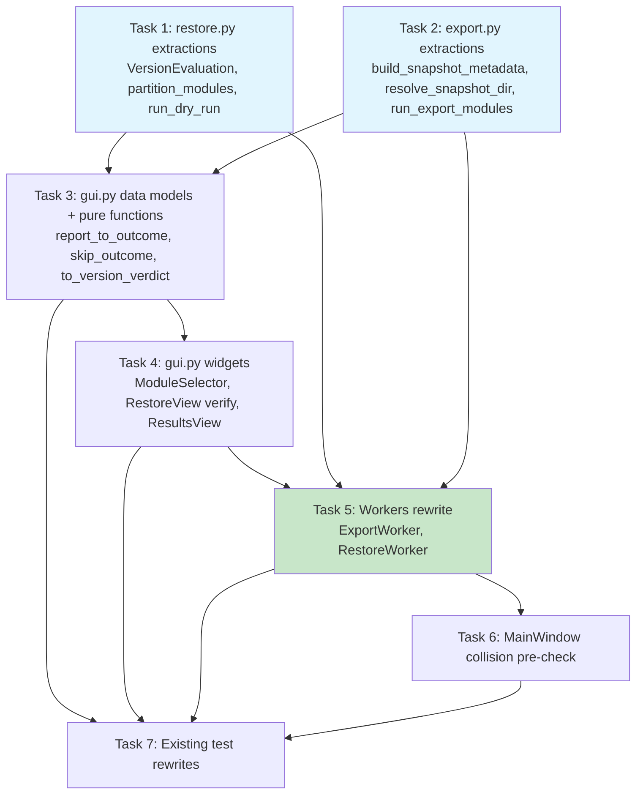

# Implementation Plan

- [x] 1. Extract version-evaluation and dry-run/skip logic in `restore.py`
  - Backend-only groundwork; no GUI changes yet. Every extraction must leave CLI-observable behavior (stdout text, exit codes) byte-identical.
  - _Requirements: 2.6, 7.1, 7.2, 7.3, 11.1_

- [x] 1.1 Add `VersionEvaluation` dataclass and `evaluate_snapshot_version`
  - Add `@dataclass(frozen=True) VersionEvaluation` (`verdict: str`, `raw: object`, `major: int | None`) to `restore.py`.
  - Implement `evaluate_snapshot_version(snapshot: dict) -> VersionEvaluation`, preserving the exact fallback chain (`snapshot_format_version` → `winsnap_version` → `"0.1.0"`) and MAJOR-parsing logic of the current inline check; keep `raw` in its original (unstringified) type.
  - Write property-based unit tests covering the fallback chain and the compatible/incompatible/unparseable branches, including the `major > SUPPORTED_MAJOR` boundary.
  - _Requirements: 7.1, 7.2, 11.3_

- [x] 1.2 Refactor `_check_format_version` into a thin wrapper over `evaluate_snapshot_version`
  - Before changing any code, write a golden-output table test against the CURRENT (pre-refactor) `_check_format_version`, replicating every case it handles (missing `snapshot_format_version` falling back to `winsnap_version` then `"0.1.0"`; unparseable string; non-string `raw` value; MAJOR greater than supported; MAJOR within supported) and capturing its printed lines and return value as the baseline to preserve.
  - Rewrite `_check_format_version` to call `evaluate_snapshot_version` and reproduce the exact two diagnostic print lines and boolean return for each verdict, including the `{raw!r}` warning line for non-string `raw` values.
  - Re-run the golden-output test from the previous step against the refactored function and confirm it still passes unchanged, demonstrating Req 11.1's byte-identical CLI behavior for this refactor.
  - _Requirements: 7.3, 11.1_

- [x] 1.3 Add `partition_modules` and its parity test against `run_modules`
  - Implement `partition_modules(modules_to_run, modules_data) -> (attemptable, skipped)` in `restore.py`, classifying by `"not_found_in_snapshot"` / `"export_error"`, mirroring `run_modules`'s existing inline membership check without modifying `run_modules` itself.
  - Write a property-based parity test: for arbitrary `modules_data` (with module functions mocked to return a trivial matched report), the set of keys `run_modules` actually reports on equals `partition_modules`'s attemptable set.
  - _Requirements: 2.2, 2.6_

- [x] 1.4 Add `run_dry_run` and rewire `main()`'s `--dry-run` branch
  - Before extracting anything, capture the CURRENT (pre-refactor) `main()` `--dry-run` branch's stdout for representative inputs (found module, not-found module, export-error module) as the golden baseline to diff against.
  - Extract `main()`'s dry-run loop into `run_dry_run(modules_to_run, modules_data) -> dict[str, dict]` (`{"would_restore", "summary", "skip_reason"}` per module), printing the identical lines in the identical order, reusing `partition_modules` and the existing `_summarize`.
  - Update `main()`'s `--dry-run` branch to call `run_dry_run` instead of its inline loop.
  - Diff the new implementation's stdout and returned dict against the captured baseline and confirm they match, satisfying Req 11.1's byte-identical CLI behavior requirement.
  - _Requirements: 2.6, 8.8, 11.1_

- [x] 2. Extract snapshot-metadata and module-run pipeline in `export.py`
  - Backend-only groundwork, independent of Task 1. `main()`'s CLI-observable output (`snapshot.json` shape, stdout, exit codes) must remain byte-identical after `main()` is reordered to use these functions.
  - _Requirements: 2.6, 9.1, 9.4, 10.1, 10.2, 10.3, 11.1_

- [x] 2.1 Add `build_snapshot_metadata`
  - Implement `build_snapshot_metadata(modules_attempted: list[str]) -> dict` in `export.py`, producing the exact same keys, values, and insertion order as `main()`'s current inline `snapshot = {...}` literal.
  - Write a unit test asserting key set and order match the pre-refactor literal for representative inputs.
  - _Requirements: 10.1, 10.2_

- [x] 2.2 Add `resolve_snapshot_dir`
  - Implement `resolve_snapshot_dir(output: Path, name: str | None, force: bool) -> Path` in `export.py`: named export delegates to `resolve_output_path` for collision handling (raises `FileExistsError` when colliding and `force=False`); unnamed export delegates to `create_snapshot_dir`.
  - Write unit tests: unnamed path uses `create_snapshot_dir`; named/no-collision; named/collision/`force=False` raises `FileExistsError`; named/collision/`force=True` deletes and returns the target.
  - _Requirements: 9.1, 9.4, 10.1_

- [x] 2.3 Add `run_export_modules`
  - Extract `main()`'s module-running loop into `run_export_modules(modules_to_run, snapshot_dir) -> dict`, preserving the "record `{'error': str(e)}` and continue on raise" behavior.
  - Write a unit test asserting one module raising does not stop the remaining modules, the return dict shape is correct, and printed lines are identical to the pre-refactor inline loop.
  - _Requirements: 10.1, 10.3_

- [x] 2.4 Add `write_snapshot_json` and `cleanup_snapshot_dir` helpers
  - Extract the inline `snapshot.json` write and the chmod-retry `rmtree` cleanup already used by `main()` into `write_snapshot_json(snapshot_dir, snapshot) -> Path` and `cleanup_snapshot_dir(snapshot_dir) -> None`.
  - _Requirements: 10.1_

- [x] 2.5 Reorder `export.py main()` to use the extracted functions
  - Update `main()` so module resolution happens before metadata construction (so `modules_attempted` feeds `build_snapshot_metadata` directly), calling `resolve_snapshot_dir`, `run_export_modules`, `build_snapshot_metadata`, `write_snapshot_json`, and `cleanup_snapshot_dir` in place of the removed inline code; `create_snapshot_dir`, `resolve_output_path`, `zip_snapshot`, `_build_modules`, `SNAPSHOT_FORMAT_VERSION` stay unchanged and are reused as-is.
  - Run `tests/test_headless_export.py` and `tests/test_roundtrip_mocked.py` unmodified and confirm they still pass, as the acceptance bar for byte-identical CLI behavior.
  - _Requirements: 10.1, 10.2, 10.3, 11.1_

- [x] 3. Reshape `gui.py` data models and add report-mapping pure functions
  - Depends on Tasks 1-2 (consumes `restore.VersionEvaluation`/`evaluate_snapshot_version`/`partition_modules`, `export`'s new surfaces). All functions in this task are Qt-independent and unit-testable headless.
  - _Requirements: 1.5, 1.7, 3.3, 5.1, 7.3, 9.3, 11.3_

- [x] 3.1 Extend `ModuleStatus` and reshape `ModuleOutcome`/`ResultsSummary`
  - Extend `ModuleStatus` enum to `MATCHED`/`PARTIAL`/`FAILED`/`SKIPPED` (values equal to `modules/report.py`'s status strings).
  - Add `items: tuple[dict, ...] = ()` to `ModuleOutcome`.
  - Add `verify_outcomes: list[ModuleOutcome]` to `ResultsSummary` plus `add_verify`, `matched`, `partial`, `failed`, `skipped`, `counts`, `verify_for` methods.
  - Add `force: bool = False` to `ExportConfig` and `verify: bool = False` to `RestoreConfig`.
  - Write/update unit tests for `ResultsSummary`'s new grouping and verify-tracking methods.
  - _Requirements: 1.4, 1.5, 3.1_

- [x] 3.2 Implement `report_to_outcome`
  - Add `report_to_outcome(name: str, report: dict) -> ModuleOutcome`, constructing `ModuleStatus(report["status"])` directly with `detail=report.get("reason")` and `items=tuple(report.get("items", []))`.
  - Write unit tests for all four report statuses, with/without `reason`, with/without `items` (verbatim passthrough), plus a property test that it never raises for any status string produced by `modules.report.aggregate_status`.
  - _Requirements: 1.1, 1.3, 1.4, 1.7, 3.3_

- [x] 3.3 Implement `skip_outcome` and remove `classify_restore_outcome`
  - Add `skip_outcome(name: str, reason_code: str) -> ModuleOutcome` mapping `"deselected"` and `partition_modules`'s `"not_found_in_snapshot"`/`"export_error"` codes to `ModuleStatus.SKIPPED` outcomes, with wording matching the CLI's printed skip messages.
  - Remove `classify_restore_outcome` entirely.
  - Write unit tests asserting exact wording match against the CLI's skip messages for each reason code.
  - _Requirements: 1.2, 1.3, 1.6, 2.2_

- [x] 3.4 Update `classify_export_outcome` to the `MATCHED` vocabulary
  - Change `classify_export_outcome`'s success case to return `ModuleStatus.MATCHED` (was `PASSED`); logic otherwise unchanged.
  - _Requirements: 1.5_

- [x] 3.5 Add `to_version_verdict`, keep `VersionVerdict`, remove `evaluate_version`
  - Add `to_version_verdict(evaluation: restore.VersionEvaluation) -> VersionVerdict` as a 3-way mapping (`compatible`/`incompatible`/`unparseable`).
  - Remove `gui.evaluate_version` entirely; keep the `VersionVerdict` enum as the GUI-side presentation type.
  - Write unit tests for the 3-way mapping.
  - _Requirements: 7.1, 7.2, 7.3, 11.3_

- [x] 3.6 Replace hardcoded module ordering with manifest-derived ordering
  - Import `modules.manifest` at `gui.py` module scope.
  - Remove `MODULES_EXPORT_ORDER`, `MODULES_RESTORE_ORDER`, and `default_snapshot_name`.
  - Update every caller of `resolve_run_modules` to pass `manifest.MODULE_NAMES` as the order argument.
  - Write a unit test asserting `manifest.MODULE_NAMES.index("apps") < index("startup")` and `< index("taskbar")`, preserved after `resolve_run_modules` filtering (apps-before-startup/taskbar regression guard).
  - _Requirements: 5.1, 5.2, 5.3, 5.4, 9.4_

- [x] 4. Update `gui.py` Qt widgets for manifest ordering and honest reporting
  - Depends on Task 3 (consumes the reshaped data models and `manifest.MODULE_NAMES`).
  - _Requirements: 3.1, 3.5, 5.1, 5.3, 8.1, 8.2, 8.3, 8.4, 8.6_

- [x] 4.1 Build `ModuleSelector` from `manifest.MODULE_NAMES`
  - Change `ModuleSelector` construction to derive its checkbox list from `manifest.MODULE_NAMES` instead of the removed `MODULES_EXPORT_ORDER`; use the same instance/shape for both `ExportView` and `RestoreView`.
  - Update `tests/test_widget_states.py` references from `MODULES_EXPORT_ORDER` to `manifest.MODULE_NAMES`.
  - _Requirements: 5.1, 5.3_

- [x] 4.2 Add "Verify after restore" checkbox to `RestoreView`
  - Add a checkbox, default unchecked, bound into `RestoreConfig.verify`.
  - Wire it so checking "Dry run" disables and unchecks "Verify" (matching the CLI's dry-run-bypasses-verify semantics).
  - _Requirements: 3.1, 3.5_

- [x] 4.3 Extend `ResultsView` for four-status grouping, reasons, per-item detail, and verify results
  - Relabel the former "Passed" group to "Matched" and add a "Partial" group, so all four report statuses (`matched`, `partial`, `failed`, `skipped`) are visually distinct.
  - Render each row's `reason` when present.
  - For rows with status `partial` or `failed`, render an indented per-item block showing each item's `name`, `status`, `detail`, and `expected`/`actual` where present.
  - For rows with a verify outcome, append `verify: <status> (<reason>)` alongside the restore status; when `verify_outcomes` is empty, render no verify column/suffix at all.
  - Keep all other layout unchanged.
  - _Requirements: 3.4, 3.5, 8.1, 8.2, 8.3, 8.4, 8.6_

- [x] 5. Rewrite `ExportWorker` and `RestoreWorker` as thin backend adapters
  - The integration point: wires the pure functions (Task 3) and widgets (Task 4) to the refactored backend (Tasks 1-2). Depends on Tasks 1-4.
  - _Requirements: 1.6, 2.1, 2.2, 2.3, 2.4, 2.5, 4.1, 4.2, 4.3, 4.4, 4.5, 6.1, 6.2, 6.3, 6.4, 9.3, 10.1, 10.2, 10.3, 10.4, 11.4, 11.5, 11.7_

- [x] 5.1 Rewrite `ExportWorker.run()`
  - Replace the hand-rolled `importlib.import_module` loop, the bare `snapshot_dir.rename(named)`, and the inline metadata dict literal with: `export.resolve_snapshot_dir`, `export.run_export_modules` (under `LogStream` stdout capture), `classify_export_outcome` per result, `export.build_snapshot_metadata`, `export.write_snapshot_json`, `export.zip_snapshot`, `export.cleanup_snapshot_dir`.
  - Keep the existing `checklist_module.run = bridge.request_app_selection` monkeypatch (and its restoration in `finally`), the admin-check warning, and `AppSelectionBridge`'s `None`-on-cancel handling unchanged.
  - Keep module resolution order sourced from `export._build_modules` (manifest order), filtered by `config.selected_modules`.
  - _Requirements: 2.5, 2.6, 9.3, 10.1, 10.2, 10.3, 10.4, 11.4, 11.5_

- [x] 5.2 Rewrite `RestoreWorker._do_restore()`
  - Replace `zf.extractall` with `restore.safe_extract`; replace "first extracted subdir" with `restore.find_snapshot_dir`.
  - Replace the inline version-fallback check with `restore.evaluate_snapshot_version` + `to_version_verdict`.
  - Build `modules_to_run` from `restore.ALL_MODULES` filtered by `config.selected_modules` (manifest order); call `restore.partition_modules` for skip rows; emit a `skip_outcome(key, "deselected")` row for every manifest module not selected.
  - For dry runs, call `restore.run_dry_run` under `LogStream` capture and map results via `skip_outcome`/`ModuleOutcome(..., MATCHED, ...)`; return before verify (dry-run bypasses verify).
  - For real restores, call `restore.run_modules` under `LogStream` capture and map each result via `skip_outcome` (for partitioned-out keys) or `report_to_outcome` (for attempted keys); continue the run when a module raises or returns `None`, per `run_modules`'s existing synthesis.
  - When `config.verify` is set, call `restore.run_verify` under `LogStream` capture and populate `summary.verify_outcomes` via `report_to_outcome`.
  - Remove the old per-module inline `mod.restore(...)` call and the removed `classify_restore_outcome`/version-fallback re-implementation.
  - _Requirements: 1.1, 1.3, 1.4, 1.6, 2.1, 2.2, 2.3, 2.4, 3.2, 3.3, 3.4, 3.5, 4.1, 4.3, 4.4, 6.1, 6.2, 6.3, 6.4, 7.1, 7.2, 8.5, 8.8, 11.4, 11.5, 11.7_

- [x] 5.3 Add worker integration tests for the rewritten adapters
  - `RestoreWorker`: zip-slip rejection via `make_winsnap_zip(member_names=["../evil.txt"])` (refused, no `run_modules` call); flat and nested archive layouts; `SnapshotLayoutError` handling; verify on/off flows; a `{"status": "failed", ...}` report surfaces as `ModuleStatus.FAILED` (direct regression test for the "no exception ⇒ shown as passed" bug); a `{"status": "partial", ...}` report renders as a distinct row with item detail; exactly one `winutil.restart_explorer()` call when any report sets `explorer_restart_required` (including `explorer`/`desktop_icons`-without-`taskbar`); version-fallback parity for a snapshot carrying only `winsnap_version`; verify never runs when `dry_run=True`.
  - `ExportWorker`: collision fail-fast (no module executes when the pre-flight check fails and the user declines); force-overwrite path re-invokes with `force=True` and succeeds; worker-produced `snapshot.json` metadata is field-for-field identical to calling `build_snapshot_metadata` directly with the same inputs; `apps`/`checklist`/`AppSelectionBridge` monkeypatch and `None`-on-cancel handling remain covered.
  - _Requirements: 1.6, 2.3, 3.2, 3.5, 4.2, 4.4, 4.5, 6.2, 6.4, 7.2, 9.3, 9.4, 10.2, 10.4, 11.6_

- [x] 6. Wire `MainWindow` export collision pre-check
  - Depends on Task 5 (needs `ExportConfig.force` and the rewritten `ExportWorker`).
  - _Requirements: 9.1, 9.2, 9.3_

- [x] 6.1 Add collision pre-check to `try_start_export()`
  - After building `config`, when `config.name` is set, call `export.resolve_output_path(config.output_dir, config.name, force=False)` synchronously on the UI thread.
  - On `FileExistsError`, show a `QMessageBox.question` overwrite confirmation; on Yes set `config.force = True` and proceed; on No log the conflict as an error and abort the start (no module runs).
  - Ensure the validated (possibly force-amended) `config` is the single object passed through to `ExportWorker`, so `try_start_export()` and `_start_export()` no longer independently rebuild `ExportConfig` from the view.
  - Write/update unit tests covering both the Yes and No confirmation paths.
  - _Requirements: 9.1, 9.2, 9.3_

- [x] 7. Rewrite existing tests broken by removed/reshaped functions and constants
  - Depends on Tasks 3-6, since these tests assert on the pre-refactor API surface.
  - _Requirements: 11.6_

- [x] 7.1 Rewrite `tests/test_prop_restore_outcome.py`
  - Replace `classify_restore_outcome`-based assertions with `report_to_outcome`/`skip_outcome`-based assertions.
  - _Requirements: 1.1, 1.2, 1.3, 11.6_

- [x] 7.2 Update `tests/test_prop_export_outcome.py`
  - Update assertions for `classify_export_outcome`'s `PASSED` → `MATCHED` rename; function itself is retained.
  - _Requirements: 1.5, 11.6_

- [x] 7.3 Rewrite `tests/test_prop_version_verdict.py` and `tests/test_prop_version_info_msg.py`
  - Replace `evaluate_version`-based assertions with `restore.evaluate_snapshot_version` + `to_version_verdict`-based assertions.
  - _Requirements: 7.1, 7.2, 7.3, 11.6_

- [x] 7.4 Rewrite `tests/test_prop_module_resolution.py`
  - Replace `MODULES_EXPORT_ORDER`/`MODULES_RESTORE_ORDER`-based assertions with `manifest.MODULE_NAMES`-based assertions.
  - _Requirements: 5.1, 5.2, 11.6_

- [x] 7.5 Repoint `tests/test_snapshot_naming.py` and `tests/test_prop_snapshot_name.py`
  - Replace `default_snapshot_name`-based assertions with `resolve_snapshot_dir`/`create_snapshot_dir`-based assertions; leave `validate_snapshot_name` tests untouched.
  - _Requirements: 9.4, 11.6_

- [x] 7.6 Rewrite `tests/test_restore_worker.py` monkeypatch targets
  - Move monkeypatch targets from ad hoc `zf.extractall`/loop internals to `restore.safe_extract`/`find_snapshot_dir`/`run_modules`/`run_verify`/`run_dry_run`/`partition_modules`.
  - _Requirements: 2.1, 2.2, 2.3, 4.1, 4.3, 11.6_

- [x] 7.7 Update `tests/test_export_worker.py` and `tests/test_export_view.py`
  - Update for the collision/force flow, metadata-builder reuse, and removed `MODULES_EXPORT_ORDER` references.
  - _Requirements: 9.1, 9.2, 9.3, 10.2, 11.6_

- [x] 7.8 Update `tests/test_results_view.py` and `tests/test_prop_results_summary.py`
  - Update for four-status grouping, `verify_outcomes`, per-item detail, and the `passed()` → `matched()` rename.
  - _Requirements: 3.4, 8.1, 8.2, 8.4, 11.6_

- [x] 7.9 Update `tests/test_widget_states.py`
  - Replace `MODULES_EXPORT_ORDER` references with `manifest.MODULE_NAMES`.
  - _Requirements: 5.1, 11.6_

## Tasks Dependency Diagram

