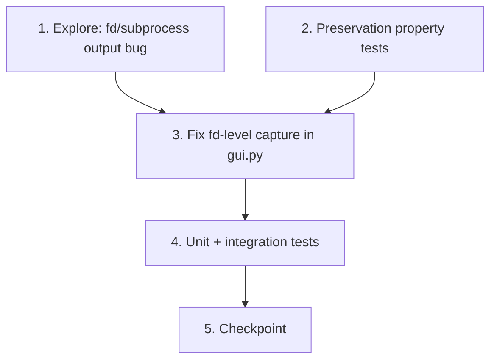

# Implementation Plan

## Overview

This plan fixes the GUI subprocess-output capture defect (child-process output,
e.g. `winget import` during restore, never reaching the Log Panel) using the
exploratory bug-condition methodology. The exploration test is written and run on
the UNFIXED code first and MUST FAIL — that failure is the proof that
object-level `contextlib.redirect_stdout` cannot capture fd-level/child-process
output. The preservation tests are written and run on the UNFIXED code and MUST
PASS, capturing the baseline behavior to keep (`print()` capture, severity
classification, headless fallback, clean teardown). Only then is the fd-level
capture fix applied in the GUI Worker layer and re-verified.

Qt objects run headless with `QT_QPA_PLATFORM=offscreen` and a module-level
`QApplication.instance() or QApplication(sys.argv)`, mirroring
`tests/test_log_stream.py`. Child-process output is simulated at the OS boundary
(writing to fd 1, or via the `FakeSubprocess` fixture / a short `python -c`
child) rather than invoking real `winget`, so the suite runs on the
`windows-latest` CI runners (Python 3.11/3.12).

The Property numbers below match the Correctness Properties in `design.md`:
Property 1 = child-process output reaches the Log Panel (Bug Condition);
Property 2 = preservation of all non-buggy behavior.

**Do NOT implement the fix until the exploration test (task 1) has been written,
run on the UNFIXED code, and observed to FAIL.**

## Tasks

- [ ] 1. Write the subprocess/fd-output bug condition exploration test
  - **Property 1: Bug Condition** - Child-process output reaches the Log Panel
  - **CRITICAL**: This test MUST FAIL on unfixed code - failure confirms the bug exists
  - **DO NOT attempt to fix the test or the code when it fails**
  - **NOTE**: This test encodes the expected behavior - it will validate the fix when it passes after implementation
  - **GOAL**: Surface the counterexample that output written to the OS stdout file descriptor (fd 1) by a child process during an Operation is NOT routed to the Log Panel when only `contextlib.redirect_stdout(log_stream)` is in effect
  - **Write this property-based test BEFORE implementing the fix**, using `hypothesis` with `@settings(max_examples=...)` >= 50, mirroring `tests/test_winget_schema_bug.py` / `tests/test_mouse_accel_bug.py` / `tests/test_wallpaper_multimon_bug.py`
  - Tag the test with a comment referencing the Bug Condition / Property from design: `isBugCondition(X) = producesFdLevelOutput(X) AND NOT outputCapturedByPython(X)`
  - Set `QT_QPA_PLATFORM=offscreen` and create a module-level `QApplication.instance() or QApplication(sys.argv)` before importing from `gui` (see `tests/test_log_stream.py`)
  - **Scoped PBT Approach**: Generate random non-empty text lines (the "winget output"); for each, inside the same `with contextlib.redirect_stdout(log_stream):` context the unfixed `RestoreWorker` uses, emulate a child process by writing the line to fd 1 (e.g. `os.write(1, (line + "\n").encode())`, or run `python -c "print(...)"` without `capture_output=True` via the `FakeSubprocess`-style boundary); then assert the line was delivered through `LogStream.log_line` into a collected list
  - The assertions should match Property 1 / Expected Behavior 2.1, 2.2: the fd-level/child-process output appears in the collected Log Entries (and does not require an attached console)
  - Include a control assertion that a plain `print(line)` inside the same context IS collected, to localize the gap to fd-level output
  - Run test on UNFIXED code
  - **EXPECTED OUTCOME**: Test FAILS (this is correct - it proves fd-level/child-process output bypasses `redirect_stdout` and never reaches the Log Panel)
  - Document counterexamples found (e.g., "line written to fd 1 inside redirect_stdout is absent from collected log_line entries; the same text via print() is present")
  - Mark task complete when the test is written, run, and the failure is documented
  - _Requirements: 1.1, 1.2, 2.1, 2.2_

- [ ] 2. Write preservation property tests (BEFORE implementing the fix)
  - **Property 2: Preservation** - Non-fd-level behavior is identical
  - **IMPORTANT**: Follow observation-first methodology - run the UNFIXED code with non-buggy inputs, record actual outputs, then write property-based tests asserting those observed outputs hold across the input domain
  - Set `QT_QPA_PLATFORM=offscreen` and create a module-level `QApplication` as above
  - Observe and capture baseline behavior on UNFIXED code for non-bug-condition inputs:
    - `print()` capture: for arbitrary generated text lines, record the `log_line` entries (text + `Severity`) produced when printing inside `contextlib.redirect_stdout(log_stream)`
    - Severity classification: for arbitrary lines with/without error markers (`error`/`exception`/`traceback`/`failed`) and warning markers (`warning`/`advisory`/`skipped`), record the `classify_severity` result
    - Headless fallback: confirm that when `sys.stdout` lacks a real `fileno()` the object-level capture path is used and does not raise
    - Teardown/restoration: record that `sys.stdout`/`sys.stderr` are unchanged after a capture context exits (and after one that raises)
  - Write property-based tests (`hypothesis`, `@settings(max_examples=...)` >= 50) asserting these observed outputs are unchanged (Preservation Requirements from design)
  - Run tests on UNFIXED code
  - **EXPECTED OUTCOME**: Tests PASS (this confirms the baseline behavior to preserve)
  - Mark task complete when tests are written, run, and passing on unfixed code
  - _Requirements: 3.1, 3.2, 3.3, 3.4, 3.5_

- [ ] 3. Fix GUI subprocess/fd-level output capture (`gui.py`)

  - [ ] 3.1 Implement the fd-level capture helper and wire it into the workers
    - Add an `FdCapture` context manager/helper in `gui.py` that, given a `LogStream`:
      - On enter: flush `sys.stdout`/`sys.stderr`; create an OS pipe (`os.pipe()`); save duplicates of fd 1 and fd 2 (`os.dup(1)`, `os.dup(2)`); redirect fd 1/fd 2 to the pipe write end (`os.dup2`)
      - Start a daemon reader thread that reads the pipe read end and writes each chunk/line into the `LogStream` (so it flows through `classify_severity` and `log_line`)
      - On exit (`finally`): flush; restore fd 1/fd 2 from the saved duplicates; close the write end so the reader sees EOF; join the reader thread; close the saved duplicates and the read end; leave `sys.stdout`/`sys.stderr` as they were
    - Add a `fileno()` guard: probe `sys.stdout.fileno()` (and/or `sys.__stdout__`); if it raises `OSError`/`ValueError`/`io.UnsupportedOperation` or is unavailable, fall back to the existing `contextlib.redirect_stdout(log_stream)` object-level capture (headless/pytest path)
    - Wire `RestoreWorker.run` (around line 1524) to run `mod.restore(modules_data[name], snapshot_dir)` inside the fd capture, keeping the per-module `LogStream` connected to `self.log.emit` and the existing `log_stream.flush()` call
    - Wire `ExportWorker.run` (around line 1260) symmetrically around `result = export_fn(snapshot_dir)`, keeping the two workers consistent and protecting against future export-time subprocess output
    - Ensure capture teardown runs in a `finally` block so fds are always restored even when a module raises; do NOT change the existing per-module exception handling or `classify_*_outcome` flow
    - Do NOT modify any module under `modules/` (module logic stays out of scope; `modules/apps.py` is untouched)
    - _Bug_Condition: isBugCondition(X) = producesFdLevelOutput(X) AND NOT outputCapturedByPython(X)_
    - _Expected_Behavior: outputAppearsInLogPanel(X) AND NOT requiresAttachedConsole(X) — fd-level/child-process output routed through LogStream as timestamped, color-coded Log Entries_
    - _Preservation: print() capture, classify_severity behavior/coloring, headless object-level fallback, clean restoration of fd 1/fd 2 and sys.stdout/sys.stderr, and unchanged module contract_
    - _Requirements: 2.1, 2.2, 3.1, 3.2, 3.3, 3.4, 3.5_

  - [ ] 3.2 Verify the bug condition exploration test now passes
    - **Property 1: Expected Behavior** - Child-process output reaches the Log Panel
    - **IMPORTANT**: Re-run the SAME test from task 1 - do NOT write a new test
    - The test from task 1 encodes the expected behavior; when it passes it confirms fd-level/child-process output now reaches the Log Panel
    - Run the exploration test from task 1 on the fixed code
    - **EXPECTED OUTCOME**: Test PASSES (confirms the bug is fixed)
    - _Requirements: 2.1, 2.2_

  - [ ] 3.3 Verify preservation tests still pass
    - **Property 2: Preservation** - Non-fd-level behavior is identical
    - **IMPORTANT**: Re-run the SAME tests from task 2 - do NOT write new tests
    - Run the preservation property tests from task 2 on the fixed code
    - **EXPECTED OUTCOME**: Tests PASS (print() capture, severity classification, headless fallback, and teardown/restoration unchanged - no regressions)
    - _Requirements: 3.1, 3.2, 3.3, 3.4, 3.5_

- [ ] 4. Add focused unit and integration tests for the fix
  - Unit: `FdCapture` redirects fd 1/fd 2 to a pipe, delivers written bytes to the `LogStream`, and restores the original fds on exit (including when the body raises); the `fileno()` guard detects an unavailable descriptor and falls back to `redirect_stdout`
  - Unit: existing `tests/test_log_stream.py` stays green (LogStream line-splitting, severity, `log_line`)
  - Integration: drive `RestoreWorker.run` (or its capture wrapper) under `QT_QPA_PLATFORM=offscreen` with a stubbed `apps`-style module whose `restore` writes to fd 1 like `winget import`; assert the simulated winget lines arrive as `log` emissions; confirm stdout/stderr fds are restored afterward and the worker reports the same `ModuleOutcome` classifications as before
  - Integration: drive `ExportWorker.run` symmetrically to confirm export still captures `print()` output with no regression
  - _Requirements: 2.1, 2.2, 3.1, 3.2, 3.3, 3.4, 3.5_

- [ ] 5. Checkpoint - Ensure all tests pass
  - Run the full suite (exploration test now passing, preservation tests still passing, unit + integration tests green): `python -m pytest tests -p no:cacheprovider`
  - Confirm `python -m py_compile` of `gui.py` succeeds and existing `tests/smoke_apps.py` still passes (CI parity on `windows-latest`, Python 3.11/3.12)
  - Ensure all tests pass, ask the user if questions arise
  - _Requirements: 2.1, 2.2, 3.1, 3.2, 3.3, 3.4, 3.5_

## Task Dependency Graph

```json
{
  "waves": [
    {
      "wave": 1,
      "tasks": ["1", "2"],
      "description": "Write the exploration test (must FAIL on unfixed code) and preservation tests (must PASS on unfixed code); independent, can run in parallel"
    },
    {
      "wave": 2,
      "tasks": ["3"],
      "description": "Implement the fd-level capture fix in the GUI Worker layer and re-verify exploration + preservation tests"
    },
    {
      "wave": 3,
      "tasks": ["4"],
      "description": "Add focused unit and integration tests for the fix"
    },
    {
      "wave": 4,
      "tasks": ["5"],
      "description": "Checkpoint - ensure the full suite passes"
    }
  ]
}
```



## Notes

- **Bug-condition methodology**: The exploration test (task 1) MUST FAIL on the
  unfixed code — that failure is the proof the bug exists. Do not "fix" the
  failing exploration test; it becomes a passing fix-check after the
  implementation task. Preservation tests (task 2) MUST PASS on the unfixed code,
  capturing the baseline behavior to keep.
- **Property mapping**: Each `**Property N:**` annotation maps to a Correctness
  Property in `design.md` (Property 1 = Bug Condition / fd-level output reaches the
  Log Panel; Property 2 = preservation of all non-buggy behavior). The same test
  is reused across the exploration task and its matching fix-verification sub-task.
- **OS-boundary simulation**: Tests simulate child-process output at the OS
  boundary (writing to fd 1, or via the `FakeSubprocess` fixture / a short
  `python -c` child) instead of invoking real `winget`, so the suite runs headless
  on the `windows-latest` CI runners. Qt tests use `QT_QPA_PLATFORM=offscreen` and
  a module-level `QApplication.instance() or QApplication(sys.argv)`.
- **Minimal, gated fix**: The fix lives entirely in the GUI Worker layer of
  `gui.py` (the new `FdCapture` helper plus its wiring). No module under
  `modules/` is modified, preserving the original `winsnap-gui` "module logic out
  of scope" boundary (Preservation 3.5). The headless path falls back to the
  existing object-level `redirect_stdout` capture, and the original fd 1/fd 2 and
  `sys.stdout`/`sys.stderr` are always restored in a `finally` block.
- **CI parity**: Keep `tests/smoke_apps.py` passing and ensure `gui.py` still
  passes `python -m py_compile`, matching the existing CI workflow.
- Recommended manual run (single execution, not watch mode):
  `python -m pytest tests -p no:cacheprovider`.
