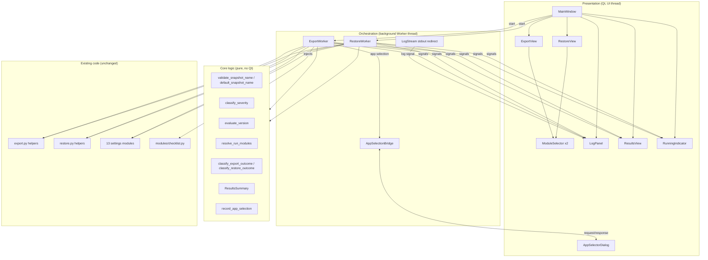
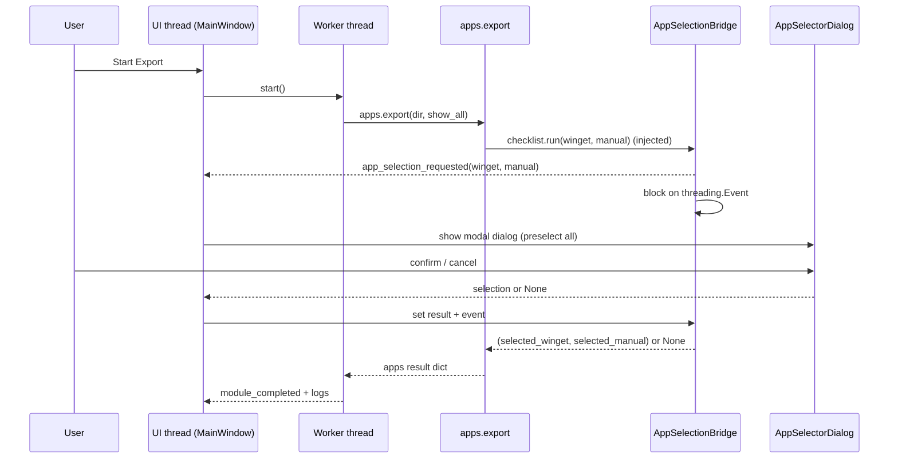

# Design Document

## Overview

WinSnap_GUI is a PyQt6 desktop application (`gui.py` in the project root) that
wraps the existing WinSnap export and restore functionality behind a graphical
interface. It is strictly a **presentation layer**: it invokes the thirteen
settings modules through their existing `export(snapshot_dir)` /
`restore(snapshot, snapshot_dir)` contract and reuses the snapshot-assembly and
version-compatibility helpers already shipped in `export.py` and `restore.py`.
It does not change the snapshot format, module logic, or the registry/file
operations the modules perform.

The design has three responsibilities that the existing CLIs do not address:

1. **Feature parity with both CLIs** — every flag (`--output`, `--name`,
   `--show-all`, `--only`, `--skip`, `--dry-run`) and every per-module option is
   reachable from the GUI.
2. **A graphical replacement for the terminal app picker** — `modules/checklist.py`
   (an `msvcrt`/ANSI terminal UI) is replaced by a Qt dialog, injected at runtime
   so that `modules/apps.py` is not modified.
3. **Operator feedback** — a persistent, color-coded, timestamped log panel with
   clear/copy controls, plus a per-run results summary (Passed / Failed / Skipped
   with reasons and counts), all while keeping the window responsive by running
   each operation on a background worker thread.

### Key research findings that inform the design

These were gathered by reading the existing source (`export.py`, `restore.py`,
`modules/apps.py`, `modules/power.py`, `modules/wallpaper.py`,
`modules/checklist.py`, `tests/conftest.py`, `.github/workflows/ci.yml`):

- **Module contract.** Every module exposes `export(snapshot_dir) -> dict` and
  `restore(snapshot, snapshot_dir)`. Modules signal problems three ways:
  (a) by **raising** (caught by the orchestrator), (b) by returning a dict with
  an `"error"` key, or (c) by returning a dict with a `"skip_reason"` key. The
  `power` module specifically returns `{"enabled": False, "skip_reason": "not_admin"}`
  when it lacks Administrator rights instead of raising. This shapes the
  Passed/Failed classification rules (Requirement 6, 14).
- **Apps picker injection point.** `modules/apps.py` does
  `from modules import checklist` then `checklist.run(winget_apps, manual_only)`
  *inside* `export()`. Replacing the attribute `modules.checklist.run` at runtime
  redirects that call to the Qt App_Selector without editing `apps.py`. The
  replacement must return the same shape `checklist.run` returns:
  `(selected_winget, selected_manual)` or `None` on cancel.
- **Reusable helpers.** `export.py` exposes `SNAPSHOT_FORMAT_VERSION`,
  `create_snapshot_dir`, and `zip_snapshot`. `restore.py` exposes `SUPPORTED_MAJOR`,
  `ALL_MODULES` (the canonical restore order), `_check_format_version`, and
  `_summarize` (one-line dry-run descriptions). Reusing these keeps the GUI in
  lock-step with the CLIs and avoids format drift.
- **Module output is `print()`-based.** Modules report progress by printing to
  stdout (e.g. `"[wallpaper] Captured: ..."`, `"[power] Skipped — requires
  Administrator rights."`). To surface this in the Log_Panel, the worker
  redirects stdout to a line-oriented stream that emits a log signal per line,
  with severity inferred from the line text.
- **Restore module ordering matters** and differs from export ordering; the GUI
  must preserve each CLI's ordering (`restore.py` runs settings before the
  Explorer restart and `apps` last).
- **Test conventions.** `tests/conftest.py` already provides OS-boundary mocks
  (`FakeWinReg`, `FakeUser32`, `FakeSubprocess`, `FakeDesktopWallpaper`).
  `hypothesis` is already a dev dependency (`requirements-dev.txt`), and CI runs
  on `windows-latest` for Python 3.11/3.12.

## Architecture

The application is layered so that all decision logic is **pure and testable
without a running Qt event loop**, while Qt widgets and threading remain thin.



### Threading model

- The Qt event loop runs on the **UI thread**. Each Operation runs on a single
  **Worker** (`QObject` moved onto a `QThread`), satisfying Requirement 15.1.
- The Worker communicates only via **Qt signals** (queued connections), so all
  widget mutation happens on the UI thread. Signals include: `log(message,
  severity)`, `module_completed(ModuleOutcome)`, `snapshot_written(path)`,
  `version_info(date, version)`, `finished(ResultsSummary)`, and
  `running_changed(bool)`.
- **stdout capture.** During an Operation the Worker wraps execution in
  `contextlib.redirect_stdout(LogStream(...))`. `LogStream` buffers bytes/str
  into lines; on each completed line it calls `classify_severity(line)` and emits
  the `log` signal. Because only one Operation runs at a time and the UI thread
  never prints, the global redirect is safe for this single-worker model.
- **App_Selector cross-thread request/response.** The `apps` module calls the
  (injected) picker *on the Worker thread*, but a `QDialog` must be shown on the
  UI thread. `AppSelectionBridge` solves this: the Worker calls
  `bridge.request_app_selection(winget, manual)`, which emits a signal to the UI
  thread and blocks the Worker on a `threading.Event`. The UI thread shows the
  modal `AppSelectorDialog`, stores the result, and sets the event; the Worker
  resumes and returns the result to `apps.export`. The UI thread is never blocked,
  so the window stays responsive (Requirement 15.2).



### View layout decision (Requirements 1.1–1.3, 15.3)

Requirement 1.1 requires a single window containing **both** the Export_View and
the Restore_View; 1.2 requires a view-switching control; and 1.3 / 15.3 require
that the user can start **either** an export or a restore regardless of which
view is displayed, with both start controls visible and enabled.

To reconcile these, the option panels for Export and Restore live in a
`QStackedWidget` toggled by a segmented view-switch control, but the **two start
buttons ("Start Export", "Start Restore") live in a persistent action bar that is
always visible**, alongside a shared Log_Panel, Results view, and running
indicator. Each view's widget state persists while hidden, so starting the
non-displayed operation reads that view's current configuration. This satisfies
"single window with both views," "view-switching control," and "both start
controls always available."

## Components and Interfaces

### Core logic module (pure Python, importable, no Qt)

To keep decision logic testable with property-based tests, the pure functions and
value types are defined as a self-contained section of `gui.py` (importable
symbols) — referred to below as the "core." None of these require a `QApplication`.

```python
# Value types
class Severity(enum.Enum): SUCCESS, WARNING, ERROR
class ModuleStatus(enum.Enum): PASSED, FAILED, SKIPPED
class VersionVerdict(enum.Enum): COMPATIBLE, INCOMPATIBLE, UNPARSEABLE

@dataclass(frozen=True)
class LogEntry: timestamp: str; message: str; severity: Severity
@dataclass(frozen=True)
class ModuleOutcome: name: str; status: ModuleStatus; detail: str | None
@dataclass
class ResultsSummary:
    outcomes: list[ModuleOutcome]
    def add(self, outcome) -> None
    def passed(self) -> list[ModuleOutcome]
    def failed(self) -> list[ModuleOutcome]
    def skipped(self) -> list[ModuleOutcome]
    def counts(self) -> tuple[int, int, int]   # (passed, failed, skipped)

@dataclass
class ExportConfig:
    output_dir: Path
    name: str | None
    show_all: bool
    selected_modules: set[str]
@dataclass
class RestoreConfig:
    snapshot_path: Path
    dry_run: bool
    selected_modules: set[str]

# Pure functions
MODULES_EXPORT_ORDER: list[str]      # mirrors export.py
MODULES_RESTORE_ORDER: list[str]     # mirrors restore.ALL_MODULES

def validate_snapshot_name(name: str) -> str | None
    # returns None if valid (<=255 chars, no Windows-forbidden chars/reserved
    # names/trailing dot or space), else an error message.
def default_snapshot_name(start: datetime) -> str
    # "winsnap_" + start.strftime("%Y%m%d_%H%M%S")
def classify_severity(line: str) -> Severity
    # error markers > warning markers > success (default)
def evaluate_version(raw: str | None, supported_major: int) -> tuple[VersionVerdict, int | None]
def resolve_run_modules(selected: set[str], order: list[str]) -> list[str]
def classify_export_outcome(name: str, *, raised: Exception | None, result: dict | None) -> ModuleOutcome
def classify_restore_outcome(name: str, *, selected: bool, present: bool,
                             export_errored: bool, raised: Exception | None) -> ModuleOutcome
def record_app_selection(winget_states: list[bool], manual_states: list[bool],
                         winget: list[dict], manual: list[dict],
                         confirmed: bool) -> tuple[list[dict], list[dict]]
def format_log_line(entry: LogEntry) -> str   # "HH:MM:SS  message"
```

### Qt widgets (UI thread)

- **`MainWindow(QMainWindow)`** — owns the view switcher + `QStackedWidget`, the
  persistent action bar (Start Export, Start Restore, running indicator), and the
  shared `LogPanel` and `ResultsView`. Holds `self._operation_in_progress: bool`.
  `try_start_export()` / `try_start_restore()` enforce the guards (Requirements
  1.4, 1.5, 2.7, 3.8, 8.2–8.4) **before** constructing a Worker, emitting error/
  warning log entries and returning early when a guard fails.
- **`ExportView(QWidget)`** — output-directory chooser (`QFileChooser` button +
  read-only path label, default = Desktop), snapshot-name `QLineEdit`
  (`maxLength=255`), a `ModuleSelector`, and a Show_All `QCheckBox` (default
  unchecked). `build_config() -> ExportConfig`.
- **`RestoreView(QWidget)`** — snapshot-file chooser (filter `*.winsnap`, single
  file), selected-path label (or "No snapshot file selected"), a `ModuleSelector`,
  and a Dry_Run `QCheckBox` (default unchecked). `build_config() -> RestoreConfig`.
- **`ModuleSelector(QWidget)`** — 13 labeled `QCheckBox`es (all checked by
  default), plus "Select all" / "Deselect all" buttons. `selected() -> set[str]`,
  `set_all(bool)`.
- **`AppSelectorDialog(QDialog)`** — two `QGroupBox` sections ("Winget apps",
  "Manual apps"), each containing a scrollable checkable list and per-group
  "Select all"/"Deselect all" buttons, plus OK/Cancel. All entries preselected on
  open. An empty group renders with no entries but the dialog is still
  confirmable/cancelable. `result_selection() -> tuple[list[dict], list[dict]] | None`.
- **`LogPanel(QWidget)`** — a read-only `QTextEdit` (rich text for per-line color)
  + "Clear" and "Copy" buttons. `append(entry)`, `clear()`, `copy()`,
  `plain_text() -> str`. Colors: success→green, warning→amber, error→red.
  Auto-scrolls to the newest entry on append.
- **`ResultsView(QWidget)`** — three labeled groups (Passed/Failed/Skipped) with
  per-module rows (Failed rows show the error message; Skipped rows show the
  reason) and a counts header. `show_summary(summary: ResultsSummary)`.
- **`RunningIndicator`** — an indeterminate `QProgressBar`/spinner shown while an
  Operation runs (Requirement 15.5).

### Workers (background thread)

- **`ExportWorker(QObject)`** — given an `ExportConfig`, it:
  1. resolves the run set via `resolve_run_modules`;
  2. if `power` is selected and the process is not admin, emits a **warning**
     log before the run (Requirement 6.1);
  3. creates the snapshot dir (`export.create_snapshot_dir`), applies the name,
     binds `show_all` to the `apps` callable, injects the App_Selector;
  4. runs each module, classifying each outcome with `classify_export_outcome`;
  5. writes `snapshot.json`, zips via `export.zip_snapshot`, cleans the temp
     folder, emits a success log with the absolute archive path and a log with the
     `snapshot_format_version`; on a fatal error it removes any partial archive and
     ends (Requirement 7).
- **`RestoreWorker(QObject)`** — given a `RestoreConfig`, it:
  1. validates/opens the archive and reads `snapshot.json`;
  2. evaluates the format version (`evaluate_version`) and logs date+version
     ("unknown" placeholders when absent); halts before any module on
     INCOMPATIBLE; warns and continues on UNPARSEABLE (Requirement 10);
  3. resolves the run set in `MODULES_RESTORE_ORDER`;
  4. for each selected module, classifies via `classify_restore_outcome`; in
     dry-run, emits `restore._summarize(...)` text and applies no changes
     (Requirement 9.6, 9.7); otherwise calls `mod.restore(...)`;
  5. emits the `ResultsSummary` on completion.
- **`AppSelectionBridge(QObject)`** — `request_app_selection(winget, manual)` is
  called on the Worker thread; emits `app_selection_requested` to the UI and
  blocks on a `threading.Event`; `provide_result(selection)` (called on the UI
  thread after the dialog closes) stores the result and releases the event.
- **`LogStream`** — a file-like object (`write`, `flush`) that splits incoming
  text into lines and emits `log(line, classify_severity(line))` per complete
  line.

### Reused existing symbols

| Source | Symbol | Used for |
| --- | --- | --- |
| `export.py` | `SNAPSHOT_FORMAT_VERSION` | Stamping/logging the format version |
| `export.py` | `create_snapshot_dir`, `zip_snapshot` | Snapshot folder + `.winsnap` archive |
| `restore.py` | `SUPPORTED_MAJOR` | Version compatibility check |
| `restore.py` | `ALL_MODULES` | Canonical restore order |
| `restore.py` | `_summarize` | Dry-run "would change" descriptions |
| `modules/*` | `export` / `restore` | The thirteen module operations (unchanged) |
| `modules/checklist.py` | `run` (attribute) | Runtime-replaced by the App_Selector |

## Data Models

### Snapshot (unchanged, consumed read-only)

The GUI neither defines nor alters the snapshot schema. It reads/writes the same
`snapshot.json` the CLIs produce:

```json
{
  "winsnap_version": "0.2.0",
  "snapshot_format_version": "0.2.0",
  "exported_at": "2024-01-01T12:00:00",
  "exported_on": { "user": "...", "machine": "..." },
  "modules_attempted": ["wallpaper", "apps", "..."],
  "modules": {
    "wallpaper": { "enabled": true, "filename": "wallpaper.jpg", "...": "..." },
    "power":     { "enabled": false, "skip_reason": "not_admin" },
    "apps":      { "winget": [ ... ], "manual": [ ... ] }
  }
}
```

### GUI value types (in-memory only)

| Type | Fields | Notes |
| --- | --- | --- |
| `Severity` | SUCCESS / WARNING / ERROR | Exactly one per Log_Entry (Req 12.4) |
| `LogEntry` | `timestamp:str(HH:MM:SS)`, `message:str`, `severity:Severity` | Rendered colored |
| `ModuleStatus` | PASSED / FAILED / SKIPPED | Results grouping |
| `ModuleOutcome` | `name`, `status`, `detail` | `detail` = error msg (Failed) / reason (Skipped) |
| `ResultsSummary` | `outcomes:list[ModuleOutcome]` | Provides grouping + counts |
| `ExportConfig` | `output_dir`, `name`, `show_all`, `selected_modules` | Built from ExportView |
| `RestoreConfig` | `snapshot_path`, `dry_run`, `selected_modules` | Built from RestoreView |
| `VersionVerdict` | COMPATIBLE / INCOMPATIBLE / UNPARSEABLE | From `evaluate_version` |

### Module list (canonical)

The thirteen module names: `wallpaper`, `apps`, `mouse_display`, `power`,
`taskbar`, `explorer`, `desktop_icons`, `sound_scheme`, `cursors`, `fonts`,
`startup`, `env_vars`, `region_lang`. Export uses the `export.py` order; restore
uses the `restore.ALL_MODULES` order (settings first, `taskbar` near the end,
`apps` last).

### Outcome classification rules

**Export** (`classify_export_outcome`):

| Condition | Status | Detail |
| --- | --- | --- |
| Module raised | FAILED | exception text |
| Result dict has `skip_reason == "not_admin"` (power) | FAILED | "Administrator privileges required to capture the active power plan" |
| Result dict has `"error"` key or other `skip_reason` | FAILED | the reported message |
| Otherwise (incl. `{"enabled": false}` / empty data) | PASSED | — |
| Module deselected | SKIPPED | "Deselected by user" |

**Restore** (`classify_restore_outcome`):

| Condition | Status | Detail |
| --- | --- | --- |
| Module deselected | SKIPPED | "Deselected by user" |
| Selected but absent from snapshot | SKIPPED | "Not present in snapshot" |
| Selected but recorded with export error | SKIPPED | "Was not captured (export error)" |
| Ran and raised | FAILED | exception text |
| Ran (or dry-run summarized) without error | PASSED | — |

## Correctness Properties

*A property is a characteristic or behavior that should hold true across all
valid executions of a system — essentially, a formal statement about what the
system should do. Properties serve as the bridge between human-readable
specifications and machine-verifiable correctness guarantees.*

The properties below target the **pure core** of `gui.py` (name validation,
version evaluation, run-set resolution, module-selection operations, severity
classification, outcome classification, app-selection recording, log formatting,
and results partitioning). These are deterministic functions over large input
spaces, so property-based testing finds edge cases that fixed examples miss. UI
rendering, threading, file I/O, and external-service behavior are covered by
example, integration, and smoke tests in the Testing Strategy instead.

### Property 1: Default snapshot name format

*For any* `datetime`, when the snapshot name is left empty, `default_snapshot_name`
SHALL produce `"winsnap_" + dt.strftime("%Y%m%d_%H%M%S")`, and the result SHALL
match the pattern `^winsnap_\d{8}_\d{6}$`.

**Validates: Requirements 2.4**

### Property 2: Snapshot name validation

*For any* string, `validate_snapshot_name` SHALL reject it (return an error
message) if and only if it is empty after trimming, exceeds 255 characters,
contains a Windows-forbidden character (`< > : " / \ | ? *` or a control
character), is a reserved device name (e.g. `CON`, `PRN`, `AUX`, `NUL`, `COM1`–
`COM9`, `LPT1`–`LPT9`), or ends with a space or dot; otherwise it SHALL accept it.

**Validates: Requirements 2.7, 2.3**

### Property 3: Module run resolution

*For any* selection subset of the thirteen modules and *for any* module ordering
(export order or restore order), `resolve_run_modules` SHALL return exactly the
selected modules, in the given canonical order, with no duplicates and no
unselected modules — i.e. `result == [m for m in order if m in selection]`.

**Validates: Requirements 3.2, 3.3, 9.3**

### Property 4: Select-all / deselect-all coverage

*For any* starting check-state of the thirteen module controls, activating
select-all SHALL leave all thirteen selected, and activating deselect-all SHALL
leave zero selected.

**Validates: Requirements 3.6, 3.7**

### Property 5: App-selection recording

*For any* lists of discovered winget apps and manual apps and *for any* boolean
selection masks over them: when confirmed, `record_app_selection` SHALL return
exactly the entries whose mask is True within each group (an empty list for a
group in which none are selected, including a group that started empty); when
cancelled, it SHALL return `([], [])` regardless of the masks. With the
all-True default mask (initial state), confirming SHALL return every entry in
both groups.

**Validates: Requirements 5.2, 5.4, 5.5, 5.7**

### Property 6: Export outcome classification

*For any* module name and result of running its `export`, `classify_export_outcome`
SHALL classify the module as FAILED when the module raised, when the result
carries an `"error"` key, or when the result carries a `skip_reason` (with the
`"not_admin"` case yielding a detail that states Administrator privileges are
required); SHALL classify it as PASSED when it completed without raising and
without an error/skip indicator, regardless of the validity or quantity of the
produced data; and SHALL classify it as SKIPPED when the module was deselected.

**Validates: Requirements 6.2, 7.3, 14.4, 14.5**

### Property 7: Restore outcome classification

*For any* module name and restore context, `classify_restore_outcome` SHALL
classify the module as SKIPPED when it was deselected, when it is absent from the
snapshot, or when it was recorded with an export error; as FAILED when it ran and
raised; and as PASSED when it ran (or was dry-run summarized) without raising.

**Validates: Requirements 14.6**

### Property 8: Snapshot version verdict

*For any* version string and supported MAJOR, `evaluate_version` SHALL return
INCOMPATIBLE when the parsed MAJOR exceeds the supported MAJOR, COMPATIBLE when
the parsed MAJOR is less than or equal to the supported MAJOR, and UNPARSEABLE
when no MAJOR can be parsed — consistent with `restore._check_format_version`.

**Validates: Requirements 10.2, 10.4, 10.5**

### Property 9: Version-info message placeholders

*For any* snapshot dictionary, the version-info log message produced at the start
of a restore SHALL contain the snapshot's export date and format version when
present, and SHALL contain the literal placeholder `"unknown"` in place of either
value that is absent.

**Validates: Requirements 10.3**

### Property 10: Severity classification is total and single-valued

*For any* log line, `classify_severity` SHALL return exactly one `Severity`
(`success`, `warning`, or `error`); a line carrying an error/exception marker
SHALL classify as `error`, and a line carrying a non-fatal advisory marker (and
no error marker) SHALL classify as `warning`. The color map SHALL associate that
single severity with exactly one color (success→green, warning→amber, error→red).

**Validates: Requirements 12.4, 12.5, 12.6**

### Property 11: Log line timestamp prefix

*For any* `LogEntry`, `format_log_line` SHALL produce a string that begins with
the entry's timestamp formatted as `HH:MM:SS`.

**Validates: Requirements 11.1**

### Property 12: Log accumulation and copy text

*For any* sequence of append and clear operations on the log model, the copyable
text SHALL equal the newline-join of `format_log_line` over the currently
retained entries (in append order); appends SHALL accumulate entries across
operations until a clear, a clear SHALL leave zero entries, and copying an empty
log SHALL yield the empty string.

**Validates: Requirements 11.3, 13.2, 13.3, 13.4**

### Property 13: Results summary partition and counts

*For any* collection of `ModuleOutcome`s, `ResultsSummary` SHALL place each
outcome in exactly one group (Passed, Failed, or Skipped) such that the group
memberships partition the input, and the reported counts SHALL satisfy
`passed + failed + skipped == total` with each count equal to the size of its
group.

**Validates: Requirements 14.1, 14.7**

## Error Handling

The GUI treats errors at four boundaries, mapping each to a severity and a
Results_Summary status as defined by the requirements.

| Boundary | Handling | Severity / Status |
| --- | --- | --- |
| **Pre-start validation** (invalid name 2.7, zero modules 3.8, no/missing/invalid snapshot 8.2–8.4, non-Windows host 1.5, op already running 1.4) | `MainWindow.try_start_*` checks the guard, emits the log entry, and returns without creating a Worker | `error` (1.4 → `warning`); no Operation begins |
| **Per-module failure during an Operation** (7.3, 6.2) | The Worker catches exceptions and inspects the returned dict (`error` / `skip_reason`); the run loop continues with the remaining selected modules | `error` log; module → FAILED |
| **Module not-admin / non-fatal advisories** (6.1, 12.6) | Pre-run admin check for `power`; advisory lines from module stdout | `warning` log |
| **Fatal export error** (7.5) — output dir not writable, archive write/zip failure | Worker aborts after logging, removes any partial `.winsnap` and the temp snapshot folder, emits `finished` so the UI re-enables controls | `error` log; Operation ends; no partial archive |
| **Incompatible snapshot version** (10.2) | Worker halts before any module runs; applies no changes | `error` log; Operation ends |
| **Unparseable snapshot version** (10.5) | Worker logs a warning and continues | `warning` log; Operation continues |

Additional rules:

- **stdout severity inference.** `LogStream` routes each module `print` line
  through `classify_severity`, so existing module messages (e.g. `"[power]
  Skipped — requires Administrator rights."`, `"ERROR: ..."`) get sensible colors
  without modifying modules.
- **Worker isolation.** An unexpected exception inside a Worker is caught at the
  top of the Worker's run method, logged as `error`, and converted into a
  `finished` signal so the UI never hangs and the in-progress flag is always
  cleared (Requirements 15.4).
- **No partial artifacts.** On any fatal export failure, the Worker cleans up the
  temp snapshot directory (mirroring `export.py`'s `_force_remove` rmtree) and
  deletes a partially written archive if present (Requirement 7.5).
- **Cross-thread safety.** All widget updates occur via queued signal/slot
  connections; Workers never touch widgets directly.

## Testing Strategy

Testing follows the existing project conventions: `pytest`, the OS-boundary mocks
in `tests/conftest.py` (`FakeWinReg`, `FakeUser32`, `FakeSubprocess`,
`FakeDesktopWallpaper`), and `hypothesis` (already in `requirements-dev.txt`) for
property-based tests. CI runs on `windows-latest` for Python 3.11/3.12.

### Dual approach

- **Property tests** verify the universal properties above against the pure core.
- **Unit / example tests** verify widget configuration, initial states, single
  guard branches, color values, and signal wiring.
- **Integration tests** verify Worker end-to-end behavior (archive creation,
  fatal-error cleanup, dry-run applying no changes) against mocked OS boundaries.
- **Smoke tests** verify one-time setup (the window constructs and shows both
  views).

### Property-based testing

The pure core functions are deterministic over large input spaces, so PBT
applies. Configuration:

- A property-based testing library is used (**Hypothesis**, already a dev
  dependency). Properties are **not** implemented from scratch.
- Each property test runs a **minimum of 100 iterations**
  (`@settings(max_examples=100)` or higher).
- Each property test is tagged with a comment referencing its design property,
  in the format: **Feature: winsnap-gui, Property {number}: {property_text}**.
- Each of the 13 correctness properties is implemented by a **single**
  property-based test.

Generators (Hypothesis strategies) needed:
- Arbitrary `datetime`s (Property 1).
- Arbitrary text including forbidden characters, reserved names, long strings,
  trailing dot/space (Property 2).
- Subsets/boolean masks over the 13 module names (Properties 3, 4).
- Lists of app dicts + parallel boolean masks, plus a `confirmed` flag
  (Property 5).
- Module names paired with synthetic results (raise / `{"error":...}` /
  `{"skip_reason":...}` / normal / deselected) (Properties 6, 7).
- Version strings: well-formed semver, MAJOR above/below supported, and garbage
  (Property 8); snapshot dicts with present/absent date and version (Property 9).
- Arbitrary log-line text, including error/warning markers (Property 10) and
  arbitrary `LogEntry`s (Property 11).
- Sequences of append/clear operations (Property 12) and collections of
  `ModuleOutcome`s (Property 13).

### Headless Qt testing

Widget tests run with the Qt **offscreen** platform (`QT_QPA_PLATFORM=offscreen`)
so they execute in CI without a display. A session-scoped `QApplication` fixture
is provided; `pytest-qt` may be used for signal/interaction assertions but is not
required for the pure-core property tests (which import only the non-Qt symbols).

### Representative example / integration / smoke tests

- **Example:** view switching (1.2), both start controls enabled per view (1.3),
  default Desktop output (2.2), name maxLength 255 (2.3), dir display/cancel
  (2.5, 2.6), 13 module controls + preselect-all (3.1, 3.4, 9.1, 9.2),
  select/deselect buttons present (3.5, 9.8), Show_All mapping/default/binding
  (4.1–4.4), App_Selector layout + per-group controls (5.1, 5.3), `apps`
  deselected omits selector (5.6), admin warning before power (6.1), format
  version logged (7.4), snapshot-file controls (8.1, 8.5, 8.6, 8.7), Dry_Run
  mapping/default + per-module dry-run summaries (9.4–9.6), version read ordering
  (10.1), severity colors (12.1–12.3), log append + auto-scroll (11.2, 11.4),
  clear/copy controls present (13.1), Failed/Skipped detail rows (14.2, 14.3),
  worker thread separate from UI (15.1), responsiveness + second-op prevention
  (15.2, 15.3), re-enable after finish (15.4), running indicator (15.5).
- **Edge case:** non-Windows refusal (1.5), zero modules selected (3.8), empty
  app group confirmable (5.7), no/missing snapshot guards (8.2, 8.3), copy empty
  log (13.4).
- **Integration:** export writes exactly one archive with absolute-path success
  log (7.1, 7.2), module raise continues remaining (7.3 continuation), fatal
  error leaves no partial archive (7.5), invalid archive guard (8.4), dry-run
  applies no changes via mocked `mod.restore` (9.7).
- **Smoke:** window launches showing both views (1.1).

### Out of scope for automated tests

Visual styling quality, the 5-second launch budget as a hard performance gate,
and true OS-level registry/file effects (already covered by the existing module
test suite and intentionally not re-exercised here, since the GUI invokes module
logic unchanged).
