# Implementation Plan

## Overview

This plan fixes four independent restore defects (winget schema, mouse pointer
acceleration, multi-monitor wallpaper, taskbar `desktop.ini`) using the
exploratory bug-condition methodology. Tests are written and run on the UNFIXED
code first (exploration + preservation), then each minimal per-module fix is
applied and re-verified. Because the modules call Windows registry/Win32/COM
APIs, tests isolate the pure/inspectable logic and mock the OS boundaries
(`winreg`, `ctypes.windll`, `subprocess`, COM) so they run on CI.

The Property numbers below match the Correctness Properties in the design:
Property 1 = winget schema, Property 2 = mouse acceleration, Property 3 =
multi-monitor wallpaper, Property 4 = taskbar tolerant copy, Property 5 =
preservation of all non-buggy inputs.

## Tasks

- [x] 1. Set up property-based test scaffolding
  - Add a `requirements-dev.txt` (or extend existing dev tooling) with `pytest` and `hypothesis`
  - Create `tests/conftest.py` with reusable fixtures that mock the OS boundaries: `winreg` (record/replay reads and capture writes), `ctypes.windll.user32` (capture `SystemParametersInfoW`/`SendMessageTimeoutW`/`GetSystemMetrics` calls), `subprocess` (capture `winget`/`taskkill`/`explorer` invocations), and the `IDesktopWallpaper` COM object
  - Add helpers to build a temporary `snapshot_dir` and to read back `winget_export.json`
  - Note: this task only creates harness/mocks; it does NOT modify any module under `modules/`
  - _Requirements: 1.1, 1.2, 1.3, 1.4_

- [x] 2. Write winget schema bug condition exploration test
  - **Property 1: Bug Condition** - Invalid winget import JSON
  - **CRITICAL**: This test MUST FAIL on unfixed code - failure confirms the bug exists
  - **DO NOT attempt to fix the test or the code when it fails**
  - **NOTE**: This test encodes the expected behavior - it will validate the fix when it passes after implementation
  - **GOAL**: Surface counterexamples that demonstrate `_write_filtered_winget_export` omits `$schema`
  - **Scoped PBT Approach**: Generate non-empty selected-package lists; for all of them assert the written JSON contains a recognized top-level `$schema` field (Bug Condition: `documentHasSelectedPackages(X) AND NOT hasField(X, "$schema")` from design)
  - Call `apps._write_filtered_winget_export(snapshot_dir, selected)` with a non-empty `selected`, then load `winget_export.json`
  - The assertions should match Property 1 / Expected Behavior 2.1: `$schema` present AND the exact selected packages preserved
  - Run test on UNFIXED code
  - **EXPECTED OUTCOME**: Test FAILS (this is correct - it proves `$schema` is absent so winget rejects the file)
  - Document counterexamples found (e.g., "written JSON has only `Sources` and no `$schema`")
  - Mark task complete when test is written, run, and failure is documented
  - _Requirements: 1.1, 2.1_

- [x] 3. Write mouse pointer acceleration bug condition exploration test
  - **Property 2: Bug Condition** - Pointer acceleration not applied
  - **CRITICAL**: This test MUST FAIL on unfixed code - failure confirms the bug exists
  - **DO NOT attempt to fix the test or the code when it fails**
  - **NOTE**: This test encodes the expected behavior - it will validate the fix when it passes after implementation
  - **GOAL**: Surface counterexamples showing `MouseSpeed` is never written and `SPI_SETMOUSE` is never called
  - **Scoped PBT Approach**: Generate snapshot mouse data where `enhance_precision` is non-null (e.g. `"0"`/`"1"` plus other strings); for all of them assert the registry receives a `MouseSpeed` write and `ctypes` receives an `SPI_SETMOUSE` (0x0004) call (Bug Condition: `X.enhance_precision IS NOT NULL` from design)
  - Call `mouse_display.restore(snapshot, snapshot_dir)` under the mocked `winreg`/`ctypes` fixtures
  - The assertions should match Property 2 / Expected Behavior 2.2: `MouseSpeed` written equal to `enhance_precision` AND `SPI_SETMOUSE` called with `speed = int(enhance_precision)`
  - Run test on UNFIXED code
  - **EXPECTED OUTCOME**: Test FAILS (no `MouseSpeed` write, no `SPI_SETMOUSE` call on unfixed code)
  - Document counterexamples found
  - Mark task complete when test is written, run, and failure is documented
  - _Requirements: 1.2, 2.2_

- [x] 4. Write multi-monitor wallpaper bug condition exploration test
  - **Property 3: Bug Condition** - Wallpaper glitched on multiple monitors
  - **CRITICAL**: This test MUST FAIL on unfixed code - failure confirms the bug exists
  - **DO NOT attempt to fix the test or the code when it fails**
  - **NOTE**: This test encodes the expected behavior - it will validate the fix when it passes after implementation
  - **GOAL**: Surface the counterexample that only the legacy single-surface API is used on a multi-monitor environment
  - **Scoped PBT Approach**: Generate monitor counts > 1 (e.g. 2..4) with an enabled wallpaper snapshot; for all of them assert the per-monitor `IDesktopWallpaper` COM path is used and NOT only the legacy `SPI_SETDESKWALLPAPER` call (Bug Condition: `X.wallpaper.enabled AND monitorCount() > 1` from design)
  - Mock `GetSystemMetrics(SM_CMONITORS=80)` to return the generated count and stage a valid wallpaper file in `snapshot_dir`; call `wallpaper.restore(snapshot, snapshot_dir)`
  - The assertions should match Property 3 / Expected Behavior 2.3: per-monitor apply used, no glitched single-surface-only path
  - Run test on UNFIXED code
  - **EXPECTED OUTCOME**: Test FAILS (unfixed code always calls legacy `SPI_SETDESKWALLPAPER` with no per-monitor handling)
  - Document counterexamples found
  - Mark task complete when test is written, run, and failure is documented
  - _Requirements: 1.3, 2.3_

- [x] 5. Write taskbar desktop.ini bug condition exploration test
  - **Property 4: Bug Condition** - Taskbar restore aborts on uncopyable file
  - **CRITICAL**: This test MUST FAIL on unfixed code - failure confirms the bug exists
  - **DO NOT attempt to fix the test or the code when it fails**
  - **NOTE**: This test encodes the expected behavior - it will validate the fix when it passes after implementation
  - **GOAL**: Surface the counterexample that a `PermissionError` on `desktop.ini` aborts the whole taskbar restore before theme writes / Explorer restart
  - **Scoped PBT Approach**: Generate pins backups containing a random mix of `*.lnk` shortcuts plus a `desktop.ini` made to raise `PermissionError` (Errno 13) on copy; for all of them assert the restore completes, all `.lnk` pins are restored, theme is written, and Explorer is restarted (Bug Condition: `containsUncopyableFile(X)` from design)
  - Stage the backup under `snapshot_dir`, mock the copy of `desktop.ini` to raise `PermissionError`, mock `_write_theme_settings`/`_restart_explorer` capture, then call `taskbar.restore(snapshot, snapshot_dir)`
  - The assertions should match Property 4 / Expected Behavior 2.4: completed without abort, all `.lnk` pins restored, theme written, Explorer restarted
  - Run test on UNFIXED code
  - **EXPECTED OUTCOME**: Test FAILS (the `PermissionError` propagates and aborts before theme/Explorer steps)
  - Document counterexamples found
  - Mark task complete when test is written, run, and failure is documented
  - _Requirements: 1.4, 2.4_

- [x] 6. Write preservation property tests (BEFORE implementing any fix)
  - **Property 5: Preservation** - Non-buggy inputs behave identically
  - **IMPORTANT**: Follow observation-first methodology - run the UNFIXED code with non-buggy inputs, record actual outputs, then write property-based tests asserting those observed outputs hold across the input domain
  - Observe and capture baseline behavior on UNFIXED code for non-bug-condition inputs:
    - Winget: for non-empty selections, record the exact `Packages`/`SourceDetails` content and ordering written to `winget_export.json`; empty selection still yields the `apps.restore` "No winget apps to install." path
    - Mouse: with `enhance_precision == None`, record the exact set of registry writes (`MouseSensitivity`, `DoubleClickSpeed`, `SwapMouseButtons`, `WheelScrollLines`, keyboard `KeyboardDelay`/`KeyboardSpeed`, `LogPixels`) and the `WM_SETTINGCHANGE` broadcast
    - Wallpaper: with monitor count `<= 1`, record the identical legacy `SPI_SETDESKWALLPAPER` call; record that disabled/missing-file guards still short-circuit
    - Manual apps: record the manual install list output (names + URLs)
    - Taskbar: with a pins backup containing only `.lnk` files, record the restored shortcuts plus theme write + Explorer restart
    - Startup: record that `modules/startup.py` still skips entries referencing a missing binary (no change introduced)
  - Write property-based tests (generating random package selections, mouse field combinations, monitor counts `<= 1`, and pins-folder contents without uncopyable files) asserting these observed outputs are unchanged (Preservation Requirements from design)
  - Run tests on UNFIXED code
  - **EXPECTED OUTCOME**: Tests PASS (this confirms the baseline behavior to preserve)
  - Mark task complete when tests are written, run, and passing on unfixed code
  - _Requirements: 3.1, 3.2, 3.3, 3.4, 3.5, 3.6_

- [x] 7. Fix invalid winget import JSON (`modules/apps.py`)

  - [x] 7.1 Implement the schema fix in `_write_filtered_winget_export`
    - Insert a top-level `"$schema"` key (e.g. `"https://aka.ms/winget-packages.schema.2.0.json"`) into the `data` dict before writing
    - Optionally add companion metadata (`CreationDate`, `WinGetVersion`) for fidelity; keep the existing `Sources`/`SourceDetails`/`Packages` structure and the exact `selected` list unchanged
    - Do NOT change `apps.restore` (import command, success/failure reporting, manual list printing stay as-is)
    - _Bug_Condition: isBugCondition_apps(X) = documentHasSelectedPackages(X) AND NOT hasField(X, "$schema")_
    - _Expected_Behavior: written JSON has recognized `$schema` AND packages preserved; winget accepts the file_
    - _Preservation: package content/ordering unchanged except added `$schema`; empty-selection no-op path and success/failure reporting unchanged_
    - _Requirements: 2.1, 3.3, 3.6_

  - [x] 7.2 Verify winget schema bug condition exploration test now passes
    - **Property 1: Expected Behavior** - Invalid winget import JSON
    - **IMPORTANT**: Re-run the SAME test from task 2 - do NOT write a new test
    - Run the exploration test from task 2 on the fixed code
    - **EXPECTED OUTCOME**: Test PASSES (confirms `$schema` present and packages preserved)
    - _Requirements: 2.1_

  - [x] 7.3 Verify preservation tests still pass
    - **Property 5: Preservation** - Non-buggy inputs behave identically
    - **IMPORTANT**: Re-run the SAME tests from task 6 - do NOT write new tests
    - **EXPECTED OUTCOME**: Tests PASS (winget package content, empty-selection no-op, reporting unchanged)
    - _Requirements: 3.3, 3.6_

- [x] 8. Fix mouse pointer acceleration (`modules/mouse_display.py`)

  - [x] 8.1 Implement the acceleration write + apply in `mouse_display.restore`
    - Add a guarded branch `if mouse.get("enhance_precision") is not None:` that writes `MouseSpeed` (string value) to `HKCU\Control Panel\Mouse`, matching how it is captured
    - After the registry write, call `SystemParametersInfoW(SPI_SETMOUSE=0x0004, 0, <pointer to int[3] {threshold1, threshold2, speed}>, SPIF_UPDATEINIFILE | SPIF_SENDCHANGE)`; use thresholds `6`, `10` when acceleration is on and `speed = int(enhance_precision)`
    - Leave all other writes (speed, double-click, swap, scroll, keyboard, DPI) and the existing `WM_SETTINGCHANGE` broadcast untouched
    - _Bug_Condition: isBugCondition_mouse(X) = X.enhance_precision IS NOT NULL_
    - _Expected_Behavior: wroteRegistry("MouseSpeed", X.enhance_precision) AND calledSpiSetMouse(speed = int(X.enhance_precision))_
    - _Preservation: other mouse/keyboard/display writes and WM_SETTINGCHANGE broadcast identical when enhance_precision is None_
    - _Requirements: 2.2, 3.2_

  - [x] 8.2 Verify mouse acceleration bug condition exploration test now passes
    - **Property 2: Expected Behavior** - Pointer acceleration applied to the live session
    - **IMPORTANT**: Re-run the SAME test from task 3 - do NOT write a new test
    - **EXPECTED OUTCOME**: Test PASSES (confirms `MouseSpeed` written and `SPI_SETMOUSE` called)
    - _Requirements: 2.2_

  - [x] 8.3 Verify preservation tests still pass
    - **Property 5: Preservation** - Non-buggy inputs behave identically
    - **IMPORTANT**: Re-run the SAME tests from task 6 - do NOT write new tests
    - **EXPECTED OUTCOME**: Tests PASS (other mouse/keyboard/display fields written identically; nothing extra when `enhance_precision == None`)
    - _Requirements: 3.2_

- [x] 9. Fix multi-monitor wallpaper (`modules/wallpaper.py`)

  - [x] 9.1 Implement monitor-count branching in `wallpaper.restore`
    - Read `GetSystemMetrics(SM_CMONITORS=80)` via `ctypes.windll.user32`
    - If monitor count `<= 1`, follow the existing legacy `SystemParametersInfoW(SPI_SETDESKWALLPAPER)` path unchanged
    - If monitor count `> 1`, apply the image through the `IDesktopWallpaper` COM interface, enumerating monitors and setting the same saved image on each
    - Keep the copy-to-`~/Pictures/WinSnap` step and the disabled/missing-file guards common to both paths
    - Add graceful fallback: if the COM path is unavailable or fails, fall back to the legacy API and report (degrade rather than crash)
    - _Bug_Condition: isBugCondition_wallpaper(X) = X.wallpaper.enabled AND monitorCount() > 1_
    - _Expected_Behavior: usedPerMonitorPath() AND NOT usedLegacyOnly() — image applies cleanly across monitors_
    - _Preservation: single-/zero-/one-monitor restore uses the identical legacy `SPI_SETDESKWALLPAPER` call; guards still short-circuit_
    - _Requirements: 2.3, 3.1_

  - [x] 9.2 Verify multi-monitor wallpaper bug condition exploration test now passes
    - **Property 3: Expected Behavior** - Wallpaper applies cleanly on multiple monitors
    - **IMPORTANT**: Re-run the SAME test from task 4 - do NOT write a new test
    - **EXPECTED OUTCOME**: Test PASSES (per-monitor `IDesktopWallpaper` path used for monitor count > 1)
    - _Requirements: 2.3_

  - [x] 9.3 Verify preservation tests still pass
    - **Property 5: Preservation** - Non-buggy inputs behave identically
    - **IMPORTANT**: Re-run the SAME tests from task 6 - do NOT write new tests
    - **EXPECTED OUTCOME**: Tests PASS (single-monitor legacy path and guards unchanged)
    - _Requirements: 3.1_

- [x] 10. Fix taskbar desktop.ini permission error (`modules/taskbar.py`)

  - [x] 10.1 Implement a tolerant per-file copy in `taskbar.restore`
    - Replace the fatal `shutil.copytree` pins copy with a tolerant copy that iterates the backup and copies files individually (or `copytree` with an `ignore` callable / per-file `try/except`), skipping any file raising `PermissionError`/`OSError`
    - Skip `desktop.ini` (and similarly non-essential hidden/system files) explicitly; only `.lnk` shortcuts must be restored
    - Log a warning for each skipped file and continue
    - Ensure `_write_theme_settings(theme)` and `_restart_explorer()` still run after the pins copy regardless of skipped files
    - _Bug_Condition: isBugCondition_taskbar(X) = containsUncopyableFile(X)  // e.g. desktop.ini raising Errno 13_
    - _Expected_Behavior: completedWithoutAbort(result) AND allLnkPinsRestored(X) AND themeWritten() AND explorerRestarted()_
    - _Preservation: pins backups with no uncopyable files restore the same `.lnk` set; theme writes and Explorer restart still run_
    - _Requirements: 2.4, 3.4_

  - [x] 10.2 Verify taskbar desktop.ini bug condition exploration test now passes
    - **Property 4: Expected Behavior** - Taskbar restore tolerates uncopyable files
    - **IMPORTANT**: Re-run the SAME test from task 5 - do NOT write a new test
    - **EXPECTED OUTCOME**: Test PASSES (skips `desktop.ini`, restores `.lnk` pins, writes theme, restarts Explorer)
    - _Requirements: 2.4_

  - [x] 10.3 Verify preservation tests still pass
    - **Property 5: Preservation** - Non-buggy inputs behave identically
    - **IMPORTANT**: Re-run the SAME tests from task 6 - do NOT write new tests
    - **EXPECTED OUTCOME**: Tests PASS (normal `.lnk`-only pins restore plus theme/Explorer steps unchanged)
    - _Requirements: 3.4_

- [x] 11. Add focused unit tests for the four fixes
  - `_write_filtered_winget_export` produces JSON containing `$schema` and the exact selected packages; empty selection still yields the documented no-op path in `apps.restore`
  - `mouse_display.restore` writes `MouseSpeed` and calls `SPI_SETMOUSE` when `enhance_precision` is set; writes nothing extra when it is `None`
  - `wallpaper.restore` selects the per-monitor path when monitor count `> 1` and the legacy path when `<= 1`; disabled/missing-file guards still short-circuit
  - `taskbar.restore` skips `desktop.ini` and per-file `PermissionError`, restores remaining `.lnk` pins, and still calls theme write + Explorer restart
  - _Requirements: 2.1, 2.2, 2.3, 2.4, 3.1, 3.2, 3.3, 3.4_

- [x] 12. Add integration tests against `restore.py`
  - Non-empty `apps` selection: assert `winget import` is invoked with a schema-valid JSON (mock `subprocess`) and success/warning reporting is preserved
  - Mocked 2-monitor environment: assert the wallpaper module takes the per-monitor apply path and the overall run reports no errors
  - Taskbar pins backup includes a permission-denied `desktop.ini`: assert the taskbar step completes, theme is applied, Explorer restart is invoked, and `restore.py` reports zero errors for `taskbar`
  - Context/ordering check: confirm the module run order in `restore.py` (`ALL_MODULES`) is unchanged and that a per-module exception is still caught and surfaced in the final error summary
  - _Requirements: 2.1, 2.3, 2.4, 3.4, 3.6_

- [x] 13. Checkpoint - Ensure all tests pass
  - Run the full suite (exploration tests now passing, preservation tests still passing, unit + integration tests green)
  - Confirm `py_compile` of all changed modules succeeds and existing `tests/smoke_apps.py` still passes (CI parity)
  - Ensure all tests pass, ask the user if questions arise
  - _Requirements: 2.1, 2.2, 2.3, 2.4, 3.1, 3.2, 3.3, 3.4, 3.5, 3.6_

## Task Dependency Graph

```json
{
  "waves": [
    {
      "wave": 1,
      "tasks": ["1"],
      "description": "Set up PBT scaffolding and OS-boundary mocks (no module changes)"
    },
    {
      "wave": 2,
      "tasks": ["2", "3", "4", "5", "6"],
      "description": "Write exploration tests (must FAIL on unfixed code) and preservation tests (must PASS on unfixed code); independent, can run in parallel"
    },
    {
      "wave": 3,
      "tasks": ["7", "8", "9", "10"],
      "description": "Apply the four minimal per-module fixes and re-verify their exploration + preservation tests; independent per module"
    },
    {
      "wave": 4,
      "tasks": ["11"],
      "description": "Add focused unit tests for all four fixes"
    },
    {
      "wave": 5,
      "tasks": ["12"],
      "description": "Add integration tests against restore.py"
    },
    {
      "wave": 6,
      "tasks": ["13"],
      "description": "Checkpoint - ensure the full suite passes"
    }
  ]
}
```

```mermaid
graph TD
    T1[1. PBT scaffolding + mocks]
    T2[2. Explore: winget schema bug]
    T3[3. Explore: mouse accel bug]
    T4[4. Explore: multi-monitor wallpaper bug]
    T5[5. Explore: taskbar desktop.ini bug]
    T6[6. Preservation property tests]
    T7[7. Fix winget schema]
    T8[8. Fix mouse acceleration]
    T9[9. Fix multi-monitor wallpaper]
    T10[10. Fix taskbar tolerant copy]
    T11[11. Unit tests]
    T12[12. Integration tests]
    T13[13. Checkpoint]

    T1 --> T2
    T1 --> T3
    T1 --> T4
    T1 --> T5
    T1 --> T6

    T2 --> T7
    T6 --> T7
    T3 --> T8
    T6 --> T8
    T4 --> T9
    T6 --> T9
    T5 --> T10
    T6 --> T10

    T7 --> T11
    T8 --> T11
    T9 --> T11
    T10 --> T11

    T11 --> T12
    T12 --> T13
```



## Notes

- **Bug-condition methodology**: Exploration tests (tasks 2-5) MUST FAIL on the
  unfixed code — that failure is the proof the bug exists. Do not "fix" a failing
  exploration test; it becomes a passing fix-check after the corresponding
  implementation task. Preservation tests (task 6) MUST PASS on the unfixed code,
  capturing the baseline behavior to keep.
- **Property mapping**: Each `**Property N:**` annotation maps to a Correctness
  Property in `design.md` (Property 1-4 are the four bug conditions; Property 5 is
  preservation). The same test is reused across the exploration task and its
  matching fix-verification sub-task.
- **OS-boundary mocking**: All four modules touch `winreg`, `ctypes.windll`,
  `subprocess`, or COM. Tests must mock these so the suite runs headless on the
  `windows-latest` CI runners; no real registry/wallpaper/taskbar changes occur.
- **Minimal, gated fixes**: Each fix only alters the code path that triggers its
  bug. Inputs that do not satisfy a bug condition must follow the original path
  unchanged (Preservation, Property 5). No fix touches `modules/startup.py`
  (binary-not-found skip is expected behavior, Requirement 3.5).
- **CI parity**: Keep `tests/smoke_apps.py` passing and ensure every changed
  module still passes `python -m py_compile`, matching the existing CI workflow.
- Recommended manual run (single execution, not watch mode):
  `python -m pytest tests -p no:cacheprovider`.
